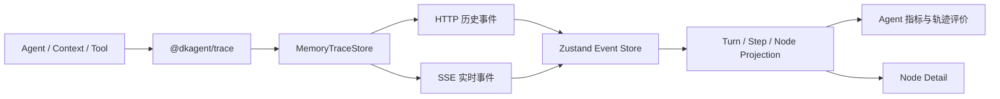
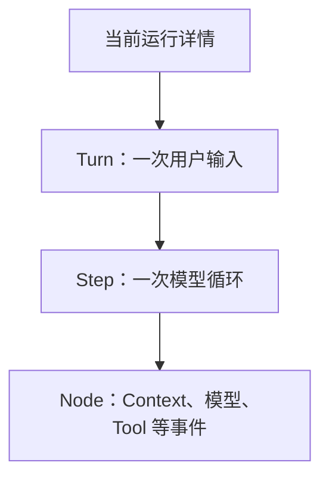

# Web Tap Agent 指标 Implementation Plan

> **For agentic workers:** REQUIRED SUB-SKILL: Use superpowers:subagent-driven-development (recommended) or superpowers:executing-plans to implement this plan task-by-task. Steps use checkbox (`- [ ]`) syntax for tracking.

**Goal:** 为 Web Tap 增加当前 Turn 的 Agent 运行指标、确定性轨迹评价和项目入口说明文档。

**Architecture:** 原始 `TraceEvent` 继续作为唯一事实来源，`projectEvents` 将当前 Turn 的完整事件保留在 Tap 投影层，纯函数 `analyzeAgentTurn` 一次计算指标和评价结果。React 组件只消费计算结果，Agent 与 Trace 契约均不修改。

**Tech Stack:** TypeScript、React 19、Zustand 5、Ant Design 6.6、Vite 8、Vitest、Testing Library、CSS Flex。

## Global Constraints

- 不计算综合 Agent 分数，不定义指标权重。
- 不接入 LLM-as-a-Judge、人工标注、参考答案管理或数据库。
- “可观测事实”“规则判断”“待评测”必须在中文界面中明确区分。
- 幻觉、压缩语义保真度和最终答案质量固定显示“待评测”，不能自动标记为通过。
- 缺失的耗时、Token 和 Tool 成功状态显示“未记录”，不能用 `0` 代替未知。
- 不修改 `packages/agent`、`packages/trace` 或 Agent 的运行行为。
- 使用现有三栏 Flex 布局，不新增图表或其他运行时依赖。
- 所有新增界面文案使用中文，原始 Trace 技术字段保持英文。

---

## File Structure

### 新增

- `packages/web-tap/src/web/model/agent-turn-analysis.ts`：从单个 `TapTurnView` 计算指标和评价结果的纯函数。
- `packages/web-tap/src/web/features/agent-metrics/AgentMetricsSummary.tsx`：紧凑展示可观测运行指标。
- `packages/web-tap/src/web/features/agent-metrics/AgentEvaluationPanel.tsx`：展示规则检查和待评测项目。
- `packages/web-tap/test/web/agent-turn-analysis.test.ts`：覆盖指标聚合和评价边界。
- `packages/web-tap/WEB-TAP.md`：项目背景、架构、边界与开发规则。

### 修改

- `packages/web-tap/src/web/model/types.ts`：为 `TapTurnView` 增加完整 `rawEvents`，定义分析结果类型。
- `packages/web-tap/src/web/model/project-events.ts`：将每个 Trace 事件一次性保存到所属 Turn。
- `packages/web-tap/src/web/app/TapApp.tsx`：为当前 Turn 派生一次分析结果并渲染两个新模块。
- `packages/web-tap/src/web/styles.css`：增加详情栈、指标网格和评价列表样式。
- `packages/web-tap/test/web/project-events.test.ts`：验证 Turn 保留完整且不重复的事件。
- `packages/web-tap/test/web/tap-app.test.tsx`：验证中文指标、规则结果、Turn 切换和移动端约束。

---

### Task 1: Agent Turn 分析纯函数

**Files:**

- Create: `packages/web-tap/src/web/model/agent-turn-analysis.ts`
- Modify: `packages/web-tap/src/web/model/types.ts`
- Modify: `packages/web-tap/src/web/model/project-events.ts`
- Create: `packages/web-tap/test/web/agent-turn-analysis.test.ts`
- Modify: `packages/web-tap/test/web/project-events.test.ts`

**Interfaces:**

- Consumes: `TapTurnView.rawEvents: TraceEvent[]` 和现有 `TapTurnView.steps`。
- Produces: `analyzeAgentTurn(turn: TapTurnView): AgentTurnAnalysis`。
- Produces: `AgentTurnMetrics`、`AgentEvaluationItem`、`AgentTurnAnalysis`。

- [ ] **Step 1: 为完整 Turn 事件投影写失败测试**

在 `packages/web-tap/test/web/project-events.test.ts` 的 `projectEvents` describe 中增加：

```ts
it("keeps every source event once on its Turn projection", () => {
  sequence = 0;
  const events = [
    event("turn.start", "turn-events", { input: "你好" }),
    event("context.before", "turn-events", beforePayload, 1),
    event("context.after", "turn-events", afterPayload, 1),
    event("model.response", "turn-events", { request, response: textResponse }, 1),
    event("turn.end", "turn-events", { answer: "你好" }, 1),
  ];

  const turn = projectEvents(events)[0]?.turns[0];

  expect(turn?.rawEvents).toEqual(events);
});
```

- [ ] **Step 2: 运行投影测试并确认失败**

Run:

```bash
npm run test:web -w @dkagent/web-tap -- --run test/web/project-events.test.ts
```

Expected: FAIL，提示 `rawEvents` 为 `undefined`。

- [ ] **Step 3: 在 Tap 投影层保存完整事件**

在 `packages/web-tap/src/web/model/types.ts` 修改：

```ts
export interface TapTurnView {
  id: string;
  steps: TapStepView[];
  rawEvents: TraceEvent[];
}
```

在 `packages/web-tap/src/web/model/project-events.ts` 中，取得 Turn 后立即保存当前事件：

```ts
const turn = getTurn(turns, session, event.traceId);
turn.rawEvents.push(event);
```

并将新 Turn 初始化改为：

```ts
const turn: TapTurnView = { id: traceId, steps: [], rawEvents: [] };
```

- [ ] **Step 4: 运行投影测试并确认通过**

Run:

```bash
npm run test:web -w @dkagent/web-tap -- --run test/web/project-events.test.ts
```

Expected: `project-events.test.ts` 全部 PASS。

- [ ] **Step 5: 为 Agent 指标和规则写失败测试**

创建 `packages/web-tap/test/web/agent-turn-analysis.test.ts`：

```ts
import type { TraceEvent } from "@dkagent/trace";
import { describe, expect, it } from "vitest";
import { analyzeAgentTurn } from "../../src/web/model/agent-turn-analysis.js";
import { projectEvents } from "../../src/web/model/project-events.js";

function traceEvent(
  id: string,
  name: TraceEvent["name"],
  phase: TraceEvent["phase"],
  data: unknown,
  options: Partial<Pick<TraceEvent, "spanId" | "parentSpanId" | "step" | "durationMs">> = {},
): TraceEvent {
  return {
    id,
    traceId: "turn-1",
    sequence: Number(id.split("-").at(-1)),
    timestamp: `2026-08-13T00:00:${id.split("-").at(-1)?.padStart(2, "0")}.000Z`,
    name,
    phase,
    data,
    ...options,
  };
}

function analyze(events: TraceEvent[]) {
  const turn = projectEvents(events)[0]?.turns[0];
  if (!turn) throw new Error("测试缺少 Turn");
  return analyzeAgentTurn(turn);
}

describe("analyzeAgentTurn", () => {
  it("aggregates a completed Tool Turn and keeps semantic quality unknown", () => {
    const result = analyze([
      traceEvent("event-1", "agent.turn", "start", { input: { input: "查天气" } }, { spanId: "turn" }),
      traceEvent("event-2", "agent.step", "start", { input: { step: 1 } }, { spanId: "step-1", parentSpanId: "turn", step: 1 }),
      traceEvent("event-3", "model.request", "start", { input: { model: "test" } }, { spanId: "model-1", parentSpanId: "step-1", step: 1 }),
      traceEvent("event-4", "model.response", "event", {
        type: "tool_use",
        usage: { inputTokens: 12, outputTokens: 4 },
      }, { spanId: "model-1", parentSpanId: "step-1", step: 1 }),
      traceEvent("event-5", "model.request", "end", { output: {} }, { spanId: "model-1", parentSpanId: "step-1", step: 1, durationMs: 20 }),
      traceEvent("event-6", "tool.call", "start", { input: { id: "call-1", name: "weather" } }, { spanId: "tool-1", parentSpanId: "step-1", step: 1 }),
      traceEvent("event-7", "tool.result", "event", {
        toolCallId: "call-1",
        result: { success: true, data: { weather: "晴" } },
      }, { spanId: "tool-1", parentSpanId: "step-1", step: 1 }),
      traceEvent("event-8", "tool.call", "end", { output: {} }, { spanId: "tool-1", parentSpanId: "step-1", step: 1, durationMs: 10 }),
      traceEvent("event-9", "context.compaction.completed", "event", {
        tokensBefore: 100,
        tokensAfter: 60,
        savedRatio: 0.4,
      }, { spanId: "context-1", parentSpanId: "step-1", step: 1 }),
      traceEvent("event-10", "agent.step", "end", { output: {} }, { spanId: "step-1", parentSpanId: "turn", step: 1, durationMs: 40 }),
      traceEvent("event-11", "agent.turn", "end", { output: { answer: "上海晴" } }, { spanId: "turn", durationMs: 50 }),
    ]);

    expect(result.metrics).toMatchObject({
      status: "completed",
      durationMs: 50,
      stepCount: 1,
      modelCallCount: 1,
      toolCallCount: 1,
      successfulToolCallCount: 1,
      inputTokens: 12,
      outputTokens: 4,
      compactionCount: 1,
      latestCompaction: { tokensBefore: 100, tokensAfter: 60, savedRatio: 0.4 },
    });
    expect(result.evaluations.find((item) => item.id === "tool_results")?.status).toBe("passed");
    expect(result.evaluations.find((item) => item.id === "context_compaction")?.status).toBe("passed");
    expect(result.evaluations.find((item) => item.id === "hallucination")?.status).toBe("unknown");
    expect(result.evaluations.find((item) => item.id === "answer_quality")?.status).toBe("unknown");
  });

  it("does not turn missing telemetry into zero or a passing quality result", () => {
    const result = analyze([
      traceEvent("event-1", "agent.turn", "start", { input: { input: "继续" } }, { spanId: "turn" }),
      traceEvent("event-2", "agent.step", "start", { input: { step: 1 } }, { spanId: "step-1", parentSpanId: "turn", step: 1 }),
    ]);

    expect(result.metrics).toMatchObject({
      status: "running",
      stepCount: 1,
      modelCallCount: 0,
      toolCallCount: 0,
      compactionCount: 0,
    });
    expect(result.metrics.durationMs).toBeUndefined();
    expect(result.metrics.inputTokens).toBeUndefined();
    expect(result.metrics.outputTokens).toBeUndefined();
    expect(result.metrics.successfulToolCallCount).toBeUndefined();
    expect(result.evaluations.find((item) => item.id === "turn_status")?.status).toBe("unknown");
    expect(result.evaluations.find((item) => item.id === "tool_results")?.status).toBe("unknown");
  });

  it("reports explicit Tool, loop and ineffective compaction failures", () => {
    const result = analyze([
      traceEvent("event-1", "agent.turn", "start", { input: { input: "执行" } }, { spanId: "turn" }),
      traceEvent("event-2", "tool.call", "start", { input: { id: "call-1", name: "search" } }, { spanId: "tool-1", step: 1 }),
      traceEvent("event-3", "tool.result", "event", {
        toolCallId: "call-1",
        result: { success: false, error: { message: "超时" } },
      }, { spanId: "tool-1", step: 1 }),
      traceEvent("event-4", "context.compaction.completed", "event", {
        tokensBefore: 100,
        tokensAfter: 100,
        savedRatio: 0,
      }, { spanId: "context-1", step: 1 }),
      traceEvent("event-5", "agent.turn", "error", {
        error: { message: "Agent 超出最大循环次数：4" },
      }, { spanId: "turn", durationMs: 80 }),
    ]);

    expect(result.metrics.status).toBe("error");
    expect(result.metrics.successfulToolCallCount).toBe(0);
    expect(result.evaluations.find((item) => item.id === "turn_status")?.status).toBe("failed");
    expect(result.evaluations.find((item) => item.id === "tool_results")?.status).toBe("failed");
    expect(result.evaluations.find((item) => item.id === "loop_efficiency")?.status).toBe("failed");
    expect(result.evaluations.find((item) => item.id === "context_compaction")?.status).toBe("warning");
  });
});
```

- [ ] **Step 6: 运行分析测试并确认失败**

Run:

```bash
npm run test:web -w @dkagent/web-tap -- --run test/web/agent-turn-analysis.test.ts
```

Expected: FAIL，提示无法解析 `agent-turn-analysis.js`。

- [ ] **Step 7: 定义 Tap 分析类型**

在 `packages/web-tap/src/web/model/types.ts` 增加：

```ts
export type AgentTurnStatus = "running" | "completed" | "error";
export type AgentEvaluationStatus = "passed" | "warning" | "failed" | "unknown";

export interface AgentTurnMetrics {
  status: AgentTurnStatus;
  durationMs?: number;
  stepCount: number;
  modelCallCount: number;
  toolCallCount: number;
  successfulToolCallCount?: number;
  inputTokens?: number;
  outputTokens?: number;
  compactionCount: number;
  latestCompaction?: {
    tokensBefore: number;
    tokensAfter: number;
    savedRatio: number;
  };
}

export interface AgentEvaluationItem {
  id: string;
  label: string;
  status: AgentEvaluationStatus;
  summary: string;
  evidenceEventIds: string[];
}

export interface AgentTurnAnalysis {
  metrics: AgentTurnMetrics;
  evaluations: AgentEvaluationItem[];
}
```

- [ ] **Step 8: 实现最小纯函数**

创建 `packages/web-tap/src/web/model/agent-turn-analysis.ts`。实现必须遵循以下结构和规则，不捕获或推断 Agent 私有状态：

```ts
import type { TraceEvent } from "@dkagent/trace";
import type {
  AgentEvaluationItem,
  AgentTurnAnalysis,
  AgentTurnMetrics,
  TapTurnView,
} from "./types.js";

export function analyzeAgentTurn(turn: TapTurnView): AgentTurnAnalysis {
  const events = turn.rawEvents;
  const turnError = events.find((event) => event.name === "agent.turn" && event.phase === "error");
  const turnEnd = events.findLast((event) => event.name === "agent.turn" && event.phase === "end");
  const status = turnError ? "error" : turnEnd ? "completed" : "running";
  const modelRequests = events.filter((event) => event.name === "model.request" && event.phase === "start");
  const modelResponses = events.filter((event) => event.name === "model.response" && event.phase === "event");
  const toolCalls = events.filter((event) => event.name === "tool.call" && event.phase === "start");
  const toolResults = events.filter((event) => event.name === "tool.result" && event.phase === "event");
  const compactions = events.filter((event) => event.name === "context.compaction.completed" && event.phase === "event");
  const stepCount = countSteps(turn);
  const usage = readCompleteUsage(modelResponses);
  const toolSuccess = readToolSuccess(toolCalls, toolResults);
  const latestCompaction = readCompaction(compactions.at(-1));
  const terminal = turnError ?? turnEnd;

  const metrics: AgentTurnMetrics = {
    status,
    ...(terminal?.durationMs === undefined ? {} : { durationMs: terminal.durationMs }),
    stepCount,
    modelCallCount: modelRequests.length + countLegacyCombinedResponses(modelResponses),
    toolCallCount: toolCalls.length,
    ...(toolSuccess === undefined ? {} : { successfulToolCallCount: toolSuccess.successCount }),
    ...(usage === undefined ? {} : usage),
    compactionCount: compactions.length,
    ...(latestCompaction === undefined ? {} : { latestCompaction }),
  };

  return {
    metrics,
    evaluations: [
      evaluateTurnStatus(status, terminal),
      evaluateModelPairs(status, modelRequests, modelResponses),
      evaluateToolPairs(status, toolCalls, toolResults),
      evaluateToolResults(toolCalls, toolResults, toolSuccess),
      evaluateLoop(status, turnError, stepCount),
      evaluateCompaction(latestCompaction, compactions),
      unknown("hallucination", "幻觉", "待评测：需要外部事实依据或参考答案"),
      unknown("compaction_fidelity", "压缩语义保真度", "待评测：需要比较原始上下文与压缩结果的关键信息"),
      unknown("answer_quality", "最终答案质量", "待评测：需要参考答案、人工评价或独立评测器"),
    ],
  };
}

function countSteps(turn: TapTurnView): number {
  const steps = new Set(turn.rawEvents
    .filter((event) => event.name === "agent.step" && event.phase === "start")
    .map((event) => event.step)
    .filter((step): step is number => step !== undefined));
  return steps.size > 0 ? steps.size : turn.steps.length;
}

function countLegacyCombinedResponses(events: TraceEvent[]): number {
  return events.filter((event) => {
    const data = unwrapData(event.data);
    return isRecord(data) && "request" in data && "response" in data;
  }).length;
}

function readCompleteUsage(events: TraceEvent[]): Pick<AgentTurnMetrics, "inputTokens" | "outputTokens"> | undefined {
  if (events.length === 0) return undefined;
  let inputTokens = 0;
  let outputTokens = 0;
  for (const event of events) {
    const response = readModelResponse(event);
    const usage = isRecord(response) ? response.usage : undefined;
    if (!isRecord(usage)
      || typeof usage.inputTokens !== "number"
      || typeof usage.outputTokens !== "number") return undefined;
    inputTokens += usage.inputTokens;
    outputTokens += usage.outputTokens;
  }
  return { inputTokens, outputTokens };
}

function readToolSuccess(
  calls: TraceEvent[],
  results: TraceEvent[],
): { successCount: number } | undefined {
  if (calls.length === 0) return undefined;
  const resultsById = new Map(results.map((event) => [readToolResultId(event), event]));
  let successCount = 0;
  for (const call of calls) {
    const callId = readToolCallId(call);
    const result = callId === undefined ? undefined : resultsById.get(callId);
    const success = readToolResultSuccess(result);
    if (success === undefined) return undefined;
    if (success) successCount += 1;
  }
  return { successCount };
}

function readCompaction(event: TraceEvent | undefined): AgentTurnMetrics["latestCompaction"] {
  if (!event) return undefined;
  const data = unwrapData(event.data);
  if (!isRecord(data)
    || typeof data.tokensBefore !== "number"
    || typeof data.tokensAfter !== "number"
    || typeof data.savedRatio !== "number") return undefined;
  return {
    tokensBefore: data.tokensBefore,
    tokensAfter: data.tokensAfter,
    savedRatio: data.savedRatio,
  };
}

function evaluateTurnStatus(
  status: AgentTurnMetrics["status"],
  terminal: TraceEvent | undefined,
): AgentEvaluationItem {
  if (status === "completed") {
    return item("turn_status", "Turn 完成状态", "passed", "本轮已正常结束", terminal ? [terminal.id] : []);
  }
  if (status === "error") {
    return item("turn_status", "Turn 完成状态", "failed", readErrorMessage(terminal) ?? "本轮执行失败", terminal ? [terminal.id] : []);
  }
  return item("turn_status", "Turn 完成状态", "unknown", "本轮仍在运行，尚不能判断是否完成", []);
}

function evaluateModelPairs(
  status: AgentTurnMetrics["status"],
  requests: TraceEvent[],
  responses: TraceEvent[],
): AgentEvaluationItem {
  const legacy = responses.filter(isLegacyCombinedResponse);
  const directResponses = responses.filter((event) => !isLegacyCombinedResponse(event));
  const requestSpanIds = new Set(requests.map((event) => event.spanId).filter((id): id is string => id !== undefined));
  const responseSpanIds = new Set(directResponses.map((event) => event.spanId).filter((id): id is string => id !== undefined));
  const missing = requests.filter((event) => event.spanId === undefined || !responseSpanIds.has(event.spanId));
  const orphan = directResponses.filter((event) => event.spanId === undefined || !requestSpanIds.has(event.spanId));
  const evidence = [...requests, ...responses].map((event) => event.id);

  if (requests.length === 0 && legacy.length === 0) {
    return item("model_pairs", "模型调用完整性", "unknown", "未记录可配对的模型请求", evidence);
  }
  if (missing.length === 0 && orphan.length === 0) {
    return item("model_pairs", "模型调用完整性", "passed", "模型请求和响应完整配对", evidence);
  }
  return item(
    "model_pairs",
    "模型调用完整性",
    status === "running" ? "unknown" : "failed",
    status === "running" ? "本轮仍在运行，模型调用尚未完整" : "存在未配对的模型请求或响应",
    evidence,
  );
}

function evaluateToolPairs(
  status: AgentTurnMetrics["status"],
  calls: TraceEvent[],
  results: TraceEvent[],
): AgentEvaluationItem {
  const callIds = new Set(calls.map(readToolCallId).filter((id): id is string => id !== undefined));
  const resultIds = new Set(results.map(readToolResultId).filter((id): id is string => id !== undefined));
  const incomplete = calls.some((event) => {
    const id = readToolCallId(event);
    return id === undefined || !resultIds.has(id);
  }) || results.some((event) => {
    const id = readToolResultId(event);
    return id === undefined || !callIds.has(id);
  });
  const evidence = [...calls, ...results].map((event) => event.id);

  if (calls.length === 0 && results.length === 0) {
    return item("tool_pairs", "Tool 链完整性", "unknown", "本轮未调用 Tool", []);
  }
  if (!incomplete) {
    return item("tool_pairs", "Tool 链完整性", "passed", "Tool Call 和 Result 完整配对", evidence);
  }
  return item(
    "tool_pairs",
    "Tool 链完整性",
    status === "running" ? "unknown" : "failed",
    status === "running" ? "本轮仍在运行，Tool 链尚未完整" : "存在缺失或孤立的 Tool Result",
    evidence,
  );
}

function evaluateToolResults(
  calls: TraceEvent[],
  results: TraceEvent[],
  success: { successCount: number } | undefined,
): AgentEvaluationItem {
  const evidence = [...calls, ...results].map((event) => event.id);
  if (calls.length === 0) {
    return item("tool_results", "Tool 执行结果", "unknown", "本轮未调用 Tool", []);
  }
  if (!success) {
    return item("tool_results", "Tool 执行结果", "unknown", "Tool 成功状态未完整记录", evidence);
  }
  if (success.successCount !== calls.length) {
    return item("tool_results", "Tool 执行结果", "failed", `${calls.length - success.successCount} 个 Tool 调用明确失败`, evidence);
  }
  return item("tool_results", "Tool 执行结果", "passed", "所有 Tool 调用均明确成功", evidence);
}

function evaluateLoop(
  status: AgentTurnMetrics["status"],
  error: TraceEvent | undefined,
  stepCount: number,
): AgentEvaluationItem {
  const message = readErrorMessage(error);
  if (message?.includes("超出最大循环次数")) {
    return item("loop_efficiency", "循环效率", "failed", message, error ? [error.id] : []);
  }
  if (status === "completed") {
    return item("loop_efficiency", "循环效率", "passed", `本轮在 ${stepCount} 个 Step 内完成；不判断该路径是否最优`, []);
  }
  return item("loop_efficiency", "循环效率", "unknown", "当前证据不足以判断循环效率", error ? [error.id] : []);
}

function evaluateCompaction(
  latest: AgentTurnMetrics["latestCompaction"],
  events: TraceEvent[],
): AgentEvaluationItem {
  const evidence = events.map((event) => event.id);
  if (events.length === 0) {
    return item("context_compaction", "Context 压缩结果", "unknown", "本轮未触发 Context 压缩", []);
  }
  if (!latest) {
    return item("context_compaction", "Context 压缩结果", "unknown", "压缩前后 Token 未完整记录", evidence);
  }
  if (latest.tokensAfter < latest.tokensBefore) {
    return item("context_compaction", "Context 压缩结果", "passed", `Token 从 ${latest.tokensBefore} 降至 ${latest.tokensAfter}；不代表语义一定完整`, evidence);
  }
  return item("context_compaction", "Context 压缩结果", "warning", "压缩后 Token 没有下降，需要检查压缩过程", evidence);
}

function unknown(id: string, label: string, summary: string): AgentEvaluationItem {
  return item(id, label, "unknown", summary, []);
}

function item(
  id: string,
  label: string,
  status: AgentEvaluationItem["status"],
  summary: string,
  evidenceEventIds: string[],
): AgentEvaluationItem {
  return { id, label, status, summary, evidenceEventIds };
}

function isLegacyCombinedResponse(event: TraceEvent): boolean {
  const data = unwrapData(event.data);
  return isRecord(data) && "request" in data && "response" in data;
}

function readModelResponse(event: TraceEvent): unknown {
  const data = unwrapData(event.data);
  return isRecord(data) && "response" in data ? data.response : data;
}

function readToolCallId(event: TraceEvent): string | undefined {
  const data = unwrapData(event.data);
  return isRecord(data) && typeof data.id === "string" ? data.id : undefined;
}

function readToolResultId(event: TraceEvent): string | undefined {
  const data = unwrapData(event.data);
  return isRecord(data) && typeof data.toolCallId === "string" ? data.toolCallId : undefined;
}

function readToolResultSuccess(event: TraceEvent | undefined): boolean | undefined {
  if (!event) return undefined;
  const data = unwrapData(event.data);
  const result = isRecord(data) ? data.result : undefined;
  return isRecord(result) && typeof result.success === "boolean" ? result.success : undefined;
}

function readErrorMessage(event: TraceEvent | undefined): string | undefined {
  const data = event ? unwrapData(event.data) : undefined;
  const error = isRecord(data) ? data.error : undefined;
  return isRecord(error) && typeof error.message === "string" ? error.message : undefined;
}

function unwrapData(data: unknown): unknown {
  if (!isRecord(data)) return data;
  if (Object.keys(data).length === 1 && "input" in data) return data.input;
  if (Object.keys(data).length === 1 && "output" in data) return data.output;
  return data;
}

function isRecord(value: unknown): value is Record<string, unknown> {
  return typeof value === "object" && value !== null;
}
```

- [ ] **Step 9: 运行纯函数与投影测试**

Run:

```bash
npm run test:web -w @dkagent/web-tap -- --run test/web/agent-turn-analysis.test.ts test/web/project-events.test.ts
```

Expected: 两个测试文件全部 PASS。

- [ ] **Step 10: 类型检查并提交 Task 1**

Run:

```bash
npm run typecheck -w @dkagent/web-tap
git diff --check
```

Expected: 两条命令退出码均为 0。

Commit:

```bash
git add packages/web-tap/src/web/model/types.ts packages/web-tap/src/web/model/project-events.ts packages/web-tap/src/web/model/agent-turn-analysis.ts packages/web-tap/test/web/project-events.test.ts packages/web-tap/test/web/agent-turn-analysis.test.ts
git commit -m "feat(web-tap): analyze agent turn metrics"
```

---

### Task 2: Agent 指标与评价界面

**Files:**

- Create: `packages/web-tap/src/web/features/agent-metrics/AgentMetricsSummary.tsx`
- Create: `packages/web-tap/src/web/features/agent-metrics/AgentEvaluationPanel.tsx`
- Modify: `packages/web-tap/src/web/app/TapApp.tsx`
- Modify: `packages/web-tap/src/web/styles.css`
- Modify: `packages/web-tap/test/web/tap-app.test.tsx`

**Interfaces:**

- Consumes: Task 1 的 `analyzeAgentTurn(turn): AgentTurnAnalysis`。
- Consumes: `AgentTurnMetrics` 和 `AgentEvaluationItem[]`。
- Produces: `AgentMetricsSummary` 和 `AgentEvaluationPanel` React 组件。

- [ ] **Step 1: 写指标和评价界面的失败测试**

在 `packages/web-tap/test/web/tap-app.test.tsx` 增加测试：

```ts
it("shows Agent facts, rule checks, and unknown semantic evaluations", () => {
  renderFixture(agentMetricsFixture());

  const metrics = screen.getByRole("region", { name: "Agent 运行指标" });
  expect(within(metrics).getByText("已完成")).toBeVisible();
  expect(within(metrics).getByText("50 毫秒")).toBeVisible();
  expect(within(metrics).getByText("12 / 4")).toBeVisible();
  expect(within(metrics).getByText("1 / 1 成功")).toBeVisible();
  expect(within(metrics).getByText("100 → 60（节省 40.0%）")).toBeVisible();

  const evaluation = screen.getByRole("region", { name: "Agent 轨迹评价" });
  expect(within(evaluation).getByText("Tool 执行结果")).toBeVisible();
  expect(within(evaluation).getAllByText("通过").length).toBeGreaterThan(0);
  expect(within(evaluation).getByText("幻觉")).toBeVisible();
  expect(within(evaluation).getByText("待评测：需要外部事实依据或参考答案")).toBeVisible();
});

it("updates Agent analysis when selecting another Turn", () => {
  renderFixture(agentMetricsFixtureWithRunningTurn());

  fireEvent.click(screen.getByRole("button", { name: /^第 2 轮/ }));

  expect(screen.getByText("进行中")).toBeVisible();
  expect(screen.getAllByText("未记录").length).toBeGreaterThan(0);
  expect(screen.getByText("本轮仍在运行，尚不能判断是否完成")).toBeVisible();
});
```

在同一测试文件增加独立夹具，不复用生产分析函数：

```ts
function metricEvent(
  id: string,
  traceId: string,
  name: TraceEvent["name"],
  phase: TraceEvent["phase"],
  data: unknown,
  options: Partial<Pick<TraceEvent, "spanId" | "parentSpanId" | "step" | "durationMs">> = {},
): TraceEvent {
  const sequence = Number(id.split("-").at(-1));
  return {
    id,
    traceId,
    sequence,
    timestamp: `2026-08-13T00:00:${String(sequence).padStart(2, "0")}.000Z`,
    name,
    phase,
    data,
    ...options,
  };
}

function agentMetricsFixture(): TraceEvent[] {
  return [
    metricEvent("metric-1", "turn-1", "agent.turn", "start", { input: { input: "查天气" } }, { spanId: "turn-1" }),
    metricEvent("metric-2", "turn-1", "agent.step", "start", { input: { step: 1 } }, { spanId: "step-1", parentSpanId: "turn-1", step: 1 }),
    metricEvent("metric-3", "turn-1", "model.request", "start", { input: { model: "test" } }, { spanId: "model-1", parentSpanId: "step-1", step: 1 }),
    metricEvent("metric-4", "turn-1", "model.response", "event", {
      type: "tool_use",
      usage: { inputTokens: 12, outputTokens: 4 },
    }, { spanId: "model-1", parentSpanId: "step-1", step: 1 }),
    metricEvent("metric-5", "turn-1", "tool.call", "start", {
      input: { id: "call-1", name: "weather", input: { city: "上海" } },
    }, { spanId: "tool-1", parentSpanId: "step-1", step: 1 }),
    metricEvent("metric-6", "turn-1", "tool.result", "event", {
      toolCallId: "call-1",
      name: "weather",
      result: { success: true, data: { weather: "晴" } },
    }, { spanId: "tool-1", parentSpanId: "step-1", step: 1 }),
    metricEvent("metric-7", "turn-1", "context.compaction.completed", "event", {
      tokensBefore: 100,
      tokensAfter: 60,
      savedRatio: 0.4,
    }, { spanId: "context-1", parentSpanId: "step-1", step: 1 }),
    metricEvent("metric-8", "turn-1", "agent.step", "end", { output: {} }, { spanId: "step-1", parentSpanId: "turn-1", step: 1, durationMs: 40 }),
    metricEvent("metric-9", "turn-1", "agent.turn", "end", { output: { answer: "上海晴" } }, { spanId: "turn-1", durationMs: 50 }),
  ];
}

function agentMetricsFixtureWithRunningTurn(): TraceEvent[] {
  return [
    ...agentMetricsFixture(),
    metricEvent("metric-10", "turn-2", "agent.turn", "start", { input: { input: "继续" } }, { spanId: "turn-2" }),
    metricEvent("metric-11", "turn-2", "agent.step", "start", { input: { step: 1 } }, { spanId: "step-2", parentSpanId: "turn-2", step: 1 }),
  ];
}
```

- [ ] **Step 2: 运行组件测试并确认失败**

Run:

```bash
npm run test:web -w @dkagent/web-tap -- --run test/web/tap-app.test.tsx
```

Expected: FAIL，找不到标题“Agent 运行指标”。

- [ ] **Step 3: 实现指标概要组件**

创建 `packages/web-tap/src/web/features/agent-metrics/AgentMetricsSummary.tsx`：

```tsx
import { Card, Statistic } from "antd";
import type { AgentTurnMetrics } from "../../model/types.js";

interface AgentMetricsSummaryProps {
  metrics: AgentTurnMetrics;
}

const statusLabels = {
  running: "进行中",
  completed: "已完成",
  error: "失败",
} as const;

export function AgentMetricsSummary({ metrics }: AgentMetricsSummaryProps) {
  return (
    <section aria-label="Agent 运行指标">
      <Card className="tap-agent-metrics" size="small" title="Agent 运行指标">
        <div className="tap-metrics-grid">
          <Statistic title="状态" value={statusLabels[metrics.status]} />
          <Statistic title="总耗时" value={formatDuration(metrics.durationMs)} />
          <Statistic title="Step" value={metrics.stepCount} />
          <Statistic title="模型调用" value={metrics.modelCallCount} />
          <Statistic title="Tool 调用" value={formatToolCalls(metrics)} />
          <Statistic title="输入 / 输出 Token" value={formatTokens(metrics)} />
          <Statistic title="Context 压缩" value={formatCompaction(metrics)} />
        </div>
      </Card>
    </section>
  );
}

function formatDuration(durationMs: number | undefined): string {
  return durationMs === undefined ? "未记录" : `${durationMs} 毫秒`;
}

function formatToolCalls(metrics: AgentTurnMetrics): string {
  if (metrics.toolCallCount === 0) return "0 次";
  return metrics.successfulToolCallCount === undefined
    ? `${metrics.toolCallCount} 次，成功状态未记录`
    : `${metrics.successfulToolCallCount} / ${metrics.toolCallCount} 成功`;
}

function formatTokens(metrics: AgentTurnMetrics): string {
  return metrics.inputTokens === undefined || metrics.outputTokens === undefined
    ? "未记录"
    : `${metrics.inputTokens} / ${metrics.outputTokens}`;
}

function formatCompaction(metrics: AgentTurnMetrics): string {
  if (metrics.compactionCount === 0) return "未触发";
  const latest = metrics.latestCompaction;
  return latest === undefined
    ? `${metrics.compactionCount} 次，Token 未记录`
    : `${latest.tokensBefore} → ${latest.tokensAfter}（节省 ${(latest.savedRatio * 100).toFixed(1)}%）`;
}
```

- [ ] **Step 4: 实现评价面板组件**

创建 `packages/web-tap/src/web/features/agent-metrics/AgentEvaluationPanel.tsx`：

```tsx
import { Card, List, Tag, Typography } from "antd";
import type { AgentEvaluationItem, AgentEvaluationStatus } from "../../model/types.js";

interface AgentEvaluationPanelProps {
  items: AgentEvaluationItem[];
}

const statusView: Record<AgentEvaluationStatus, { color: string; label: string }> = {
  passed: { color: "success", label: "通过" },
  warning: { color: "warning", label: "需关注" },
  failed: { color: "error", label: "失败" },
  unknown: { color: "default", label: "待评测" },
};

export function AgentEvaluationPanel({ items }: AgentEvaluationPanelProps) {
  return (
    <section aria-label="Agent 轨迹评价">
      <Card className="tap-agent-evaluation" size="small" title="Agent 轨迹评价">
        <List
          dataSource={items}
          rowKey="id"
          renderItem={(item) => {
            const view = statusView[item.status];
            return (
              <List.Item className="tap-evaluation-item">
                <div className="tap-evaluation-heading">
                  <Typography.Text strong>{item.label}</Typography.Text>
                  <Tag color={view.color}>{view.label}</Tag>
                </div>
                <Typography.Text type="secondary">{item.summary}</Typography.Text>
              </List.Item>
            );
          }}
        />
      </Card>
    </section>
  );
}
```

- [ ] **Step 5: 在 TapApp 中一次派生并渲染分析结果**

在 `packages/web-tap/src/web/app/TapApp.tsx`：

```tsx
import { useEffect, useMemo } from "react";
import { AgentEvaluationPanel } from "../features/agent-metrics/AgentEvaluationPanel.js";
import { AgentMetricsSummary } from "../features/agent-metrics/AgentMetricsSummary.js";
import { analyzeAgentTurn } from "../model/agent-turn-analysis.js";
```

在 `selectedTurn` 后只计算一次：

```tsx
const turnAnalysis = useMemo(
  () => selectedTurn === undefined ? undefined : analyzeAgentTurn(selectedTurn),
  [selectedTurn],
);
```

将 Detail 区域改为：

```tsx
<main className="tap-region tap-detail-region">
  <div className="tap-detail-stack">
    {turnAnalysis === undefined ? null : (
      <>
        <AgentMetricsSummary metrics={turnAnalysis.metrics} />
        <AgentEvaluationPanel items={turnAnalysis.evaluations} />
      </>
    )}
    <NodeDetailBoundary key={selectedNodeId ?? "empty"} node={selectedNode}>
      <NodeDetail node={selectedNode} />
    </NodeDetailBoundary>
  </div>
</main>
```

不要把分析结果写回 Zustand；它是当前 `selectedTurn` 的派生值。

- [ ] **Step 6: 增加 Flex 响应式样式**

在 `packages/web-tap/src/web/styles.css` 增加：

```css
.tap-detail-stack {
  display: grid;
  gap: 16px;
  width: 100%;
  max-width: 960px;
  margin-inline: auto;
}

.tap-detail-stack .tap-node-detail {
  max-width: none;
  margin-inline: 0;
}

.tap-metrics-grid {
  display: flex;
  flex-wrap: wrap;
  gap: 16px 24px;
}

.tap-metrics-grid .ant-statistic {
  flex: 1 1 140px;
  min-width: 0;
}

.tap-metrics-grid .ant-statistic-content {
  overflow-wrap: anywhere;
  font-size: 18px;
}

.tap-evaluation-item.ant-list-item {
  display: grid;
  gap: 4px;
}

.tap-evaluation-heading {
  display: flex;
  flex-wrap: wrap;
  gap: 8px;
  align-items: center;
  justify-content: space-between;
}
```

- [ ] **Step 7: 运行组件测试并修正可访问名称冲突**

Run:

```bash
npm run test:web -w @dkagent/web-tap -- --run test/web/tap-app.test.tsx
```

Expected: `tap-app.test.tsx` 全部 PASS。若既有页面中存在多个“已完成”文本，测试必须限定到 `Agent 运行指标` Card 或 `Agent 轨迹评价` region，不能弱化为不精确查询。

- [ ] **Step 8: 检查 Ant Design API、类型和完整 Web 回归**

Run:

```bash
antd lint packages/web-tap/src/web/features/agent-metrics packages/web-tap/src/web/app/TapApp.tsx --format json
npm run typecheck -w @dkagent/web-tap
npm run test:web -w @dkagent/web-tap -- --run
git diff --check
```

Expected: antd lint 无 error；TypeScript 退出码 0；Web 测试全部 PASS；diff check 无输出。

- [ ] **Step 9: 提交 Task 2**

```bash
git add packages/web-tap/src/web/features/agent-metrics/AgentMetricsSummary.tsx packages/web-tap/src/web/features/agent-metrics/AgentEvaluationPanel.tsx packages/web-tap/src/web/app/TapApp.tsx packages/web-tap/src/web/styles.css packages/web-tap/test/web/tap-app.test.tsx
git commit -m "feat(web-tap): show agent metrics and evaluations"
```

---

### Task 3: Web Tap 项目说明与整体验证

**Files:**

- Create: `packages/web-tap/WEB-TAP.md`

**Interfaces:**

- Consumes: 已实现的 Trace、Store、HTTP/SSE、Zustand、Projection 和 UI 结构。
- Produces: Web Tap 项目入口文档，不产生运行时代码接口。

- [ ] **Step 1: 编写项目说明文件**

创建 `packages/web-tap/WEB-TAP.md`，内容必须覆盖以下完整结构：

```markdown
# Web Tap

## 背景

Web Tap 是 DKAgent 的本地学习与调试界面，用于观察一次用户输入触发的 AgentLoop。它帮助开发者理解 Context 构建、模型调用、Tool 调用和上下文压缩过程，不参与 Agent 决策。

## 当前能力

- 按 Turn、Step、Node 展示 AgentLoop。
- 通过 HTTP 加载已有内存 Trace，通过 SSE 接收实时事件。
- 展示模型请求响应、Tool 调用结果和 Context 压缩前后内容。
- 展示当前 Turn 的 Agent 运行指标和确定性轨迹评价。
- 对常用节点和字段做中文显示，同时保留原始 JSON。

## 启动

```bash
npm run observe
```

开发前端界面：

```bash
npm run dev
```

## 架构



页面数据关系：



## 模块职责

### Agent

- 执行 AgentLoop。
- 在关键流程调用 Trace API。
- 不知道 Web Tap 的组件、指标和评价规则。

### Trace

- 记录结构化事实、父子关系、时间、顺序和耗时。
- 在 Store 边界进行脱敏。
- 观测失败不能改变 Agent 的执行结果。

### Web Tap

- 读取 Trace 并投影成页面数据。
- 对技术事件和常用字段做中文显示。
- 从 Trace 计算运行指标和确定性规则结果。
- 未适配事件降级展示原始 JSON。

## 指标与评价边界

Web Tap 区分：

- 可观测事实：耗时、Step、Token、Tool 调用和压缩次数。
- 规则判断：调用链是否完整、Tool 是否明确失败、压缩后 Token 是否下降。
- 待评测：幻觉、压缩语义保真度和最终答案质量。

没有外部证据时，Web Tap 不会把“未发现错误”显示成“答案正确”。

## 开发规则

1. Agent 执行需要的字段定义在 Agent；只为观测服务的字段和计算定义在 Trace 或 Web Tap。
2. Trace 技术字段使用英文，中文只存在于 Web Tap 展示层。
3. 新事件必须保留原始 JSON，并为未知事件提供降级显示。
4. Prompt、Authorization、API Key、Headers 和环境变量必须在进入 Store 时脱敏。
5. Web Tap 不能反向修改 Agent 状态或改变 Agent 结果。
6. 优先扩展纯投影函数，再增加 React 展示；组件不直接解释原始 Trace。
7. 页面继续使用 React、Zustand、Ant Design 和 CSS Flex，不为简单指标增加图表依赖。

## 当前非目标

- Session 列表与持久化。
- 数据库、分页和全文搜索。
- LLM-as-a-Judge、人工标注和综合评分。
- 实验对比、趋势监控和告警。
- OpenTelemetry 导出和跨进程追踪。

## 扩展方向

未来在真实需求出现后，可增加 Session 列表、时间瀑布图、Trace 对比、人工评价和独立 Evaluator。扩展仍应通过 Trace 或评价接口接入，不能把 Tap 展示字段放回 Agent 业务对象。
```

- [ ] **Step 2: 对照源码核对文档事实**

Run:

```bash
rg -n "MemoryTraceStore|/api/events|text/event-stream|projectEvents|analyzeAgentTurn" packages/trace packages/web-tap/src
rg -n "Session 列表|数据库|LLM-as-a-Judge" packages/web-tap/WEB-TAP.md
git diff --check
```

Expected: 第一条命令能够定位每个已声明能力的实现；第二条命令只在“当前非目标/边界”语境出现；diff check 无输出。

- [ ] **Step 3: 运行 Web Tap 全量验证**

Run:

```bash
npm run test -w @dkagent/web-tap
npm run typecheck -w @dkagent/web-tap
npm run build -w @dkagent/web-tap
antd lint packages/web-tap/src/web --format json
git diff --check
```

Expected: Node/Web 测试全部 PASS；两组 TypeScript 检查退出码 0；Vite build 成功；antd lint 无 error；diff check 无输出。Vite 既有 chunk-size warning 可以记录，但不能报告为失败。

- [ ] **Step 4: 手工验证 Tap**

Run:

```bash
npm run observe
```

在终端输入一个普通问题和一个会触发 Tool 的问题，浏览器检查：

1. Turn 切换会同步更新 Agent 指标。
2. 普通完成 Turn 显示状态、耗时、模型次数和 Token。
3. Tool Turn 显示调用总数、明确成功数和 Tool 链评价。
4. Context 压缩发生时显示前后 Token 和节省比例。
5. 幻觉、压缩语义保真度、最终答案质量始终显示“待评测”。
6. 390px 视口没有水平滚动条，评价状态同时包含文字标签。

Expected: 六项均满足；控制台无新增运行错误。

- [ ] **Step 5: 提交文档**

```bash
git add packages/web-tap/WEB-TAP.md
git commit -m "docs(web-tap): describe architecture and boundaries"
```

- [ ] **Step 6: 最终范围检查**

Run:

```bash
git diff main...HEAD -- packages/agent packages/trace
git status --short
git log --oneline main..HEAD
```

Expected:

- 第一条命令无输出，确认未修改 Agent 和 Trace。
- 工作树干净。
- 分支包含设计提交和三个实现提交。
