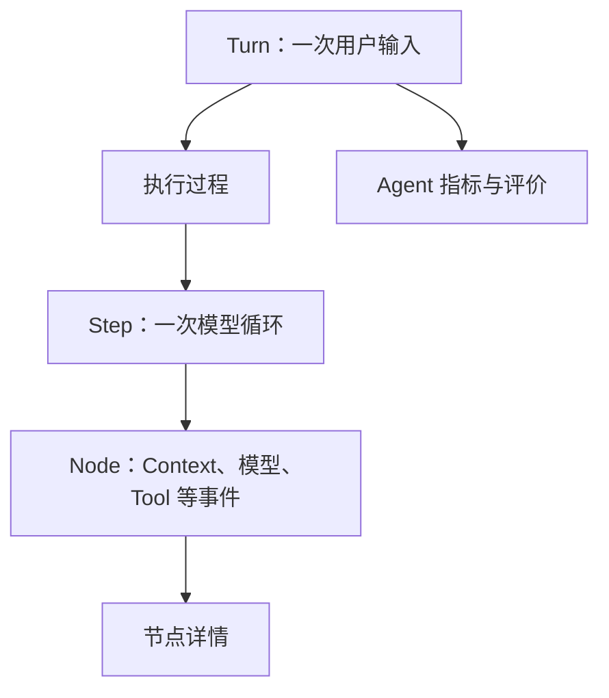

# Web Tap 工作区重设计 Implementation Plan

> **For agentic workers:** REQUIRED SUB-SKILL: Use superpowers:subagent-driven-development (recommended) or superpowers:executing-plans to implement this plan task-by-task. Steps use checkbox (`- [ ]`) syntax for tracking.

**Goal:** 将 Agent 指标和执行过程改造成当前 Turn 下的并行工作区，并以“精密观测台”视觉语言提供可折叠指标栏和响应式移动抽屉。

**Architecture:** 先把已经测试和 Terra 审核过的 Agent 指标提交恢复到当前 `main` 基线，再让 `TapApp` 组合 `TurnList + TurnWorkspace`。`TurnWorkspace` 内部并列 `ExecutionWorkspace` 和 `AgentInsightsRail`；`selectedTurnId` 同时驱动两者，`selectedNodeId` 只驱动节点详情，指标栏展开状态保持为 React 局部 UI 状态。

**Tech Stack:** React 19、TypeScript、Vite 8、Ant Design 6、Zustand 5、CSS Flex、Vitest、Testing Library、Playwright

## Global Constraints

- 只修改 `packages/web-tap` 及本计划文档，不修改 `packages/agent` 和 `packages/trace`。
- 从当前 `main` 的设计提交 `20722ad` 开始，保留用户未提交的 `.gitignore` 和 `packages/agent/src/session/store.ts` 修改。
- 复用已经审查的指标提交 `cc0f945`、`2672fe2`、`c657e1d`、`0a4d1ff`、`a422ba1`；不引入可视化草稿提交 `f1cbf3e`。
- 指标和评价规则保持不变；不得把 Node 级内容混入 Turn 级指标。
- 页面继续使用 React、Zustand、Ant Design 和 CSS Flex，不新增运行时依赖。
- 中文界面保留技术词 `Agent`、`Turn`、`Step`、`Tool`、`Token`、`Context`、`Trace`、`JSON`。
- 桌面断点为 `>= 1280px`，紧凑断点为 `768px–1279px`，移动断点为 `< 768px`。
- 桌面指标栏默认展开；紧凑视口默认折叠；移动端使用抽屉。
- 原始 JSON 继续默认折叠；未知节点继续降级展示安全 JSON。
- 不实现拖拽分栏、深色模式、图表、综合 Agent 分数、Session 列表或持久化。

---

### Task 1: 恢复已审核的 Agent 指标基线

**Files:**
- Restore from reviewed commits: `packages/web-tap/src/web/model/agent-turn-analysis.ts`
- Restore from reviewed commits: `packages/web-tap/src/web/features/agent-metrics/AgentMetricsSummary.tsx`
- Restore from reviewed commits: `packages/web-tap/src/web/features/agent-metrics/AgentEvaluationPanel.tsx`
- Modify from reviewed commits: `packages/web-tap/src/web/model/project-events.ts`
- Modify from reviewed commits: `packages/web-tap/src/web/model/types.ts`
- Modify from reviewed commits: `packages/web-tap/src/web/app/TapApp.tsx`
- Modify from reviewed commits: `packages/web-tap/src/web/styles.css`
- Test from reviewed commits: `packages/web-tap/test/web/agent-turn-analysis.test.ts`
- Test from reviewed commits: `packages/web-tap/test/web/project-events.test.ts`
- Test from reviewed commits: `packages/web-tap/test/web/tap-app.test.tsx`
- Restore from reviewed commits: `packages/web-tap/WEB-TAP.md`

**Interfaces:**
- Consumes: `TapTurnView.rawEvents: TraceEvent[]`
- Produces: `analyzeAgentTurn(turn: TapTurnView): AgentTurnAnalysis`
- Produces: `AgentMetricsSummary({ metrics: AgentTurnMetrics })`
- Produces: `AgentEvaluationPanel({ items: AgentEvaluationItem[] })`

- [ ] **Step 1: 确认基线和脏文件边界**

```bash
git branch --show-current
git status --short
git log --oneline --reverse main..codex/web-tap-agent-metrics
```

Expected:

- 当前实现分支基于包含 `20722ad` 的 `main`。
- `.gitignore` 和 `packages/agent/src/session/store.ts` 可以保持未暂存，但后续命令不得暂存它们。
- 日志包含 `cc0f945` 至 `a422ba1`，以及明确排除的 `f1cbf3e`。

- [ ] **Step 2: 应用五个已审核提交**

```bash
git cherry-pick cc0f945 2672fe2 c657e1d 0a4d1ff a422ba1
```

Expected: 五个提交成功应用；若只在 `TapApp.tsx`、`styles.css` 或 `tap-app.test.tsx` 出现冲突，保留指标实现和当前主分支既有 Node/Detail 布局，禁止接受 `packages/agent` 或 `packages/trace` 改动。

- [ ] **Step 3: 验证恢复范围**

```bash
git diff --exit-code 20722ad..HEAD -- packages/agent packages/trace
git log --oneline -6
```

Expected:

- 第一条命令退出码为 `0`。
- 最近五条功能提交依次包含 `cc0f945`、`2672fe2`、`c657e1d`、`0a4d1ff`、`a422ba1` 的等价 cherry-pick。
- 不包含 `f1cbf3e`。

- [ ] **Step 4: 运行指标基线验证**

```bash
npm run test:web -w @dkagent/web-tap -- --run
npm run typecheck -w @dkagent/web-tap
git diff --check
```

Expected: Web 测试全部通过，类型检查通过，`git diff --check` 无输出。该任务复用已经完成的 TDD 和 Terra 审核，不重写指标算法。

---

### Task 2: 建立桌面端并行工作区和可折叠指标栏

**Files:**
- Create: `packages/web-tap/src/web/model/turn-summary.ts`
- Create: `packages/web-tap/src/web/features/layout/TapHeader.tsx`
- Create: `packages/web-tap/src/web/features/layout/TurnHeader.tsx`
- Create: `packages/web-tap/src/web/features/layout/AgentInsightsRail.tsx`
- Modify: `packages/web-tap/src/web/features/turns/TurnList.tsx`
- Modify: `packages/web-tap/src/web/app/TapApp.tsx`
- Modify: `packages/web-tap/src/web/styles.css`
- Test: `packages/web-tap/test/web/tap-app.test.tsx`

**Interfaces:**
- Consumes: `TapTurnView`, `AgentTurnAnalysis`, `TapState["connectionStatus"]`
- Produces: `summarizeTurn(turn: TapTurnView): TapTurnSummary`
- Produces: `AgentInsightsContent({ analysis }: { analysis?: AgentTurnAnalysis })`
- Produces: `AgentInsightsRail({ analysis, collapsed, onToggle })`
- Produces: `TapHeader({ connectionStatus })`
- Produces: `TurnHeader({ turn, turnIndex })`

- [ ] **Step 1: 写出桌面层级和折叠行为的失败测试**

在 `packages/web-tap/test/web/tap-app.test.tsx` 中替换旧三栏 CSS 契约测试，并增加：

```tsx
it("places execution and Agent insights as sibling regions for the selected Turn", () => {
  renderFixture(agentMetricsFixture());

  const workspace = screen.getByRole("region", { name: "第 1 轮工作区" });
  const execution = within(workspace).getByRole("region", { name: "执行过程" });
  const insights = within(workspace).getByRole("complementary", { name: "Agent 指标" });
  const detail = within(execution).getByRole("main");

  expect(execution.parentElement).toBe(insights.parentElement);
  expect(execution).toContainElement(detail);
  expect(insights).not.toContainElement(detail);
  expect(within(workspace).getByText("Agent 指标汇总当前 Turn，不随 Node 切换")).toBeVisible();
});

it("collapses Agent insights without changing the selected Turn or Node", () => {
  const { store } = renderFixture(agentMetricsFixture());
  const selectedTurnId = store.getState().selectedTurnId;
  const selectedNodeId = store.getState().selectedNodeId;

  fireEvent.click(screen.getByRole("button", { name: "收起 Agent 指标" }));

  const insights = screen.getByRole("complementary", { name: "Agent 指标" });
  expect(insights).toHaveClass("is-collapsed");
  expect(within(insights).queryByText("输入 / 输出 Token")).not.toBeInTheDocument();
  expect(within(insights).getByRole("button", { name: "展开 Agent 指标" })).toBeVisible();
  expect(store.getState().selectedTurnId).toBe(selectedTurnId);
  expect(store.getState().selectedNodeId).toBe(selectedNodeId);
});

it("keeps Turn-level metrics unchanged when selecting another Node", () => {
  renderFixture(agentMetricsFixture());
  const insights = screen.getByRole("complementary", { name: "Agent 指标" });
  const tokenText = within(insights).getByText("12 / 4").textContent;

  fireEvent.click(screen.getByRole("button", { name: /模型响应/ }));

  expect(within(insights).getByText("12 / 4")).toHaveTextContent(tokenText ?? "");
});
```

- [ ] **Step 2: 运行聚焦测试，确认旧结构失败**

```bash
npm run test:web -w @dkagent/web-tap -- --run test/web/tap-app.test.tsx
```

Expected: FAIL，缺少“第 1 轮工作区”“执行过程”“Agent 指标”并行结构或折叠按钮。

- [ ] **Step 3: 抽取可复用的 Turn 摘要**

创建 `packages/web-tap/src/web/model/turn-summary.ts`：

```ts
import type { TapNodeView, TapTurnView } from "./types.js";

export interface TapTurnSummary {
  input: string;
  toolCount: number;
  status: TapNodeView["status"];
  statusLabel: "进行中" | "已完成" | "错误";
}

export function summarizeTurn(turn: TapTurnView): TapTurnSummary {
  const nodes = turn.steps.flatMap((step) => step.nodes);
  const start = nodes.find((node) => node.kind === "turn_start");
  const input = readStringField(start?.detail, "input") ?? "未记录输入";
  const hasError = nodes.some((node) => node.status === "error");
  const isCompleted = nodes.some((node) => node.kind === "turn_end");
  const status = hasError ? "error" : isCompleted ? "completed" : "running";
  return {
    input,
    toolCount: nodes.filter((node) => node.kind === "tool_call").length,
    status,
    statusLabel: status === "error" ? "错误" : status === "completed" ? "已完成" : "进行中",
  };
}

function readStringField(value: unknown, key: string): string | undefined {
  if (typeof value !== "object" || value === null) return undefined;
  const field = (value as Record<string, unknown>)[key];
  return typeof field === "string" ? field : undefined;
}
```

删除 `TurnList.tsx` 内的私有 `summarizeTurn` 和 `readStringField`，改为：

```ts
import { summarizeTurn } from "../../model/turn-summary.js";
```

- [ ] **Step 4: 创建产品栏、Turn 标题和指标栏组件**

创建 `packages/web-tap/src/web/features/layout/TapHeader.tsx`：

```tsx
import { Typography } from "antd";
import type { TapState } from "../../store/tap-store.js";

const connectionLabels: Record<TapState["connectionStatus"], string> = {
  connecting: "连接中",
  live: "实时观察",
  reconnecting: "正在重连",
  error: "连接异常",
};

export function TapHeader({ connectionStatus }: {
  connectionStatus: TapState["connectionStatus"];
}) {
  return (
    <header className="tap-product-header">
      <div className="tap-brand">
        <span className="tap-brand-mark" aria-hidden="true">DK</span>
        <Typography.Text strong>DKAgent Tap</Typography.Text>
      </div>
      <span className={`tap-connection is-${connectionStatus}`} aria-live="polite">
        <span className="tap-connection-dot" aria-hidden="true" />
        {connectionLabels[connectionStatus]}
      </span>
    </header>
  );
}
```

创建 `packages/web-tap/src/web/features/layout/TurnHeader.tsx`：

```tsx
import { Empty, Tag, Typography } from "antd";
import { summarizeTurn } from "../../model/turn-summary.js";
import type { TapTurnView } from "../../model/types.js";

export function TurnHeader({ turn, turnIndex }: {
  turn: TapTurnView | undefined;
  turnIndex: number;
}) {
  if (!turn) return <Empty description="暂无当前 Turn" image={Empty.PRESENTED_IMAGE_SIMPLE} />;
  const summary = summarizeTurn(turn);
  const tagColor = summary.status === "error" ? "error" : summary.status === "completed" ? "success" : "processing";
  return (
    <header className="tap-turn-header">
      <div>
        <Typography.Title level={1}>第 {turnIndex} 轮</Typography.Title>
        <Typography.Text ellipsis={{ tooltip: summary.input }}>{summary.input}</Typography.Text>
      </div>
      <Tag color={tagColor}>{summary.statusLabel}</Tag>
    </header>
  );
}
```

创建 `packages/web-tap/src/web/features/layout/AgentInsightsRail.tsx`：

```tsx
import LeftOutlined from "@ant-design/icons/LeftOutlined";
import RightOutlined from "@ant-design/icons/RightOutlined";
import { Badge, Button, Empty, Typography } from "antd";
import type { AgentTurnAnalysis } from "../../model/types.js";
import { AgentEvaluationPanel } from "../agent-metrics/AgentEvaluationPanel.js";
import { AgentMetricsSummary } from "../agent-metrics/AgentMetricsSummary.js";

export function AgentInsightsContent({ analysis }: { analysis?: AgentTurnAnalysis }) {
  if (!analysis) return <Empty description="暂无 Agent 指标" image={Empty.PRESENTED_IMAGE_SIMPLE} />;
  return (
    <div className="tap-insights-content">
      <Typography.Text type="secondary">Agent 指标汇总当前 Turn，不随 Node 切换</Typography.Text>
      <AgentMetricsSummary metrics={analysis.metrics} />
      <AgentEvaluationPanel items={analysis.evaluations} />
    </div>
  );
}

export function AgentInsightsRail({ analysis, collapsed, onToggle }: {
  analysis?: AgentTurnAnalysis;
  collapsed: boolean;
  onToggle(): void;
}) {
  const attentionCount = analysis?.evaluations.filter(
    (item) => item.status === "warning" || item.status === "failed",
  ).length ?? 0;
  return (
    <aside className={`tap-insights-rail${collapsed ? " is-collapsed" : ""}`} aria-label="Agent 指标">
      <header className="tap-insights-header">
        {collapsed ? <Badge count={attentionCount} size="small"><span className="tap-insights-label">指标</span></Badge> : <Typography.Title level={2}>Agent 指标</Typography.Title>}
        <Button
          type="text"
          icon={collapsed ? <LeftOutlined /> : <RightOutlined />}
          aria-label={collapsed ? "展开 Agent 指标" : "收起 Agent 指标"}
          onClick={onToggle}
        />
      </header>
      {collapsed ? null : <AgentInsightsContent analysis={analysis} />}
    </aside>
  );
}
```

- [ ] **Step 5: 重组 `TapApp` 的桌面结构**

在 `TapApp.tsx` 中保留现有 Store 选择器和 `analyzeAgentTurn` 的 `useMemo`，增加：

```tsx
const [metricsCollapsed, setMetricsCollapsed] = useState(false);
```

把返回结构改为：

```tsx
<div className="tap-app-shell">
  <TapHeader connectionStatus={connectionStatus} />
  <div className="tap-app-body">
    <TurnList
      turns={turns}
      selectedTurnId={selectedTurnId}
      connectionStatus={connectionStatus}
      onSelect={selectTurn}
    />
    <section className="tap-workspace" aria-label={`第 ${selectedTurnIndex + 1} 轮工作区`}>
      <TurnHeader turn={selectedTurn} turnIndex={selectedTurnIndex + 1} />
      <div className="tap-workspace-content">
        <section className="tap-execution-workspace" aria-label="执行过程">
          <NodeNav
            turn={selectedTurn}
            turnIndex={selectedTurnIndex + 1}
            selectedNodeId={selectedNodeId}
            onSelect={selectNode}
          />
          <main className="tap-region tap-detail-region">
            <NodeDetailBoundary key={selectedNodeId ?? "empty"} node={selectedNode}>
              <NodeDetail node={selectedNode} />
            </NodeDetailBoundary>
          </main>
        </section>
        <AgentInsightsRail
          analysis={turnAnalysis}
          collapsed={metricsCollapsed}
          onToggle={() => setMetricsCollapsed((value) => !value)}
        />
      </div>
    </section>
  </div>
</div>
```

若没有当前 Turn，`aria-label` 使用“当前 Turn 工作区”，避免出现“第 0 轮”。

- [ ] **Step 6: 添加桌面 Flex 契约和精密观测台基础样式**

用以下结构替换旧 `.tap-app-shell` 三栏规则；保留 Node Detail、Context、消息和 JSON 的既有样式：

```css
:root {
  font-family: Inter, "PingFang SC", "Microsoft YaHei", sans-serif;
  color: var(--ant-color-text, #253247);
  background: #edf2f7;
  --tap-navy: #172338;
  --tap-canvas: #edf2f7;
  --tap-panel: #ffffff;
  --tap-border: #dce4ed;
  --tap-shadow: 0 6px 18px rgba(37, 50, 71, 0.06);
}

.tap-app-shell {
  display: flex;
  flex-direction: column;
  height: 100vh;
  height: 100dvh;
  overflow: hidden;
  background: var(--tap-canvas);
}

.tap-product-header {
  flex: 0 0 52px;
  display: flex;
  align-items: center;
  justify-content: space-between;
  padding-inline: 20px;
  color: #dfe8f5;
  background: var(--tap-navy);
}

.tap-product-header .ant-typography { color: inherit; }
.tap-brand { display: flex; align-items: center; gap: 10px; }
.tap-brand-mark { display: grid; place-items: center; width: 28px; height: 28px; border: 1px solid rgba(255, 255, 255, 0.24); border-radius: 8px; color: #ffffff; font: 700 11px/1 "SFMono-Regular", Consolas, monospace; }
.tap-connection { display: inline-flex; align-items: center; gap: 7px; color: #bdc9d8; font-size: 12px; }
.tap-connection-dot { width: 7px; height: 7px; border-radius: 50%; background: currentColor; }
.tap-connection.is-live { color: #68d7a7; }
.tap-connection.is-reconnecting { color: #f0b35a; }
.tap-connection.is-error { color: #ff8585; }

.tap-app-body,
.tap-workspace-content,
.tap-execution-workspace {
  display: flex;
  min-width: 0;
  min-height: 0;
}

.tap-app-body { flex: 1 1 auto; }
.tap-workspace { flex: 1 1 auto; display: flex; flex-direction: column; min-width: 0; }
.tap-turn-header { flex: 0 0 72px; display: flex; align-items: center; justify-content: space-between; padding: 12px 20px; background: var(--tap-panel); border-block-end: 1px solid var(--tap-border); }
.tap-turn-header .ant-typography { margin: 0; }
.tap-turn-header h1.ant-typography { margin-block-end: 3px; font-size: 18px; }
.tap-workspace-content { flex: 1 1 auto; gap: 12px; padding: 12px; }
.tap-execution-workspace { flex: 1 1 auto; overflow: hidden; background: var(--tap-panel); border: 1px solid var(--tap-border); border-radius: 10px; box-shadow: var(--tap-shadow); }
.tap-turn-region { flex: 0 0 240px; }
.tap-node-region { flex: 0 0 300px; }
.tap-detail-region { flex: 1 1 auto; }
.tap-insights-rail { flex: 0 0 320px; min-width: 0; overflow-y: auto; background: var(--tap-panel); border: 1px solid var(--tap-border); border-radius: 10px; box-shadow: var(--tap-shadow); transition: flex-basis 160ms ease; }
.tap-insights-rail.is-collapsed { flex-basis: 48px; overflow: hidden; }
.tap-insights-header { display: flex; align-items: center; justify-content: space-between; min-height: 52px; padding: 8px 12px; border-block-end: 1px solid var(--tap-border); }
.tap-insights-content { display: grid; gap: 12px; padding: 12px; }
.tap-insights-content .ant-card { border-color: var(--tap-border); box-shadow: none; }
.tap-turn-button,
.tap-node-button { border-radius: 8px; transition: color 140ms ease, background-color 140ms ease, border-color 140ms ease; }
.tap-turn-button.is-selected,
.tap-node-button.is-selected { color: #0c5fd7; background: #e7f0ff; border-color: #b8d2fb; }
.tap-json-block { font-family: "SFMono-Regular", Consolas, "Liberation Mono", Menlo, monospace; }
```

- [ ] **Step 7: 运行桌面聚焦测试和回归**

```bash
npm run test:web -w @dkagent/web-tap -- --run test/web/tap-app.test.tsx
npm run test:web -w @dkagent/web-tap -- --run
npm run typecheck -w @dkagent/web-tap
git diff --check
```

Expected: 聚焦测试通过，Web 全量测试通过，类型检查通过，diff check 无输出。

- [ ] **Step 8: 提交桌面工作区**

```bash
git add packages/web-tap/src/web/model/turn-summary.ts \
  packages/web-tap/src/web/features/layout/TapHeader.tsx \
  packages/web-tap/src/web/features/layout/TurnHeader.tsx \
  packages/web-tap/src/web/features/layout/AgentInsightsRail.tsx \
  packages/web-tap/src/web/features/turns/TurnList.tsx \
  packages/web-tap/src/web/app/TapApp.tsx \
  packages/web-tap/src/web/styles.css \
  packages/web-tap/test/web/tap-app.test.tsx
git commit -m "feat(web-tap): separate execution and agent insights"
```

---

### Task 3: 增加紧凑视口、移动抽屉和响应式验证

**Files:**
- Create: `packages/web-tap/src/web/shared/useTapViewport.ts`
- Modify: `packages/web-tap/src/web/features/layout/TapHeader.tsx`
- Modify: `packages/web-tap/src/web/app/TapApp.tsx`
- Modify: `packages/web-tap/src/web/styles.css`
- Test: `packages/web-tap/test/web/tap-app.test.tsx`

**Interfaces:**
- Produces: `type TapViewport = "mobile" | "compact" | "wide"`
- Produces: `getTapViewport(width: number): TapViewport`
- Produces: `useTapViewport(): TapViewport`
- Modifies: `TapHeader` accepts `onOpenTurns()` and `onOpenInsights()` callbacks
- Consumes: `AgentInsightsContent` from Task 2 inside the移动端 Drawer

- [ ] **Step 1: 写出断点和移动抽屉的失败测试**

在 `tap-app.test.tsx` 增加：

```tsx
it("maps viewport widths to the approved responsive modes", () => {
  expect(getTapViewport(390)).toBe("mobile");
  expect(getTapViewport(767)).toBe("mobile");
  expect(getTapViewport(768)).toBe("compact");
  expect(getTapViewport(1279)).toBe("compact");
  expect(getTapViewport(1280)).toBe("wide");
});

it("opens Turn and Agent insight drawers on mobile", async () => {
  setViewportWidth(390);
  renderFixture(agentMetricsFixture());

  fireEvent.click(screen.getByRole("button", { name: "打开对话轮次" }));
  expect(await screen.findByRole("dialog", { name: "对话轮次" })).toBeVisible();

  fireEvent.click(screen.getByRole("button", { name: "关闭对话轮次" }));
  fireEvent.click(screen.getByRole("button", { name: "打开 Agent 指标" }));
  const drawer = await screen.findByRole("dialog", { name: "Agent 指标" });
  expect(within(drawer).getByText("12 / 4")).toBeVisible();
});

it("starts with the Agent insight rail collapsed in compact mode", () => {
  setViewportWidth(1024);
  renderFixture(agentMetricsFixture());

  expect(screen.getByRole("complementary", { name: "Agent 指标" })).toHaveClass("is-collapsed");
});
```

并在测试文件增加：

```ts
function setViewportWidth(width: number) {
  Object.defineProperty(window, "innerWidth", { configurable: true, value: width });
  fireEvent(window, new Event("resize"));
}
```

在 `beforeEach` 中调用 `setViewportWidth(1440)`，保证既有测试默认桌面模式。

- [ ] **Step 2: 运行聚焦测试，确认缺少响应式行为**

```bash
npm run test:web -w @dkagent/web-tap -- --run test/web/tap-app.test.tsx
```

Expected: FAIL，缺少 `getTapViewport`、移动按钮或 Drawer。

- [ ] **Step 3: 实现无依赖的视口 Hook**

创建 `packages/web-tap/src/web/shared/useTapViewport.ts`：

```ts
import { useEffect, useState } from "react";

export type TapViewport = "mobile" | "compact" | "wide";

export function getTapViewport(width: number): TapViewport {
  if (width < 768) return "mobile";
  if (width < 1280) return "compact";
  return "wide";
}

export function useTapViewport(): TapViewport {
  const [viewport, setViewport] = useState(() => getTapViewport(window.innerWidth));
  useEffect(() => {
    const update = () => setViewport(getTapViewport(window.innerWidth));
    window.addEventListener("resize", update);
    return () => window.removeEventListener("resize", update);
  }, []);
  return viewport;
}
```

- [ ] **Step 4: 扩展产品栏的移动入口**

把 `TapHeader` Props 扩展为：

```ts
interface TapHeaderProps {
  connectionStatus: TapState["connectionStatus"];
  mobile: boolean;
  attentionCount: number;
  onOpenTurns(): void;
  onOpenInsights(): void;
}
```

在品牌和连接状态之间增加：

```tsx
{mobile ? (
  <div className="tap-mobile-actions">
    <Button type="text" aria-label="打开对话轮次" onClick={onOpenTurns}>对话</Button>
    <Badge count={attentionCount} size="small">
      <Button type="text" aria-label="打开 Agent 指标" onClick={onOpenInsights}>指标</Button>
    </Badge>
  </div>
) : null}
```

- [ ] **Step 5: 在 `TapApp` 接入断点默认值和两个移动 Drawer**

增加状态和断点同步：

```tsx
const viewport = useTapViewport();
const mobile = viewport === "mobile";
const [turnsOpen, setTurnsOpen] = useState(false);
const [insightsOpen, setInsightsOpen] = useState(false);
const [metricsCollapsed, setMetricsCollapsed] = useState(viewport !== "wide");

useEffect(() => {
  setMetricsCollapsed(viewport !== "wide");
  if (!mobile) {
    setTurnsOpen(false);
    setInsightsOpen(false);
  }
}, [mobile, viewport]);

const attentionCount = turnAnalysis?.evaluations.filter(
  (item) => item.status === "warning" || item.status === "failed",
).length ?? 0;
```

桌面/紧凑模式正常渲染 `TurnList` 和 `AgentInsightsRail`；移动模式不重复渲染它们，而在 `TapApp` 末尾增加：

```tsx
<Drawer
  title="对话轮次"
  aria-label="对话轮次"
  placement="left"
  width="min(88vw, 360px)"
  open={mobile && turnsOpen}
  closeIcon={null}
  extra={<Button type="text" aria-label="关闭对话轮次" onClick={() => setTurnsOpen(false)}>关闭</Button>}
  onClose={() => setTurnsOpen(false)}
>
  <TurnList
    turns={turns}
    selectedTurnId={selectedTurnId}
    connectionStatus={connectionStatus}
    onSelect={(turnId) => {
      selectTurn(turnId);
      setTurnsOpen(false);
    }}
  />
</Drawer>

<Drawer
  title="Agent 指标"
  aria-label="Agent 指标"
  placement="right"
  width="min(92vw, 420px)"
  open={mobile && insightsOpen}
  onClose={() => setInsightsOpen(false)}
>
  <AgentInsightsContent analysis={turnAnalysis} />
</Drawer>
```

`TapHeader` 传入 `mobile`、`attentionCount` 和两个打开回调。

- [ ] **Step 6: 实现紧凑和移动 CSS**

删除旧 `959px` 和 `639px` 三栏换行规则，增加：

```css
@media (max-width: 1279px) and (min-width: 768px) {
  .tap-turn-region { flex-basis: 208px; }
  .tap-node-region { flex-basis: 280px; }
  .tap-workspace-content { gap: 8px; padding: 8px; }
}

@media (max-width: 767px) {
  #root,
  .tap-app-shell { min-height: 100vh; min-height: 100dvh; height: auto; }
  .tap-app-shell { overflow: visible; }
  .tap-product-header { position: sticky; inset-block-start: 0; z-index: 10; padding-inline: 12px; }
  .tap-app-body,
  .tap-workspace,
  .tap-workspace-content,
  .tap-execution-workspace { min-height: 0; overflow: visible; }
  .tap-workspace-content,
  .tap-execution-workspace { flex-direction: column; }
  .tap-workspace-content { padding: 8px; }
  .tap-turn-header { min-height: 68px; padding: 10px 12px; }
  .tap-node-region,
  .tap-detail-region { flex: 0 0 auto; width: 100%; overflow: visible; }
  .tap-node-region { max-height: none; border-inline-end: 0; border-block-end: 1px solid var(--tap-border); }
  .tap-region { padding: 14px; }
  .tap-json-block { overflow-x: auto; white-space: pre; overflow-wrap: normal; }
  .ant-drawer .tap-turn-region { width: 100%; padding: 0; border: 0; }
}

@media (prefers-reduced-motion: reduce) {
  .tap-insights-rail { transition-duration: 0.01ms; }
}
```

- [ ] **Step 7: 运行响应式测试和完整 Web 回归**

```bash
npm run test:web -w @dkagent/web-tap -- --run test/web/tap-app.test.tsx
npm run test -w @dkagent/web-tap
npm run typecheck -w @dkagent/web-tap
npm run build -w @dkagent/web-tap
git diff --check
```

Expected: Node/Web 测试全部通过，类型检查通过，构建成功；允许保留既有 Vite 大 chunk 警告。

- [ ] **Step 8: 提交响应式交互**

```bash
git add packages/web-tap/src/web/shared/useTapViewport.ts \
  packages/web-tap/src/web/features/layout/TapHeader.tsx \
  packages/web-tap/src/web/app/TapApp.tsx \
  packages/web-tap/src/web/styles.css \
  packages/web-tap/test/web/tap-app.test.tsx
git commit -m "feat(web-tap): add responsive observability workspace"
```

---

### Task 4: 更新项目说明并完成真实页面验收

**Files:**
- Modify: `packages/web-tap/WEB-TAP.md`
- Verify only: `packages/web-tap/src/web/**/*`
- Verify only: `packages/web-tap/test/**/*`

**Interfaces:**
- Consumes: Task 2 的桌面工作区和 Task 3 的响应式行为
- Produces: 与实际页面一致的架构说明和最终验收证据

- [ ] **Step 1: 更新页面关系和响应式边界文档**

把 `WEB-TAP.md` 的页面数据关系补充为：



并写明：

```markdown
页面在桌面端同时展示执行过程和可折叠 Agent 指标栏；紧凑视口默认折叠指标栏，移动端通过抽屉查看 Turn 和 Agent 指标。切换 Node 不会改变 Turn 级指标。
```

- [ ] **Step 2: 运行 Ant Design 和完整自动验证**

```bash
antd lint packages/web-tap/src/web --format json
npm run test -w @dkagent/web-tap
npm run typecheck -w @dkagent/web-tap
npm run build -w @dkagent/web-tap
git diff --check
git diff --exit-code 20722ad..HEAD -- packages/agent packages/trace
```

Expected:

- Ant Design lint 无新增问题。
- Web Tap Node/Web 测试全部通过。
- 类型检查和构建通过。
- 允许既有 Vite 大 chunk 警告。
- Agent/Trace diff 为空。

- [ ] **Step 3: 启动真实 Web Tap**

```bash
npm run observe
```

Expected: 输出本地 Web Tap 地址；`/api/events` 返回事件数组，页面显示“实时观察”。若当前模型环境不可用，使用已有 Trace 事件完成页面验收，不伪造 Agent 成功结果。

- [ ] **Step 4: 使用 Playwright 验证桌面、紧凑和移动端**

依次使用 `1440×900`、`1024×768` 和 `390×844`：

```text
1440px：Turn 列表、ExecutionWorkspace、Agent 指标栏同屏；指标栏默认展开。
1024px：Agent 指标栏默认折叠；点击后可以展开，Node Detail 仍可阅读。
390px：页面无整体横向溢出；“对话”和“指标”按钮分别打开抽屉；Step/Node 与 Detail 纵向排列。
```

每个视口检查：

```text
1. 切换 Turn 后执行过程和指标同时更新。
2. 切换 Node 后 Token 和规则评价不变化。
3. 键盘焦点在 Turn、Node、折叠按钮和移动入口上清晰可见。
4. Tool Call/Result 视觉配对保留。
5. Context 压缩节点仍展示前后 Token。
6. 浏览器控制台没有本版本新增错误；既有 favicon 404 单独记录为基线。
```

- [ ] **Step 5: 提交文档和验收范围**

```bash
git add packages/web-tap/WEB-TAP.md
git commit -m "docs(web-tap): describe parallel workspace layout"
git status --short
```

Expected: 提交只包含 `WEB-TAP.md`；最终工作区仍可以保留任务前已有的 `.gitignore` 和 `packages/agent/src/session/store.ts` 未提交修改，但不包含 Web Tap 遗漏文件。
