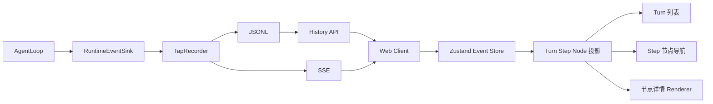

# DKAgent Tap Session 详情页设计

## 1. 目标

把 `packages/web-tap` 的原生 HTML Viewer 升级为一个用于学习和优化 DKAgent Harness 的可视化页面。

第一版聚焦一个 Session 的详情，不实现 Session 列表页。页面需要帮助使用者回答：

1. 每次用户输入后，AgentLoop 经历了哪些 Step 和运行节点？
2. 每个节点实际接收、产生了哪些字段？
3. 上下文压缩等功能为何触发，触发前后发生了什么？
4. 当前 Harness 流程中哪些环节值得继续调节和优化？

目标技术栈固定为：

- React + TypeScript；
- Vite；
- Ant Design；
- Zustand。

## 2. 核心层级

页面和事件数据统一采用以下层级：

```text
Session
└── Turn：每次用户输入产生一轮
    └── Step：AgentLoop 内部的一次模型循环
        └── Node：上下文、模型、Tool、结束、错误或功能事件
```

第一版虽然只有当前进程的一个 Session，前端状态和选择器仍保留 `sessionId`，以便未来增加 Session 列表页，而无需重写详情页。

### Turn

- 以 `turnId` 标识；
- 从 `turn.start` 开始；
- 以 `turn.end` 或 `turn.error` 结束；
- 每次新的用户输入新增一个 Turn；
- Turn 摘要优先显示用户输入、状态、Step 数和特殊功能标记。

### Step

- 对应 AgentLoop 的 `step = 1...maxSteps`；
- 一个 Turn 至少包含一个 Step；
- 模型产生 Tool Call 后，下一个 Step 会携带 Tool Result 继续调用模型；
- Step 不是左侧一级导航，只在右侧节点导航中作为分组。

### Node

Node 是页面最小的可选择单元。普通节点由 Runtime Event 映射，特殊功能可以由一个事件或一组相关事件派生。

## 3. MVP 范围

### 包含

- 展示当前 Session 的多个 Turn；
- 按 Step 分组展示选中 Turn 的 AgentLoop 节点；
- 展示节点关键字段，并对标题和关键字段进行汉化；
- 始终保留完整原始 JSON；
- 实时接收事件，断线后从 JSONL 补读；
- 展示节点的等待、进行中、完成和失败状态；
- 展示上下文构建前后结果；
- 上下文压缩触发时展示专属过程视图；
- Tap、HTTP、SSE 或前端失败时不影响 AgentLoop。

### 不包含

- Session 列表页；
- 网页内发起对话；
- 修改 Agent 参数或从页面控制 AgentLoop；
- 搜索、筛选、导出和跨 Session 对比；
- 模型厂商、费用和排行；
- 复杂流程编辑器或图表系统；
- 远程访问、登录和多人协作。

## 4. 页面信息架构

页面不使用面包屑。顶部只保留产品标题、实时连接状态和当前 Turn 的简要统计。

主体采用三栏结构：

```text
┌──────────────────────────────────────────────────────────┐
│ DKAgent Tap                        ● 实时监听             │
├──────────────┬────────────────────────────┬──────────────┤
│ Turn 列表     │ 节点详情                    │ 节点导航      │
│              │                            │              │
│ 第 1 轮       │ 关键字段（汉化）             │ Step 1       │
│ 第 2 轮       │ 消息 / Tool / Diff          │  ├ 上下文前   │
│ 第 3 轮       │ 原始 JSON                   │  ├ 上下文后   │
│              │                            │  └ 模型响应   │
│              │                            │ Step 2       │
└──────────────┴────────────────────────────┴──────────────┘
```

### 左栏：Turn 列表

- 每次 `turn.start` 新增一个 Turn Tab；
- 标题使用“第 N 轮”；
- 摘要显示用户输入，超长文本截断；
- 辅助信息显示 Step 数、Tool 调用数和状态；
- 出现上下文压缩或错误时显示文字标记，不只依赖颜色；
- 默认选中最新 Turn，用户手动选择历史 Turn 后不强制跳回。

### 中栏：节点详情

中栏只展示当前选中节点，避免同时堆叠所有事件。

详情由三部分组成：

1. 节点标题：中文名称、原始事件类型、Turn 和 Step；
2. 语义视图：按节点类型展示关键字段、消息、Tool 参数或前后对比；
3. 原始 JSON：折叠面板，支持复制，保证所有字段可检查。

汉化只作用于展示标签，不修改事件原始字段和值。例如：

| 原始字段 | 页面标签 |
| --- | --- |
| `maxContextTokens` | 最大上下文 |
| `reservedOutputTokens` | 输出预留 |
| `availableInputTokens` | 可用输入预算 |
| `estimatedInputTokens` | 估算输入 Token |
| `droppedMessageCount` | 移除消息数 |
| `systemPrompt` | 系统提示词 |
| `messages` | 消息列表 |
| `tools` | 工具定义 |
| `request` | 模型请求 |
| `response` | 模型响应 |

### 右栏：节点导航

- 显示当前 Turn 的全部节点；
- 使用 Step 作为分组标题；
- `turn.start` 放在 Step 1 的最前方；
- `turn.end`、`turn.error` 放在实际结束的 Step 下；
- Tool Call 和 Tool Result 可以分别选择，但在视觉上保持成对关系；
- 特殊功能节点插入实际发生位置；
- 点击节点后切换中栏详情；
- 新事件到达且用户仍在查看当前节点时，自动跟随最新节点；用户查看历史节点时不抢占选择。

## 5. 节点模型

前端不直接让组件理解所有 Runtime Event。先通过纯函数投影成稳定的 View Model：

```ts
interface TapTurnView {
  turnId: string;
  index: number;
  input: string;
  status: "running" | "completed" | "error";
  steps: TapStepView[];
  flags: Array<"context_compacted" | "tool_used">;
}

interface TapStepView {
  step: number;
  nodes: TapNodeView[];
}

interface TapNodeView {
  id: string;
  kind: TapNodeKind;
  title: string;
  eventType: string;
  status: "waiting" | "running" | "completed" | "error";
  eventIds: string[];
  detail: unknown;
  rawEvents: RuntimeEvent[];
}
```

组件只消费 `TapTurnView`、`TapStepView` 和 `TapNodeView`。新增事件类型时，优先扩展投影层和对应详情 Renderer，不修改三栏页面骨架。

## 6. 第一版节点

| Node | 来源 | 详情重点 |
| --- | --- | --- |
| 用户输入 | `turn.start` | 输入文本、时间、Turn ID |
| 构建上下文前 | `context.before` | 完整历史、System Prompt、Tool Schema、预算配置 |
| 构建上下文后 | `context.after` | 最终消息、Token 预算、移除消息数 |
| 模型请求 | `model.response.payload.request` | 实际提交给 Provider 的请求快照 |
| 模型响应 | `model.response.payload.response` | 文本、Tool Calls、Usage、Stop Reason |
| Tool 调用 | `tool.call` | 名称、参数、toolCallId |
| Tool 结果 | `tool.result` | 结果、错误和 toolCallId |
| 最终回答 | `turn.end` | 返回文本 |
| 运行错误 | `turn.error` | 错误消息和所在阶段 |

`model.response` 在事件层仍可保持单个事件，投影层将其呈现为“模型请求”和“模型响应”两个相邻节点，便于分别学习输入和输出。

## 7. 特殊功能节点

特殊功能节点用于解释 Harness 功能的内部过程，不等同于普通日志。

### 上下文直接裁剪

当同一 `turnId + step` 的 `context.before` 与 `context.after` 存在差异，且 `droppedMessageCount > 0` 时，派生“上下文裁剪”节点，展示：

- 触发原因；
- 最大上下文、输出预留和可用输入预算；
- 裁剪前后消息数与 Token；
- 被移除的消息组；
- Tool Call / Result 是否完整保留；
- Before、After 和原始事件 JSON。

### 历史摘要压缩

随着 DKAgent Context Compressor 完善，压缩过程需要独立运行时事件。建议事件只描述事实，不包含 Tap 展示概念：

```text
context.compaction.start
context.compaction.end
context.compaction.error
```

详情至少包含：

- 触发阈值与触发时 Token；
- 压缩前历史范围；
- 旧摘要；
- 本次新增摘要范围；
- 新摘要；
- 压缩前后 Token；
- `firstKeptMessageIndex` 和累计压缩次数；
- 失败原因及采用的兜底策略。

第一版 UI 预留 `feature renderer` 注册点。如果 Agent 尚未发送上述事件，页面不伪造摘要压缩过程，只展示可由 `context.before/after` 证明的直接裁剪结果。

## 8. 前端模块

```text
packages/web-tap/
├── src/
│   ├── server/              # Node HTTP、SSE、静态资源
│   ├── recorder/            # JSONL 记录与读取
│   └── web/
│       ├── app/             # React 入口与 Ant Design ConfigProvider
│       ├── api/             # history client、SSE client
│       ├── store/           # Zustand 原始事件与选择状态
│       ├── model/           # Event -> Turn/Step/Node 投影
│       ├── features/
│       │   ├── turns/       # 左栏 Turn 列表
│       │   ├── timeline/    # 右栏 Step/Node 导航
│       │   ├── node-detail/ # 中栏详情容器
│       │   └── compaction/  # 上下文功能详情
│       └── shared/          # 通用字段、JSON、状态组件
├── index.html
└── vite.config.ts
```

### Zustand 状态边界

Store 只保存跨栏共享的最小状态：

```ts
interface TapStore {
  events: RuntimeEvent[];
  connectionStatus: "connecting" | "live" | "reconnecting" | "error";
  selectedSessionId: string | null;
  selectedTurnId: string | null;
  selectedNodeId: string | null;
}
```

Turn、Step、Node、统计值和 Diff 都由 selector 或纯投影函数派生，不重复写入 Store，避免事件状态和页面状态产生两份真相。

### Ant Design 组件边界

- 页面骨架：`Layout`；
- Turn 列表：`List` 或轻量自定义按钮列表；
- 节点导航：`Steps` 或 Timeline 语义的组合组件；
- 字段展示：`Descriptions`；
- 消息与功能区块：`Collapse`、`Card`；
- 原始 JSON：原生 `pre/code` 包在 `Collapse` 中；
- 状态：`Badge`、`Tag`、`Alert`；
- 复制：`Button` + Clipboard API。

实现前必须通过 Ant Design CLI 核对项目实际安装版本的组件 API。

## 9. 数据流



事件仍是唯一运行事实。Tap 不向 AgentLoop 写入配置，不允许从页面修改 Context、Tool 或模型请求。

## 10. 构建与运行

- Vite 开发模式负责 React HMR；
- 生产构建输出到 `packages/web-tap/dist`；
- TapServer 在 `npm run observe` 时托管静态构建产物；
- History API 与 SSE 路径继续保持 `/api/events` 和 `/api/events/stream`；
- 本地服务继续只监听 `127.0.0.1`；
- Agent 与 web-tap 的依赖方向继续是 `web-tap -> agent public runtime events`。

## 11. 错误与隐私

- SSE 断开时显示“重连中”，重连后先补读历史再合并实时事件；
- 事件按 ID 去重，按 Session 首次时间和 sequence 排序；
- 未识别事件展示为“未知节点”，仍可查看原始 JSON；
- 单个详情 Renderer 失败时降级为原始 JSON，不能让整个页面白屏；
- Trace 继续在 Recorder 写入前脱敏；
- 页面不加载外部业务资源，不向远程服务发送 Trace；
- Tap 故障不得传播到 AgentLoop。

## 12. 验证

### 单元测试

- 事件正确投影为 `Session -> Turn -> Step -> Node`；
- 每个 `turn.start` 生成一个且只生成一个 Turn；
- 多 Step Tool Loop 的节点顺序正确；
- Model Request 和 Response 可从单个事件投影为两个节点；
- Context Before/After 正确派生裁剪节点和消息 Diff；
- 完整 Tool Call / Result 不会在 Diff 中被拆散；
- 未识别事件降级为通用节点；
- Zustand selectors 不修改原始事件。

### 组件测试

- 选择 Turn 会更新右侧 Step/Node；
- 选择 Node 会更新中栏详情；
- 原始 JSON 可展开和复制；
- 新事件的自动跟随不会打断历史查看；
- 错误、加载、空数据和断线状态均有明确反馈。

### 集成测试

- 首次加载读取 JSONL 历史；
- SSE 事件实时追加；
- 断线期间事件可在重连后补齐；
- Vite 构建产物能由 TapServer 正常托管；
- `npm run observe` 仍能同时启动 Agent CLI 与 Viewer。

### 人工验收

1. 连续输入至少三次，左栏出现三个 Turn；
2. 一轮普通文本回答只包含一个 Step；
3. 一轮 Tool 调用按 Step 展示 Tool Call、Result 和后续模型请求；
4. 降低 Token 预算触发上下文裁剪，能看到触发原因和前后差异；
5. 每个节点都能查看汉化关键字段与完整原始 JSON；
6. 关闭浏览器后 Agent 继续工作，重新打开后历史恢复。

## 13. 扩展边界

未来新增 Session 列表页时：

- 路由增加 Session List 和 Session Detail；
- 列表页只负责选择 `sessionId`；
- 本设计的详情页通过 `sessionId` 加载，不改变 Turn、Step、Node 结构。

未来新增 Memory、RAG、子 Agent、审批或 Harness Hook 时：

- Agent Runtime 新增中立事件；
- 投影层注册新的 `TapNodeKind`；
- `node-detail` 注册对应 Renderer；
- 不修改三栏布局和既有事件含义。

## 14. 完成标准

- `packages/web-tap` 使用 React、Vite、Ant Design、Zustand；
- 页面不包含 Session 列表和面包屑；
- 左栏按用户输入展示 Turn；
- 右栏按 Step 分组展示当前 Turn 的 Node；
- 中栏展示节点汉化字段、语义视图和原始 JSON；
- Tool Loop 与上下文裁剪过程可被准确理解；
- 未识别的新事件仍可降级展示；
- Agent Core 不依赖 web-tap；
- Tap 故障不影响 AgentLoop；
- 自动测试和人工验收均通过，且不新增 Agent 原有测试失败。
