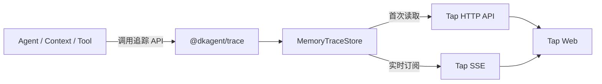

# DKAgent Trace 日志最小 MVP 设计

## 目标

新增一套与 Agent 业务状态解耦的结构化 Trace 日志。Agent 运行时记录模型循环、Context 构建与压缩、模型请求响应、Tool 调用结果；Tap 从内存日志读取并实时展示。

第一版用于本地学习和流程分析，不落库，不建设通用日志平台。

## 核心原则

1. Agent 只保存执行 Agent 所必需的数据。
2. 日志 ID、时间、顺序、耗时、展示统计等字段全部定义在 Trace 模块。
3. Tap 只消费 Trace，不读取 Agent 内部状态。
4. 日志失败不得改变 Agent 的执行结果。
5. 技术字段保持英文，Tap 对节点名和常用字段做词级汉化。

## Pi 参考边界

借鉴 Pi 的 Observability 思路：核心模块只发出稳定的结构化生命周期事件，外部监听器决定如何转换为日志、界面或监控；观测订阅者是被动能力，失败不得影响 Agent。

第一版不照搬 Pi 的 Session JSONL、扩展系统、OpenTelemetry 适配器和跨运行时上下文，只实现 DKAgent 当前学习场景需要的最短链路。

## 模块边界



### `packages/agent`

- 在关键流程调用 Trace API。
- 不生成 Trace 专属字段。
- 不依赖 Tap、HTTP、SSE 或具体存储。
- 未注入 Tracer 时使用空实现，保持原有行为。

### `packages/trace`

第一版控制为五个文件：

```text
packages/trace/src/
├── types.ts
├── tracer.ts
├── memory-store.ts
├── sanitize.ts
└── index.ts
```

- `types.ts`：事件、Sink、Store 接口。
- `tracer.ts`：创建 Trace、Span 和过程事件，自动处理时间、顺序、耗时与异常。
- `memory-store.ts`：内存缓存、完整读取和实时订阅。
- `sanitize.ts`：安全序列化与敏感字段脱敏。
- `index.ts`：公共导出。

### `packages/web-tap`

- HTTP 返回当前内存事件。
- SSE 推送新增事件。
- 将事件投影为“用户对话轮次 → Step → 节点”。
- 维护事件名和字段名的中文词典。
- 未适配的新事件降级展示原始 JSON。

## 最小日志契约

```ts
interface TraceEvent {
  id: string;
  traceId: string;
  spanId?: string;
  parentSpanId?: string;
  sequence: number;
  timestamp: string;
  durationMs?: number;
  name: TraceEventName;
  phase: "start" | "event" | "end" | "error";
  step?: number;
  data: unknown;
}

interface TraceSink {
  emit(event: TraceEvent): void;
}

interface TraceStore extends TraceSink {
  list(): TraceEvent[];
  subscribe(listener: (event: TraceEvent) => void): () => void;
}
```

每次用户输入创建一个 `traceId`。Agent Loop、Context、模型和 Tool 操作使用同一 Trace；`step` 对应模型循环次数。

Tracer 提供可读的最小调用方式：

```ts
return tracer.span("context.build", { input }, async (span) => {
  span.event("context.tokens.counted", {
    stage: "before_compaction",
    tokens,
  });

  const snapshot = await buildContext();
  span.setOutput(snapshot);
  return snapshot;
});
```

## 第一版事件

只定义当前 DKAgent 已有能力需要的事件：

- `agent.turn`
- `agent.step`
- `context.build`
- `context.snapshot.created`
- `context.tokens.counted`
- `context.threshold.checked`
- `context.compaction.planned`
- `context.summary.request`
- `context.summary.response`
- `context.compaction.completed`
- `model.request`
- `model.response`
- `tool.call`
- `tool.result`

模型输入输出、Tool 参数结果、Context 前后内容均完整记录。以下字段无条件脱敏：API Key、Authorization、Headers、环境变量。

## Context 压缩日志

压缩过程按真实执行顺序记录：

1. 构建原始快照。
2. 计算压缩前 Token。
3. 判断是否达到触发阈值。
4. 选择待摘要和保留的消息。
5. 记录摘要模型输入。
6. 记录摘要模型输出或失败。
7. 重建最终 Context。
8. 计算压缩后 Token。
9. 记录最终业务模型输入。

`context.tokens.counted` 的 `stage` 第一版支持：

- `before_compaction`
- `after_compaction`
- `final_request`

`context.compaction.completed` 至少记录：

```ts
{
  tokensBefore: number;
  tokensAfter: number;
  tokensSaved: number;
  savedRatio: number;
  summarizedMessageCount: number;
  retainedMessageCount: number;
  fallbackUsed: boolean;
}
```

## Agent 状态清理

Trace 接入后，Agent 状态只保留执行必需字段：

- `ConversationContextState` 保留 `summary` 和 `firstKeptMessageIndex`。
- `ContextSnapshot` 保留模型请求需要的 `systemPrompt`、`messages`、`tools`，以及 Agent 后续运行需要的 `nextContextState`。
- 当前仅用于观察的 Token 统计、压缩次数、丢弃数量、前后差异和兜底标记迁移到 Trace 事件，不继续污染 Agent 返回类型。

Token 等中间值仍可作为 Context 算法内部局部变量使用，但不为 Tap 扩充业务对象。

## Tap 汉化

底层事件名和 JSON Key 保持英文。Tap 使用简单映射进行词级汉化：

```ts
const eventLabels = {
  "context.tokens.counted": "计算 Token",
  "context.compaction.completed": "Context 压缩完成",
  "model.request": "模型请求",
};

const fieldLabels = {
  tokensBefore: "压缩前 Token",
  tokensAfter: "压缩后 Token",
  tokensSaved: "节省 Token",
};
```

不引入完整国际化框架。

## 组合与数据流

`web-tap` 的 observe 启动入口负责组装 `MemoryTraceStore`、Tracer、Agent 和 Tap Server。Agent 及其子模块只接收追踪抽象，不知道日志最终被 Tap 消费。

```text
用户输入
  → 创建 Trace
  → Agent Loop 记录事件
  → MemoryTraceStore
  → HTTP 首次加载 / SSE 实时推送
  → Tap 投影并汉化
```

内存 Store 设置固定容量，超过容量时删除最旧事件，避免长期运行无限占用内存。第一版不提供筛选、分页或全文搜索。

## 异常处理

- Span 自动记录 `error`，Agent 继续按原逻辑抛出业务异常。
- Sink、Store、订阅者和序列化异常全部在 Trace 边界隔离。
- 脱敏后的同一份事件同时用于历史读取和 SSE，避免实时数据泄漏。
- 循环引用等无法序列化内容降级为安全错误描述。

## 开发与审核方式

为控制实现和上下文 Token，本日志模块不采用 TDD，也不新增专项自动化测试。

完成标准：

1. 开发者逐文件审查模块边界和事件字段归属。
2. 审查普通回答、Tool Loop、Context 压缩和异常路径的事件链。
3. 运行 TypeScript 类型检查。
4. 运行现有相关回归检查，确认 Agent 与 Tap 原能力未被破坏。
5. 手工查看 Tap，确认压缩流程、Token 前后对比和词级汉化。

## 非目标

第一版不实现：

- Session 列表和 Session 持久化。
- JSONL、数据库或日志文件。
- OpenTelemetry、Sentry 和跨进程追踪。
- 日志级别、全文搜索、复杂过滤和分页。
- 为尚未实现的记忆、Skill、子 Agent 预建事件。
- 完整国际化框架。
