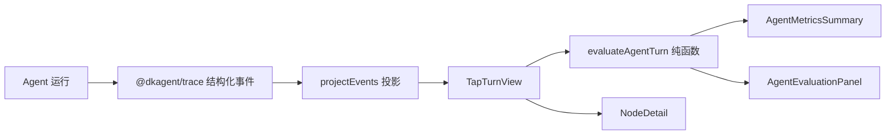

# Web Tap Agent 指标下一版本设计

## 目标

在现有 `Turn → Step → Node` 运行详情上增加两类能力：

1. 用紧凑指标概括当前 Turn 的 Agent 运行表现。
2. 用确定性规则检查 Agent 轨迹是否完整、是否出现明确错误。

同时新增 `packages/web-tap/WEB-TAP.md`，说明项目背景、架构、边界和开发规则，作为 Web Tap 的长期入口文档。

本版本不计算综合分，不使用 LLM Judge，不把无法从 Trace 证明的质量结论标记为通过。

## 评价原则

Tap 必须区分三类信息：

| 类型 | 含义 | 示例 |
| --- | --- | --- |
| 可观测事实 | Trace 中直接记录或可以确定计算 | 总耗时、Step 数、Token、Tool 调用次数 |
| 规则判断 | 根据明确规则和 Trace 证据得出 | Tool Call/Result 完整、压缩后 Token 下降 |
| 待评测 | 当前缺少参考答案、外部证据或语义评测器 | 幻觉、答案正确性、压缩语义保真度 |

“没有发现错误”不能表达为“答案正确”；“Token 下降”不能表达为“压缩策略合理”。

## 页面设计

保持当前三栏结构：

```text
┌────────────┬────────────────┬────────────────────────────────┐
│ Turn 列表   │ Node 导航       │ Detail                         │
│ 固定宽度     │ 固定宽度         │ 自适应宽度                       │
│            │                │ AgentMetricsSummary            │
│            │                │ AgentEvaluationPanel           │
│            │                │ NodeDetail                     │
└────────────┴────────────────┴────────────────────────────────┘
```

### `AgentMetricsSummary`

位于 Detail 顶部，随选中的 Turn 更新，第一版展示：

- 状态：进行中、已完成或失败。
- 总耗时：根 `agent.turn` 的结束或错误事件耗时；运行中显示“计算中”。
- Step 数：当前 Turn 的实际 Step 数。
- 模型调用：`model.request` 的启动次数。
- Tool 调用：调用总数和成功数。
- Token：所有业务 `model.response` 的输入与输出 Token 合计；不重复累加摘要模型调用。
- Context 压缩：完成次数，以及最新一次压缩的前后 Token 和节省比例。

缺失的数据统一显示“未记录”，不使用 `0` 冒充未知值。

### `AgentEvaluationPanel`

显示确定性检查和当前无法判断的 Agent 质量项。检查状态统一为：

```ts
type EvaluationStatus = "passed" | "warning" | "failed" | "unknown";
```

第一版规则：

| 检查项 | 通过 | 失败/警告 | 未知 |
| --- | --- | --- | --- |
| Turn 完成状态 | 存在正常 `agent.turn.end` | 存在 `agent.turn.error` | 仍在运行或事件不完整 |
| 模型调用完整性 | 每个已结束 Step 的请求都有响应 | 已结束 Turn 存在未配对请求 | Turn 仍在运行 |
| Tool 链完整性 | 每个 Tool Call 都有相同调用 ID 的 Result | 已结束 Turn 存在缺失或孤立 Result | Turn 仍在运行 |
| Tool 执行结果 | 所有 `result.success` 都为 `true` | 明确存在 `success: false` | 旧事件没有 `success` 字段 |
| 循环效率 | 正常完成，且未发生超限错误 | 出现“超过最大循环次数”错误 | 不评价 Step 数是否业务最优 |
| Context 压缩结果 | 压缩后 Token 小于压缩前 Token | 压缩后没有下降 | 未触发压缩或缺少 Token |
| 幻觉 | 不自动判断 | 不自动判断 | 始终为“待评测：需要事实依据” |
| 压缩语义保真度 | 不自动判断 | 不自动判断 | 始终为“待评测：需要原文语义比较” |
| 最终答案质量 | 不自动判断 | 不自动判断 | 始终为“待评测：需要参考答案或人工评价” |

每项展示一句中文结论和简短依据。规则只消费 Trace，不向 Agent 增加评价字段。

## 前端数据模型

指标和检查结果属于 Tap 投影模型，定义在 `packages/web-tap`：

```ts
interface AgentTurnMetrics {
  status: "running" | "completed" | "error";
  durationMs?: number;
  stepCount: number;
  modelCallCount: number;
  toolCallCount: number;
  successfulToolCallCount?: number;
  inputTokens?: number;
  outputTokens?: number;
  compactionCount: number;
  latestCompaction?: {
    tokensBefore: number;
    tokensAfter: number;
    savedRatio: number;
  };
}

interface AgentEvaluationItem {
  id: string;
  label: string;
  status: "passed" | "warning" | "failed" | "unknown";
  summary: string;
  evidenceEventIds: string[];
}
```

实现一个纯函数，从当前 `TapTurnView` 的 `rawEvents` 聚合结果。为了避免重新读取 Agent 类型，`TapTurnView` 增加属于投影层的原始事件集合；不修改 `TraceEvent` 和 Agent 业务对象。

## 组件与边界



### `packages/agent`

- 不增加评价字段。
- 不依赖 Web Tap 的指标或规则。
- 本版本不修改 Agent 行为。

### `packages/trace`

- 保持通用事实日志，不保存“是否合理”“是否幻觉”等结论。
- 本版本不新增 Trace 事件。

### `packages/web-tap`

- 聚合 Trace 数据并计算展示指标。
- 保存确定性评价规则和中文说明。
- 未知字段继续降级显示原始 JSON。
- React 组件只渲染计算结果，不在组件内重复遍历或解释原始事件。

## 项目描述文件

新增 `packages/web-tap/WEB-TAP.md`，包含：

1. 项目背景和学习目标。
2. 当前能力和启动方式。
3. `Trace → Store → HTTP/SSE → Zustand → Projection → UI` 架构图。
4. `Turn → Step → Node` 页面数据模型。
5. Agent、Trace、Tap 三者边界。
6. 中文展示、原始技术字段、未知事件降级、脱敏等规则。
7. 当前非目标和后续可扩展方向。

该文档只描述已经实现的能力和本版本新增能力，不把 Session、数据库、LLM Judge 写成现有事实。

## UI 实现约束

- 使用现有 React、Zustand、Ant Design 和 CSS Flex。
- 指标使用紧凑 Card/Descriptions，不新增图表依赖。
- 检查结果使用语义化状态颜色和文字，不能只依赖颜色。
- 不为简单派生值新增 Zustand 状态；从当前选中 Turn 同步计算。
- 聚合逻辑集中在纯函数中，避免组件渲染期间多次遍历 Trace。
- 移动端保持无水平溢出，指标允许自动换行。

## 异常与兼容

- 旧 Trace 缺少 `durationMs`、`usage` 或 `result.success` 时显示未知。
- Turn 尚未结束时，未配对的模型或 Tool 节点不立即判为失败。
- 未识别事件不参与规则计算，但仍保留在节点详情的原始 JSON 中。
- 指标计算异常由现有详情错误边界隔离，不能使左右导航消失。

## 验证

自动检查：

1. 纯函数覆盖完成、运行中、失败、旧事件缺字段、Context 压缩和 Tool 失败场景。
2. 组件测试确认中文指标、四种检查状态和“待评测”文案。
3. 运行 Web Tap 全量测试、类型检查和构建。
4. 使用 Ant Design CLI 检查新增组件 API 和 lint。

手工检查：

1. 运行普通回答、Tool Loop 和 Context 压缩场景。
2. 切换 Turn 后指标与规则结果同步更新。
3. 桌面端和 390px 宽度无横向溢出。
4. 确认幻觉、压缩语义保真度和答案质量没有被错误标记为通过。

## 非目标

本版本不实现：

- 综合 Agent 分数和指标权重。
- LLM-as-a-Judge、人工标注和参考答案管理。
- Session 列表、数据集和实验对比。
- 时间瀑布图、趋势图和聚合监控看板。
- 数据库、日志持久化和 OpenTelemetry 导出。
- 修改 AgentLoop、Context 压缩策略或 Tool 行为。
