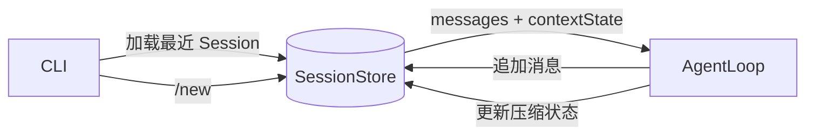

# DKAgent Session MVP 设计

## 目标

第一阶段只实现普通对话 Session：程序重启后自动恢复最近一次对话，输入 `/new` 创建全新对话。

本阶段不实现 Memory、状态机、Checkpoint、回滚、分支、事件回放和面试诊断进度。

## 成功标准

```text
启动 → 对话数轮 → 退出
→ 再次启动 → 恢复最近对话和压缩状态
→ 模型继续回答
→ 输入 /new → 进入空白 Session
```

## 架构



### 必要模块

| 模块 | 职责 | 必要原因 |
|---|---|---|
| `session/types.ts` | 定义 Session 快照和持久化端口 | 隔离 AgentLoop 与 SQLite |
| `session/store.ts` | 创建、恢复 Session，追加消息并保存 Context 状态 | 提供跨进程持久化 |
| CLI 集成 | 启动时恢复最近 Session，处理 `/new` | 让持久化能力可被用户使用 |
| AgentLoop 集成 | 从快照初始化，并在状态变化时调用持久化端口 | 保证内存状态和持久化状态同步 |

不增加 `SessionManager`：MVP 没有状态机和任务编排，额外 Manager 只会转发 Store 调用。

## 数据模型

### sessions

| 字段 | 作用 |
|---|---|
| `id` | Session 唯一标识 |
| `summary` | Context 历史摘要 |
| `first_kept_message_index` | 第一条仍保留原文的消息下标 |
| `created_at` | 创建时间 |
| `updated_at` | 最近更新时间，用于选择最近 Session |

### session_messages

| 字段 | 作用 |
|---|---|
| `id` | 自增顺序标识 |
| `session_id` | 所属 Session |
| `message_json` | 完整 AgentMessage，保留 Tool 字段 |
| `created_at` | 写入时间 |

原始消息只追加、不覆盖；Context 压缩状态允许覆盖。这是从普通数据库方案向事件流方案演进时保留的关键原则。

## 核心接口

```typescript
interface SessionStore {
  create(): SessionSnapshot;
  loadLatest(): SessionSnapshot | null;
  appendMessage(sessionId: string, message: AgentMessage): void;
  saveContextState(
    sessionId: string,
    state: ConversationContextState,
  ): void;
}
```

`SessionSnapshot` 包含 `sessionId`、完整 `messages` 和 `contextState`。

## 数据流

### 启动

```text
CLI → loadLatest()
    → 有 Session：用 messages + contextState 创建 AgentLoop
    → 无 Session：create() 后创建空 AgentLoop
```

### 每轮对话

```text
用户消息 → 先持久化 → 加入 AgentLoop
ContextManager.build()
    → contextState 变化 → 保存最新状态
模型返回
    → Assistant/Tool 消息逐条持久化并加入 AgentLoop
```

持久化失败时不允许只更新内存，避免当前进程看似成功、重启后数据消失。

### 新建会话

```text
/new → create() → 创建新的空 AgentLoop
```

旧 Session 保留，但 MVP 不提供列表和手动切换能力。

## 错误处理

- 数据库无法打开：CLI 启动失败并显示原因。
- 消息写入失败：停止本轮，不更新对应内存状态。
- Session 数据无法解析：明确报错，不静默创建新 Session。
- 模型调用失败：保留已经写入的用户消息，不伪造 Assistant 回复。

模型失败后无法准确描述一轮执行到了哪个阶段，这是方案 B 的已知限制，不在 MVP 内增加补丁式状态字段。

## 测试标准

1. 创建 Session 后，关闭并重新打开数据库可以恢复。
2. User、Assistant、Tool 消息按原顺序和完整结构恢复。
3. `summary` 与 `firstKeptMessageIndex` 可以恢复。
4. `/new` 创建空 Session，不修改旧 Session。
5. 持久化失败时，不产生只存在于 AgentLoop 内存的消息。

## 向事件流方案演进

| 使用方案 B 遇到的问题 | 方案 C 增加的能力 |
|---|---|
| 不知道一轮是否完整执行 | `TurnStarted/TurnFailed/TurnCompleted` |
| 无法回到历史节点 | `parentId + leafId` |
| Context 状态只有最新版 | `CompactionCreated` |
| Tool 执行中断后状态不明确 | `ToolStarted/ToolCompleted` |
| 无法追溯当前状态形成原因 | 事件回放 |

Memory 不属于方案 C 的自动产物。事件流只为 Memory 提取提供可信原始证据；MemoryStore、提取规则和检索将在 Session MVP 之后单独设计。
