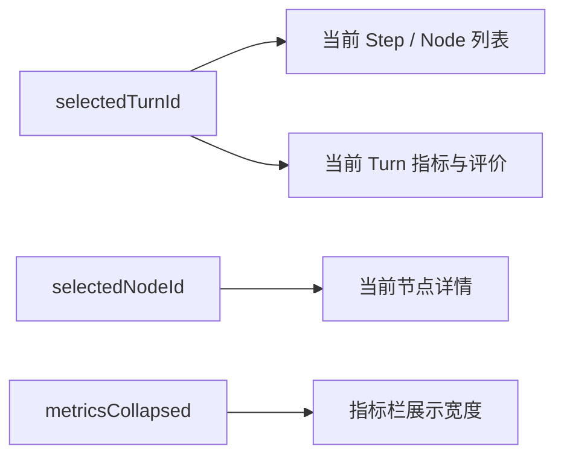
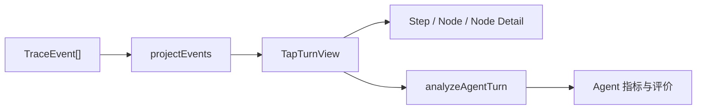

# Web Tap 工作区交互与视觉重设计

## 背景

Web Tap 当前使用 `Turn 列表 → Node 导航 → Detail` 三栏结构，并把 Agent 运行指标放在节点详情上方。这种布局在视觉上容易让人误解为：Agent 指标属于当前 Node。

实际逻辑是：

- 一次用户输入产生一个 Turn。
- 一个 Turn 包含多个 Step，每个 Step 包含多个 Node。
- Agent 运行指标汇总当前 Turn 的全部 Trace。
- 节点详情只解释当前选中的 Node。

因此，Agent 运行指标和执行过程应该是当前 Turn 下的并行模块；节点详情则是执行过程内部的下钻内容。

## 目标

1. 正确表达 Turn、执行过程、Agent 指标和节点详情的逻辑关系。
2. 提升高密度 Trace、JSON 和指标信息的可读性。
3. 保留当前最小 MVP，不改变 Agent、Trace 和指标计算逻辑。
4. 在桌面、平板和移动端提供明确且可操作的响应式布局。

## 已确认方案

采用“同屏双工作区 + 可折叠指标栏”：

```text
TapApp
├─ 产品栏：DKAgent Tap、连接状态
└─ 当前运行详情
   ├─ 对话轮次 TurnList
   └─ TurnWorkspace
      ├─ 当前 Turn 标题、状态、摘要
      └─ TurnContent
         ├─ ExecutionWorkspace
         │  ├─ Step / Node 导航
         │  └─ 当前节点详情
         └─ AgentInsightsRail
            ├─ Agent 运行指标
            ├─ Trace 规则判断
            └─ 待评测项
```

桌面布局：

```text
┌──────────┬──────────────────────────────────┬──────────────┐
│ 对话轮次 │ 执行过程                         │ Agent 指标   │
│ 240px    │ Step 300px + Node Detail 自适应  │ 320px/折叠  │
└──────────┴──────────────────────────────────┴──────────────┘
```

指标栏默认展开，可以一键折叠。折叠后保留窄栏，展示展开按钮和需关注/失败数量。第一版不实现拖拽调整宽度。

## 信息层级

### 对话轮次

`TurnList` 选择当前 Turn。每个条目继续展示：

- 用户输入摘要。
- Step 数量。
- Tool 调用数量。
- 进行中、已完成或错误状态。

选择 Turn 后，同时更新执行过程和 Agent 指标。

### 执行过程

`ExecutionWorkspace` 包含两部分：

1. `NodeNav`：按照 Step 分组展示 Node。
2. `NodeDetail`：展示当前 Node 的中文字段和原始 JSON。

选择 Step/Node 只更新节点详情，不重新定义 Agent 指标的范围。

### Agent 指标

`AgentInsightsRail` 始终属于当前 Turn，内部按以下顺序展示：

```text
Agent 运行指标
├─ 运行事实
│  Step、耗时、模型调用、Tool、Token、Context 压缩
├─ Trace 规则判断
│  调用链完整性、Tool 结果、循环上限、压缩结果
└─ 待评测
   幻觉、答案质量、压缩语义保真度
```

“运行事实”“规则判断”“待评测”的证据边界保持不变，不增加综合分或语义推断。

## 选择与联动



状态职责：

```ts
selectedTurnId
  // 决定执行过程和 Agent 指标

selectedNodeId
  // 只决定节点详情

metricsCollapsed
  // 只控制指标栏展开/收起
```

`selectedTurnId` 和 `selectedNodeId` 继续由 Zustand 管理。`metricsCollapsed` 是局部界面状态，第一版使用 React 本地状态，不写入 Trace，也不增加全局 Store 状态。

实时跟随逻辑保持现状：当用户仍查看最新 Turn/Node 时，新增 Trace 继续跟随；查看历史 Turn/Node 时不强制跳回最新位置。

## 组件设计

```text
TapApp
├─ TapHeader                  新增产品栏
├─ TurnList                  保留，调整视觉
└─ TurnWorkspace             新增布局容器
   ├─ TurnHeader             当前轮次摘要
   ├─ ExecutionWorkspace     新增执行过程容器
   │  ├─ NodeNav             保留，调整视觉
   │  └─ NodeDetail          保留
   └─ AgentInsightsRail      新增可折叠容器
      ├─ AgentMetricsSummary 保留
      └─ AgentEvaluationPanel 保留
```

组件边界遵循：

- `TapApp` 只负责选择数据、建立事件连接和组合布局。
- `TurnWorkspace` 只负责当前 Turn 的页面结构。
- `ExecutionWorkspace` 不计算指标。
- `AgentInsightsRail` 不解释原始 Trace，只渲染 `analyzeAgentTurn` 的结果。
- 现有投影函数、指标分析函数和 Node renderer 继续保持独立。

为控制 MVP 规模，不为单次复用创建额外通用布局库。

## 视觉方向

采用“精密观测台”风格：

- 深蓝产品栏建立 DKAgent Tap 的工具辨识度。
- 雾灰工作区承载页面背景。
- 白色面板承载 Turn、执行过程、Node Detail 和指标。
- 减少大面积边框，使用背景层级、间距和细分隔线组织信息。
- 蓝色只表示当前选择和运行中。
- 绿色表示通过，橙色表示需关注，红色表示失败。
- 状态信息必须同时有文字或图标，不能只依赖颜色。
- JSON、事件名和 Token 使用等宽字体；中文说明使用系统字体。
- 不引入装饰性图表、渐变背景和无意义动画。

交互状态包括：

- Turn、Node、折叠按钮的 hover 状态。
- 明确的选中状态。
- `:focus-visible` 键盘焦点。
- 指标栏展开/折叠的短时 CSS 过渡；遵守 `prefers-reduced-motion`。

原始 JSON 默认折叠，避免抢占中文字段的阅读重点；展开后只在代码区域内部横向滚动。

## 响应式规则

### 桌面端：宽度不小于 1280px

- Turn 列表宽度约 240px。
- Step/Node 导航宽度约 300px。
- Node Detail 使用剩余空间。
- Agent 指标栏宽度约 320px，默认展开。

### 平板与窄桌面：768px 至 1279px

- Turn 列表适当缩窄。
- Agent 指标栏默认折叠，用户可以主动展开。
- Step/Node 导航保持固定宽度，Node Detail 使用剩余空间。

### 移动端：小于 768px

- 页面只保留一个主内容区。
- Turn 列表通过抽屉打开。
- Agent 指标通过抽屉打开。
- Step/Node 导航和节点详情在主区内纵向组织。
- 页面整体不产生横向滚动。

响应式切换只改变展示形式，不清除当前 Turn、Node 和指标内容。

## 数据流与边界

数据计算保持不变：



本版本不修改：

- AgentLoop。
- Trace 事件协议。
- Agent 指标和评价规则。
- Context 压缩策略。
- Session 功能。
- 日志持久化。

Agent 和 Trace 不依赖页面布局或折叠状态。

## 空状态与异常

- 未选择 Turn：执行区和指标栏分别展示中文空状态。
- 指标字段缺失：继续展示“未记录”，不使用 `0` 代替未知值。
- 未识别节点：继续降级展示原始 JSON。
- 节点渲染失败：现有错误边界保留 Turn、Step 和指标区域，并展示安全 JSON。
- SSE 断开：产品栏显示“正在重连”或“连接异常”。
- 指标栏折叠和响应式切换不能改变数据选择状态。

## 实现范围

主要修改范围：

- `packages/web-tap/src/web/app/TapApp.tsx`
- `packages/web-tap/src/web/styles.css`
- `packages/web-tap/src/web/features/turns/TurnList.tsx`
- `packages/web-tap/src/web/features/timeline/NodeNav.tsx`
- `packages/web-tap/src/web/features/agent-metrics/*`
- 必要的新布局组件及相关 Web 测试

不修改 `packages/agent` 和 `packages/trace`。

## 验证标准

自动验证：

1. 切换 Turn 后，执行过程和指标同时更新。
2. 切换 Node 时，指标内容不发生变化。
3. 指标栏展开、折叠后，Turn 和 Node 选择不丢失。
4. 空状态和连接状态显示正确。
5. 运行 Web Tap 现有测试、类型检查和构建。
6. 使用 Ant Design 规则检查组件 API 和用法。

真实页面验证：

1. 在普通 Turn、Tool Turn 和 Context 压缩 Turn 下检查布局。
2. 桌面、平板和 390px 页面无整体横向溢出。
3. Turn、Step、Node 和指标栏按钮可通过键盘操作。
4. 指标栏展开/折叠时 Node Detail 保持可读。
5. 浏览器控制台没有本版本新增错误。

## 非目标

- 可拖拽分栏。
- 用户自定义面板顺序和宽度。
- 深色模式。
- 图表、趋势和跨 Turn 对比。
- 综合 Agent 分数。
- LLM Judge 和人工评价入口。
- 修改 Agent 或 Trace 的运行行为。
