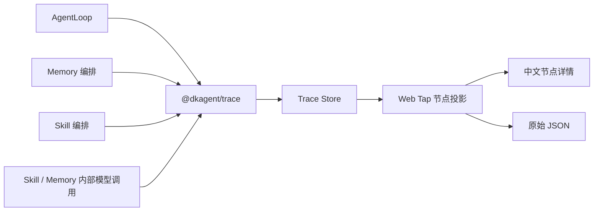

# Memory 与 Skill Trace 设计

## 背景

DKAgent 已经能把 AgentLoop、Context、主模型、顶层 Tool 和部分 Memory 行为记录到 `@dkagent/trace`，Web Tap 再将事件投影成 Session → Turn → Step → Node。

当前存在两个观测缺口：

1. `memory.recall`、`memory.extract`、`memory.write` 已是合法 Trace 事件，但 Web Tap 没有对应节点定义，因此会降级成“未知事件”。
2. `diagnose-transcript` Skill 内部会执行多个阶段并直接调用 QueryEngine。这些调用没有经过 AgentLoop 的主模型 Trace，所以 Tap 只能看到外层 `analyze_interview` Tool，看不到 Skill 的阶段及模型输入输出。

本设计补齐 Memory、Skill 和其内部模型调用的 Trace，同时保持 Agent 业务对象、Memory 业务对象与 Tap 展示模型解耦。

## 目标

1. Memory 召回、提取和写入在 Tap 中成为有中文标题的正式节点。
2. `diagnose-transcript` 可以展示技能开始、关键阶段、结束和失败。
3. Skill 内部每次真实模型调用均记录成可配对的模型请求和响应，并能看出所属阶段。
4. Memory 提取模型调用可见，但不记录用户原文、回答原文和完整 Memory content。
5. Agent 运行指标统计本轮所有真实模型调用；顶层 Tool 指标不被 Skill 内部流水线污染。
6. Trace 缺失、关闭或失败时，不改变 Agent、Memory、Tool 和 Skill 的业务结果。

## 非目标

- 不给 `AgentMessage`、`ConversationContextState`、`MemoryEntry`、Tool 参数或 Skill 结果增加 Tap 展示字段。
- 不在 QueryEngine 全局自动打点。
- 不把 Skill 内部函数伪装成 Agent 发起的 `tool.call`。
- 不实现 Trace 数据库、分布式链路、采样、搜索、瀑布图或成本换算。
- 不记录完整 Memory content，也不提供从 Raw JSON 绕过脱敏的入口。
- 不重做 Web Tap 布局、节点详情组件和原始 JSON 组件。

## 方案选择

### 方案 A：编排层显式 Trace（采用）

Memory 和 Skill 在知道业务语义的编排边界记录 Span；内部模型调用继续使用标准 `model.request`、`model.response`，并携带日志侧的模块和操作元数据。

优点是阶段语义准确，不会和 AgentLoop、Context 已有模型 Trace 重复，改动范围可控。缺点是新增模型调用点时需要显式选择 `operation`。

### 方案 B：QueryEngine 全局自动 Trace

所有模型请求都由 QueryEngine 统一记录。它不容易漏掉未来调用，但会和 AgentLoop、Compressor 已有 Trace 重复；底层 QueryEngine 也不知道调用属于哪个 Skill 阶段，需要额外上下文或业务参数。

### 方案 C：只适配 Tap

只为现有 `memory.*` 增加中文节点。这是改动最小的修复，但 Skill 内部阶段和模型输入输出仍不可见，不能满足本次目标。

## 总体架构



`packages/agent` 只在发生真实操作的位置描述“发生了什么”。`packages/trace` 拥有日志元数据、父子关系、顺序、时间、耗时和脱敏边界。`packages/web-tap` 负责中文标题、模块颜色、节点详情和指标计算。

## Trace 契约

### 日志侧元数据

在 Trace 中增加可选字段：

```ts
export type TraceModule =
  | "agent"
  | "context"
  | "memory"
  | "skill"
  | "tool"
  | "model"
  | "session";

export interface TraceEvent<TData = unknown> {
  // 现有字段保持不变
  module?: TraceModule;
  operation?: string;
  data: TData;
}

export interface TraceEventOptions {
  step?: number;
  module?: TraceModule;
  operation?: string;
}
```

`module` 表示这次操作归属的业务模块，`operation` 表示模块内的稳定技术操作名。它们只服务观测，不进入 Agent、Memory、Tool 或 Skill 的输入输出类型。

Tracer 必须让 `span` 的 start/end/error 和 Span 内产生的 event 继承相同 `module`、`operation`。旧调用不传新字段时行为保持不变。

### 新事件名

TraceEventName 增加：

```text
skill.run
skill.stage
```

Skill 内部模型不增加专用事件名，继续使用：

```text
model.request
model.response
```

这保证模型调用完整性、调用次数和 Token 可以沿用现有统计逻辑。

## 调用层级

### Skill 调用

```text
agent.turn
└─ agent.step
   └─ tool.call                     analyze_interview
      └─ skill.run                  diagnose-transcript
         ├─ skill.stage             read_transcript
         ├─ skill.stage             preprocess_transcript
         │  └─ model.request
         │     └─ model.response
         ├─ skill.stage             structure_interview
         │  └─ model.request
         │     └─ model.response
         ├─ skill.stage             extract_project_facts
         ├─ skill.stage             analyze_expression
         ├─ skill.stage             retrieve_reference
         ├─ skill.stage             analyze_answer
         ├─ skill.stage             generate_report
         └─ skill.stage             write_report
```

重复阶段可以携带问题 ID、Cluster ID 或序号，Tap 不根据数组位置猜测归属。父子关系继续由 Tracer 的 AsyncLocalStorage 自动传播。

### Memory 调用

```text
agent.turn
├─ memory.recall
└─ memory.write
   └─ memory.extract
      └─ model.request              module=memory operation=extract
         └─ model.response
```

Memory 写入发生在最终答案生成之后，但仍属于同一 Turn。没有显式 `step` 时，Tap 延续现有规则，将事件放入当前 Turn 的最新 Step。

## Skill 阶段

首版只覆盖 `diagnose-transcript` 的关键编排阶段：

| operation | Tap 中文名 | 输入与输出摘要 |
|---|---|---|
| `read_transcript` | 读取并解析面试稿 | 文件路径、字符数、Turn 数 |
| `preprocess_transcript` | 纠错预处理 | Turn 数、纠错数量 |
| `structure_interview` | 构建问答结构 | Cluster 数、问题数 |
| `extract_project_facts` | 提取项目事实 | Cluster ID、事实数量 |
| `analyze_expression` | 分析表达 | Question ID、判断状态 |
| `retrieve_reference` | 检索参考资料 | Question ID、参考资料数量 |
| `analyze_answer` | 分析回答 | Question ID、分析状态 |
| `generate_report` | 生成分析报告 | 覆盖数量、得分、生成状态 |
| `write_report` | 写入分析报告 | 报告路径、字符数 |

`skill.run` 的 `operation` 使用 Skill 稳定名称 `diagnose-transcript`。阶段 Trace 只保存理解流程所需的计数、ID、路径和状态；完整大对象由对应模型节点或最终 Tool Result 展示，不在每个阶段重复复制。

## Skill 内部模型输入输出

`queryModelJson` 增加可选 Trace 参数，由各调用者显式提供 `module: "skill"` 和 `operation`。它的执行顺序是：

```text
记录 model.request start
→ 调用 QueryEngine
→ 记录 model.response event
→ 解析 fenced JSON
→ Zod 校验
→ 记录 model.request end 或 error
```

Skill 的请求节点展示实际的模型、System Prompt 和 User Content；响应节点展示模型原始文本、Token 用量和停止原因。若 JSON 解析或 Zod 校验失败，模型响应仍保留，随后 Span 记录 error，便于区分“模型返回失败”和“结构校验失败”。

Trace 使用不含 `abortSignal`、回调函数等运行对象的请求副本，避免 Raw JSON 出现无意义字段。

## Memory 模型脱敏

Memory 继续遵守既有设计：Trace 不记录完整 Memory content。

### 请求

实际请求仍使用本轮 `userInput` 与 `assistantAnswer`，Trace 副本只保留结构：

```json
{
  "model": "model-id",
  "systemPrompt": "Memory 提取规则",
  "messages": [
    { "role": "user", "content": "[MEMORY_INPUT_REDACTED]" }
  ],
  "inputSummary": {
    "userInputCharacterCount": 27,
    "answerCharacterCount": 326
  },
  "maxTokens": 500,
  "temperature": 0
}
```

### 响应

响应保留模型调用结果结构、停止原因、Token 和候选统计；候选 `content` 固定替换为脱敏标记：

```json
{
  "type": "tool_use",
  "usage": { "inputTokens": 420, "outputTokens": 38 },
  "stopReason": "tool_use",
  "candidateCount": 1,
  "rejectedCount": 0,
  "memories": [
    { "type": "preference", "key": "response_style", "content": "[MEMORY_CONTENT_REDACTED]" }
  ]
}
```

Memory 原文在创建 TraceEvent 之前就被替换。历史 HTTP、实时 SSE 和 Raw JSON 收到的是同一脱敏事件，不能依赖前端隐藏。

## Web Tap 节点投影

### 模块归属

Tap 优先使用 `event.module`，没有时继续按事件名前缀推断。因此旧 Trace 兼容，跨模块的模型调用又能显示正确来源：

```text
model.request + module=skill  → 技能 Tag
model.request + module=memory → 记忆 Tag
model.request 无 module       → 模型 Tag
```

Memory 使用紫色“记忆”，Skill 使用青色“技能”。状态仍由现有圆点、文字和错误样式表达，不能只依赖颜色。

### 中文节点

| Trace | phase | Tap 标题 |
|---|---|---|
| `memory.recall` | start/end/error | 召回记忆 / 召回完成 / 召回记忆失败 |
| `memory.extract` | start/end/error | 提取记忆 / 提取完成 / 提取记忆失败 |
| `memory.write` | start/event/end/error | 写入记忆 / 记忆写入结果 / 写入完成 / 写入记忆失败 |
| `skill.run` | start/end/error | 技能开始 / 技能完成 / 技能失败 |
| `skill.stage` | start/end/error | 阶段开始 / 阶段完成 / 阶段失败 |
| `model.request` | start/error | 技能模型请求、记忆模型请求或现有模型请求 |
| `model.response` | event | 技能模型响应、记忆模型响应或现有模型响应 |

节点标题由 `name + phase + module + operation` 的纯投影函数生成。所有技术字段继续使用英文；中文只存在于 Web Tap。

### 节点详情

- Memory、Skill 阶段使用现有 `FieldDescriptions` 展示字段，不增加独立复杂组件。
- 模型请求和响应继续复用现有 Model renderer。
- 已解析的字符串 `content` 继续使用现有 Markdown 组件。
- Tool 调用结果保持现状。
- Raw JSON 保持现有入口和结构。
- 真正未适配的新事件继续降级到“未知节点”，不能因本次适配删除兜底。

## 指标口径

本轮模型调用次数和 Token 统计所有真实模型调用：

```text
主 Agent + Context 摘要 + Skill 内部模型 + Memory 提取模型
```

标准 `model.request`、`model.response` 的 Span 配对规则不变，因此 Skill 和 Memory 调用自动进入现有模型完整性评价。

顶层 Tool 指标仍只统计模型发起的 `tool.call`、`tool.result`。`skill.run`、`skill.stage` 和 Skill 内部直接执行的函数不进入 Tool 数量和成功率。

本版不增加按模块拆分的图表或成本计算；模块 Tag 和节点详情足以解释总数来源。

## 错误与兼容

- `ToolContext.tracer` 是可选能力；没有 Tracer 时 Skill 原有行为不变。
- Tracer Sink 的同步抛错和异步拒绝继续被隔离，不能中断业务流程。
- Skill 失败记录 `skill.stage error`、`skill.run error`，外层 `tool.result` 仍按原有错误协议返回。
- Memory 召回、提取和写入失败继续不影响当前回答。
- 旧事件没有 `module`、`operation` 时继续使用事件名前缀和现有中文标题。
- Trace 事件顺序、Session、Trace、Span、parentSpanId 和 Step 继承规则保持不变。

## 验证标准

### Trace

- `module`、`operation` 能从 Span 传播到 start/event/end/error。
- 新字段经过序列化和脱敏后，在历史读取与实时订阅中一致。
- Sink 失败不改变 operation 的返回值和异常。

### Memory

- `memory.recall`、`memory.extract`、`memory.write` 形成正确父子关系。
- Memory 模型请求和响应能够配对并记录 Token。
- Trace 序列化结果搜索不到用户原文、回答原文及候选 content。
- 候选数量、类型、键名、保存、忽略和失败数量可见。

### Skill

- `diagnose-transcript` 形成 `skill.run → skill.stage → model.request/response` 层级。
- 重复问题分析节点携带正确 Question ID，项目事实节点携带正确 Cluster ID。
- Skill 模型响应在 JSON 解析失败时仍可见，且随后有 error 节点。
- 不产生伪造的内部 `tool.call`。

### Web Tap

- `memory.recall/extract/write` 不再显示为未知节点。
- Skill 阶段和 Skill/Memory 模型节点显示正确中文标题与模块 Tag。
- Agent 模型调用数和 Token 包含 Skill、Memory 的真实模型调用。
- 既有 AgentLoop、Context、Tool、Session、Markdown 和 Raw JSON 回归通过。

### 手工验收

使用 `npm run observe` 完成：

1. 普通对话触发 Memory 召回和自动提取，确认节点、统计和脱敏。
2. 触发 `analyze_interview`，确认 Skill 阶段、模型输入输出、父子关系和最终 Tool Result。
3. 检查浏览器控制台、HTTP 历史事件和 SSE 实时事件没有未预期错误或 Memory 原文泄漏。
