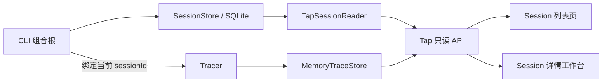
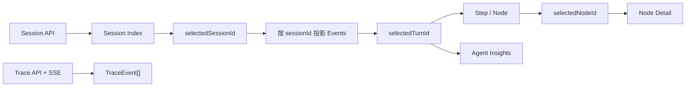

# Web Tap Session Trace 设计

## 背景

DKAgent 已有两套真实数据：

- `SessionStore` 使用 SQLite 保存 Session、完整消息和 Context 压缩状态。
- `TraceStore` 在当前进程内保存 AgentLoop、Context、模型、Tool 和 Memory 的结构化运行事件。

Web Tap 目前只消费 Trace，并在 `projectEvents` 中把所有事件投影到一个固定的 `current` Session。这无法回答“某条 Trace 属于哪个 Session”，也无法从独立的 Session 列表进入详情。

本设计把 Web Tap 扩展为只读的 Session Trace Viewer，同时保持 Session、Trace、Agent 与界面职责清晰。

## 目标

1. 增加独立 Session 列表页，进入已有的 Session 详情工作台。
2. 用日志侧 `sessionId` 准确关联 Session 与 Trace，不给 Agent 消息、Memory 或 Context 增加 Tap 专用字段。
3. 为 Session、Context、Memory、Skill、Tool 等节点增加稳定的模块 Tag。
4. 节点详情中需要展示的文本 `content` 使用 Markdown；Tool 结果和原始 JSON 保持现状。
5. 当前仍使用内存 Trace；未来接数据库时不改变页面层级和事件归属规则。

## 非目标

- Web 端创建、切换或删除 Session。
- 根据历史消息推测或补造 Step、Node、Token、耗时等 Trace。
- 本版实现 Trace 数据库、分页、保留策略或跨进程聚合。
- 修改 AgentLoop、Context、Memory、Tool 的业务行为。
- 重做现有 Agent 指标、节点详情和原始 JSON 组件。

## 已确认的信息关系

```text
Session
└─ Turn：一次用户输入发起的一轮对话
   ├─ Execution：本轮执行过程
   │  └─ Step
   │     └─ Node
   │        └─ Node Detail
   └─ Agent Insights：本轮运行指标和规则评价
```

Agent 指标与执行过程是 Turn 下的并行模块。选择 Node 只改变 Node Detail，不改变指标统计范围。

## 总体架构

采用“Trace 上下文关联 + Session 只读适配器 + 内存 Trace”的最小方案。



### 边界

`packages/agent` 继续拥有 Session 业务状态和执行流程，不依赖 Web Tap。`packages/trace` 拥有日志关联字段、事件顺序、时间和存储抽象。`packages/web-tap` 只读 Session 和 Trace，并负责页面投影、汉化、Tag 和 Markdown 展示。

`observe.ts` 是组合根：创建 Session Store、Trace Store 和 Tracer，把 Session Store 交给 Agent CLI，把只读 Session 能力和 Trace Store 交给 Tap Server。普通 CLI 启动仍可自行创建 Session Store。

## Session 与 Trace 关联

### 日志契约

在日志侧增加可选字段：

```ts
interface TraceEvent<TData = unknown> {
  sessionId?: string;
  id: string;
  traceId: string;
  // 其余现有字段保持不变
  data: TData;
}
```

`sessionId` 可选是为了兼容没有 Session 的测试、独立 Trace 使用场景和已有事件。Web Tap 不再把缺少 `sessionId` 的多个 Trace 强行视为真实 Session；这类事件可降级到“未关联”观察组。

### 绑定方式

Tracer 提供显式的 Session 运行上下文，例如：

```ts
await tracer.withSession(currentSession.id, () => agent.run(userInput));
```

`withSession` 使用 Tracer 已有的异步上下文传播能力。根 Trace、子 Span 和过程 Event 自动继承同一个 `sessionId`，AgentLoop、Context、Model、Tool 和 Memory 不需要重复传参。

这个字段只用于日志归属，不写入 `AgentMessage`、`SessionSnapshot.contextState`、Memory 记录或 Tool 参数。

## Session 读取边界

Tap Server 只接收最小只读端口：

```ts
interface TapSessionReader {
  list(): TapSessionSummary[];
  load(sessionId: string): TapSessionDetail | null;
}
```

展示专用类型定义在 Web Tap：

```ts
interface TapSessionSummary {
  id: string;
  createdAt: string;
  updatedAt: string;
  preview: string;
  messageCount: number;
  turnCount: number;
  hasTrace: boolean;
}

interface TapSessionDetail {
  id: string;
  createdAt: string;
  updatedAt: string;
  messages: AgentMessage[];
  contextSummary: string;
}
```

`preview`、数量和 `hasTrace` 都是 Tap 投影字段，不扩充 Agent 的 `SessionSummary`。MVP 可以由适配器读取 SessionSnapshot 后计算；数据规模扩大时再改为专用查询，不提前修改 Session 表。

Agent CLI 对注入的 Session Store 不取得资源所有权；`observe.ts` 在 Agent 与 Tap 都结束后统一关闭它，避免 Server 读取已经关闭的连接。

## 只读 HTTP 接口

| 接口 | 作用 |
|---|---|
| `GET /api/sessions` | 返回按更新时间倒序排列的 Session 列表 |
| `GET /api/sessions/:id` | 返回真实消息、时间和 Context 摘要 |
| `GET /api/sessions/:id/events` | 返回当前 Store 中属于该 Session 的 Trace |
| `GET /api/events/stream` | 保留实时 SSE；事件自身携带 `sessionId` |

不增加任何 Session 写接口。Server 继续只监听 `127.0.0.1`，静态文件安全边界和 Trace 脱敏规则保持不变。

当前 `MemoryTraceStore` 仍可由 Server 在内存中过滤 `sessionId`。未来数据库 Store 可以在存储实现中增加索引查询，HTTP 契约和页面无需变化。

## 页面与路由

采用独立入口页：

```text
/
└─ SessionListPage
   └─ 点击 Session
      └─ /sessions/:sessionId
         └─ SessionDetailPage
            ├─ TurnList
            └─ TurnWorkspace
               ├─ ExecutionWorkspace
               │  ├─ NodeNav：按 Step 分组
               │  └─ NodeDetail
               └─ AgentInsightsRail
```

Session 列表展示首条用户输入预览、最近更新时间、对话轮数以及“有运行轨迹 / 暂无运行轨迹”。支持按 Session ID 或预览文本做当前已加载数据的本地搜索，不增加服务端全文检索。

详情页复用现有工作区：Turn 列表决定执行过程和 Agent 指标；Node 选择只决定详情。桌面端 Agent 指标与执行过程并列；既有平板折叠和移动端 Drawer 规则保持不变。

路由使用标准前端路由，静态 Server 对非 API 的有效页面路径回退到 `index.html`，保证刷新 `/sessions/:sessionId` 后仍能进入详情。

## 没有 Trace 的历史 Session

历史 Session 可能来自 Tap 启动前或进程重启前，此时 SQLite 有消息而内存 Store 没有 Trace。

页面必须：

1. 展示真实 Session 消息。
2. 明确显示“暂无运行轨迹”。
3. 不生成 Step、Node、耗时、Token 或 Agent 指标。

这保证 Session 历史和 Trace 证据边界清楚。未来 Trace 接数据库后，同一路由自动获得历史事件。

## 模块 Tag

模块类型由 Web Tap 根据事件名前缀投影，不写回 Trace 数据：

| 事件前缀 | 中文 Tag | 视觉颜色 |
|---|---|---|
| `session.*` | 会话 | 靛蓝 |
| `context.*` | 上下文 | 蓝色 |
| `memory.*` | 记忆 | 紫色 |
| `skill.*` | 技能 | 青色 |
| `tool.*` | 工具 | 琥珀色 |
| `model.*` | 模型 | 中性玫红 |
| `agent.*` | Agent | 中性灰蓝 |
| 其他 | 其他 | 灰色 |

模块颜色只表达“节点来自哪个模块”。运行中、成功、需关注和失败继续使用现有状态圆点、图标和文字，不能只依赖颜色。

`TapNodeView` 增加 Web 侧派生字段 `module`，`NodeNav` 和 `NodeDetail` 复用同一 `ModuleTag`，避免两个区域各自判断事件前缀。

## Markdown content

本版不重新设计 Node Detail，也不改变 Tool 结果和原始 JSON。

新增一个最小 `MarkdownContent` 组件。以下已解析内容使用它：

- System、User、Assistant 消息的字符串型 `content`。
- 模型响应等节点中已经被 renderer 识别为正文的字符串型 `content`。

以下内容保持现状：

- `tool.call` 和 `tool.result` 的现有字段展示。
- 非字符串 `content`。
- Node Detail 底部的 Raw JSON。
- 未识别节点的 JSON 降级展示。

Markdown 支持标题、段落、列表、引用、链接、行内代码和代码块。组件不启用原始 HTML，也不引入 `rehype-raw`；外部链接采用安全属性。Markdown 渲染只替换具体 `content` 的 DOM，不改变父级 Descriptions、Message Card 或 Collapse 结构。

## 前端状态与数据流



`selectedSessionId` 决定当前 Session 消息和 Trace；`selectedTurnId` 同时决定执行过程与指标；`selectedNodeId` 只决定节点详情。切换 Session 时选择其最新 Turn 和 Node；无 Trace 时清空 Turn/Node 选择。

SSE 到达新事件时：

- 事件属于当前 Session 且用户仍跟随最新节点：继续自动跟随。
- 事件属于其他 Session：只更新该 Session 的 Trace 状态，不跳转页面。
- 用户正在查看历史 Turn/Node：保持当前位置。

## 空状态与异常

- Session 列表为空：显示“暂无 Session，请先运行 DKAgent”。
- Session 读取失败：显示中文错误和重试按钮，不影响 Agent CLI。
- 路由中的 Session 不存在：显示“Session 不存在”并提供返回列表入口。
- Session 存在但无 Trace：显示真实消息和“暂无运行轨迹”。
- Trace SSE 断开：沿用实时监听、重连中和连接异常状态。
- Markdown renderer 异常：沿用 Node Detail 错误边界并保留安全 Raw JSON。
- 未关联 `sessionId` 的旧事件：进入“未关联”观察组，不绑定到真实 Session。

所有 Tap Server、Session Reader、SSE、投影和 Markdown 异常都不得改变 Agent 执行结果。

## 未来 Trace 数据库演进

数据库版本继续使用同一个日志契约：`sessionId` 负责 Session 归属，`traceId` 负责一次用户输入，`spanId/parentSpanId` 负责调用链。

```text
当前：TraceEvent → MemoryTraceStore → Tap API
未来：TraceEvent → DatabaseTraceStore → Tap API
```

未来需要新增的是 Store 内部的写入、索引、分页、保留和清理策略，而不是修改 Agent 状态或前端信息层级。建议数据库至少为 `sessionId`、`traceId`、`timestamp/sequence` 建立查询索引；具体数据库选型不属于本版。

## 实现范围

主要修改范围：

- `packages/trace/src/types.ts`
- `packages/trace/src/tracer.ts`
- `packages/agent/src/cli/run.ts`
- `packages/web-tap/src/observe.ts`
- `packages/web-tap/src/tap/server.ts`
- `packages/web-tap/src/web/app/*`
- `packages/web-tap/src/web/model/*`
- `packages/web-tap/src/web/features/node-detail/*`
- `packages/web-tap/src/web/features/timeline/*`
- `packages/web-tap/src/web/styles.css`

不修改 Session 表结构、AgentLoop 业务算法、Memory 数据模型、Context 压缩策略和 Tool 实现。

## 验证标准

1. 两个 Session 各运行一轮时，Trace 只出现在对应 Session 详情中。
2. `/new` 和 `/switch` 后的新事件携带正确 `sessionId`，不存在串 Session。
3. Session 列表可进入有 Trace 和无 Trace 两种详情。
4. 无 Trace 的 Session 只展示真实消息，不产生推测节点或指标。
5. 切换 Session、Turn、Node 时，选择范围和 Agent 指标范围正确。
6. Context、Memory、Skill、Tool、Model 和 Agent 节点使用稳定模块 Tag，状态信息仍可独立识别。
7. System、User、Assistant 的字符串 `content` 正确渲染 Markdown；Tool 结果和 Raw JSON 与当前一致。
8. 刷新 `/sessions/:id`、SSE 重连、Session 不存在和 Markdown 异常均有明确降级。
9. Trace 或 Tap 失败不影响普通 `npm run dev` Agent 对话。
10. Web Tap 类型检查、现有回归、构建和真实页面桌面/移动端检查通过。
