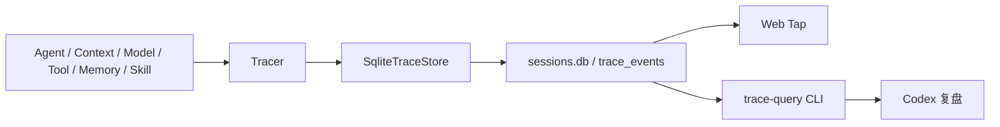

# DKAgent SQLite Trace 持久化设计

## 背景

DKAgent 当前通过 `Tracer` 生成结构化 `TraceEvent`，由 `MemoryTraceStore` 保存并通过 Web Tap 展示。Trace 已能用 `sessionId` 关联 Session，用 `traceId` 标识一次用户输入，用 `spanId/parentSpanId` 表示调用层级。

当前 Trace 只存在于进程内，进程重启后即丢失。SQLite 中虽然仍有 Session 消息和 Context 状态，但无法继续追溯某次 Agent 执行时使用了什么 Context、调用了什么模型和 Tool、在哪一步失败。

## 目标

1. 将完整脱敏后的 Trace 事件持久化到 SQLite，进程重启后仍可追溯。
2. 让 Codex 通过稳定的只读命令定位一次 Turn，并还原 `Trace → Span → Event` 执行树。
3. Web Tap 读取真实历史 Trace，不根据 Session 消息推测 Step、Node、Token 或耗时。
4. 删除 Session 时原子删除关联 Trace。
5. 默认保留最近 30 天 Trace，过期后保留 Session 消息。
6. 保持 Agent Core 只依赖 `Tracer/TraceSink`，不感知 SQLite、查询 CLI 或 Web Tap。

## 非目标

- 审计级防篡改、签名、访问审计或合规归档。
- 永久保存、跨项目聚合、趋势监控和告警。
- OpenTelemetry、Sentry、Langfuse 或远程 Trace 服务导出。
- 让运行中的 DKAgent 通过 Agent Tool 查询 Trace。
- 第一版新增 Trace/Span/Event 三张持久化表或批量异步写入器。
- 在 CLI 中提供删除、修改或任意 SQL 执行能力。

## 核心决策

### 同一逻辑数据库、独立 Trace 表

Trace 与 Session 共用 `.dkagent/sessions.db`，新增 `trace_events` 表。Trace 仍由独立的 `SqliteTraceStore` 管理；共用数据库只为获得可靠外键和单库查询，不把 Trace 字段写入 `sessions` 或 `session_messages`。



### 原始事件单表，查询时组合 Span

DKAgent 当前 Tracer 是事件模型：一个逻辑 Span 会产生 `start`、零到多个 `event`、以及 `end` 或 `error`。数据库原样保存这些事实，不提前投影成多张表。

例如：

```text
model.request start   spanId=model-1
model.response event  spanId=model-1
model.request end     spanId=model-1
```

查询 CLI 按 `spanId` 组合为一个模型调用，输入来自 `start.data`，结果来自内部事件和 `end.data`，耗时来自终止事件。这样既保留原始顺序，也能向 Codex 展示 `Trace → Span → Event` 树。

### 完整脱敏内容

保存模型请求与响应、Context、Tool 参数与结果等完整事件内容，以支持开发复盘。所有事件必须在进入 Store 前执行统一脱敏。API Key、Authorization、Headers、环境变量和 Memory 召回原文不得进入数据库。

## 数据表

```sql
CREATE TABLE IF NOT EXISTS trace_events (
    id TEXT PRIMARY KEY,
    session_id TEXT NOT NULL
        REFERENCES sessions(id) ON DELETE CASCADE,
    trace_id TEXT NOT NULL,
    span_id TEXT,
    parent_span_id TEXT,
    sequence INTEGER NOT NULL,
    timestamp TEXT NOT NULL,
    duration_ms INTEGER,
    name TEXT NOT NULL,
    phase TEXT NOT NULL,
    step INTEGER,
    module TEXT,
    operation TEXT,
    schema_version INTEGER NOT NULL DEFAULT 1,
    data_json TEXT NOT NULL
);

CREATE INDEX IF NOT EXISTS idx_trace_events_session_order
    ON trace_events(session_id, timestamp, sequence);

CREATE INDEX IF NOT EXISTS idx_trace_events_trace_order
    ON trace_events(trace_id, sequence);

CREATE INDEX IF NOT EXISTS idx_trace_events_retention
    ON trace_events(timestamp);
```

### 排序语义

`sequence` 由当前 `Tracer` 实例递增，进程重启后会归零，因此它不是数据库级全局顺序。单个 Turn 内按 `sequence` 排序；跨 Turn 或 Session 列表按 `timestamp` 排序，并用 `id` 作为稳定兜底。

### 版本语义

`schema_version` 表示持久化事件的解释版本。第一版固定为 `1`。未来字段语义改变时增加版本并在查询层兼容，不能让 Codex 使用新格式错误解释旧事件。

## 模块边界

### `packages/trace`

新增 `SqliteTraceStore`，负责：

- 创建 Trace 表和索引。
- 保存已经脱敏的 `TraceEvent`。
- 按 Session、Trace 和最近 Turn 查询。
- 写入成功后通知实时订阅者。
- 启动时执行 30 天保留清理。
- 通过可选 `onWriteError` 回调向组合根报告连续写入故障；同一连续故障只报告一次，后续写入成功后恢复报告能力。
- 关闭数据库连接。

Trace 读取能力应从无边界的全量 `list()` 演进为最小查询接口：

```ts
interface TraceReader {
  listBySession(sessionId: string): TraceEvent[];
  listByTrace(traceId: string): TraceEvent[];
  listRecentTurns(limit: number): TraceTurnSummary[];
}
```

为避免一次改动扩大过多，现有 `TraceStore` 测试所需的 `list()` 可以保留，但 Web Tap 和查询 CLI 不再使用它加载全部历史。

### `packages/agent`

AgentLoop、Context、Model、Tool、Memory 和 Skill 继续只调用现有 Trace API。`SqliteSessionStore.delete()` 删除 `sessions` 行时，由 SQLite 的 `ON DELETE CASCADE` 在同一事务内删除关联 Trace。

不向 `AgentMessage`、`SessionSnapshot` 或 Context 状态增加 Trace 展示字段。

### `packages/web-tap`

`observe.ts` 继续作为组合根：

1. 先创建 `SqliteSessionStore`，确保 `sessions` 表存在。
2. 再创建同一路径的 `SqliteTraceStore`。
3. 将 Tracer 注入 Agent CLI。
4. 将只读 Trace Reader 交给 Tap Server。

Tap Server 的 Session Trace 接口直接执行 `listBySession(sessionId)`，不再读取全部事件后在内存过滤。SSE 仍通过 Store 订阅已成功落库的新事件。

## 写入数据流

```text
业务模块调用 Tracer
  → Tracer 生成关联字段和生命周期事件
  → sanitizeTraceEvent
  → SqliteTraceStore Prepared Statement 写入
  → 写入成功
  → 通知 SSE 订阅者
```

第一版采用单事件同步写入。它优先保证本地开发时的持久性和实现简单度。只有实际测量证明写入延迟影响 Agent 运行时，才引入批量队列；不能预先增加后台刷新、崩溃恢复和队列背压复杂度。

## Codex 查询 CLI

提供只读入口：

```bash
npm run trace -- <command>
```

第一版只提供三个子命令：

```bash
# 列出最近 Turn，定位 traceId
npm run trace -- recent --limit 10

# 展示一次完整执行链
npm run trace -- show <traceId>

# 筛选指定 Session 的失败事件
npm run trace -- errors --session <sessionId>
```

所有命令支持 `--json`。CLI 以只读模式打开数据库，只接受明确命令和参数化查询，不接受用户提供的 SQL 文本。

### `recent` 输出

- `traceId`、`sessionId`、开始时间和耗时。
- 用户输入预览。
- 成功、失败或不完整状态。
- Step、模型调用和 Tool 调用数量。

### `show` 输出

文本模式根据 `spanId/parentSpanId` 输出缩进树；同一 Span 的 `start/event/end|error` 合并展示。`--json` 返回按原始 `sequence` 排序的完整脱敏事件，不丢弃 `data_json`。

### 标准追溯流程

```text
用户描述某次问题
  → recent 定位时间、输入预览、Session 和 traceId
  → show 获取完整事件
  → 按父子关系检查 Context、Model、Tool 和最终输出
  → errors 补查错误事件
```

查询层必须检查：

- Span 是否具有 `start` 和一个 `end/error`。
- Span 是否出现重复 `start`、重复终止或无法关联的子事件。
- 根 `agent.turn` 是否正常结束。

发现异常时输出“轨迹可能不完整”，不能把缺失事件解释为业务未执行。

## 保留与删除

- 默认保留最近 30 天 Trace。
- `SqliteTraceStore` 启动时按 `timestamp` 删除过期事件。
- 过期清理只删除 Trace，不删除 Session 或消息。
- 删除 Session 时，由外键在同一事务内删除全部关联 Trace。
- 第一版不增加后台定时清理器或用户可配置保留周期。

历史 Session 的 Trace 过期后，Web Tap 继续展示真实消息，并明确显示“暂无运行轨迹”。

## 异常处理

- Span 业务异常继续由 Tracer 记录为 `error`，然后按现有逻辑向业务层抛出。
- SQLite 写入异常由 Trace 边界隔离，不能改变 Agent 最终回答。
- Store 写入失败时不通知 SSE，避免页面出现数据库中不存在的事件。
- Store 通过 `onWriteError` 通知组合根；组合根给出明确警告，提示本轮 Trace 可能不完整。同一连续故障只警告一次，后续成功写入后才允许再次警告。
- 数据库损坏、JSON 解析失败或未知 `schema_version` 必须由查询 CLI 明确报错，不能猜测内容。
- Web Tap 或查询 CLI 失败不能关闭或修改 Agent Session。

## 安全边界

- Trace 数据库仅用于本地开发，文件权限限制为当前用户读写。
- Web Tap 继续只监听 `127.0.0.1`。
- 所有写入路径复用同一脱敏函数，不能让历史读取和实时 SSE 使用两套安全规则。
- Prompt、用户输入、模型内容和 Tool 数据会被本地保存，项目文档必须明确提醒不要输入无法落盘的秘密。
- 查询 CLI 不提供写操作，不执行任意 SQL，不输出数据库连接信息。

## 未来数据库演进

当前设计的稳定边界是 `Tracer → TraceStore/TraceReader`，不是 SQLite 文件。迁移 PostgreSQL 时保持：

- `sessions`、`session_messages`、`trace_events` 为同一逻辑数据库中的独立表。
- `session_id` 外键和级联删除语义不变。
- Trace 事件契约、Web Tap 层级和 Codex CLI 命令不变。
- 只替换 SQLite Store 为 PostgreSQL Store。

当数据规模真实增长后，才考虑按时间分区、批量导出、Span 聚合表或独立分析存储。第一版不为这些场景预建抽象。

## 验证标准

1. 普通回答、Tool Loop、Context 压缩、Memory 和 Skill 路径写入完整 Trace。
2. 进程重启后，`recent → show <traceId>` 能还原 Turn、Step、Model 和 Tool 调用树。
3. 两个 Session 的 Trace 不串联；`/new` 和 `/switch` 后事件归属正确。
4. 删除 Session 后，关联 Trace 在同一事务中消失。
5. 31 天前的 Trace 在 Store 启动时被删除，Session 消息仍保留。
6. SQLite 写入失败不影响 Agent 回答，并产生一次明确警告。
7. SSE 只展示已经落库的事件。
8. API Key、Authorization、Headers、环境变量和 Memory 召回原文不出现在数据库。
9. `recent`、`show`、`errors` 的文本及 `--json` 输出稳定可解析。
10. 缺失终止事件、重复生命周期或无法关联的子事件出现时，CLI 标记“轨迹可能不完整”。
11. Web Tap 能读取进程重启前的历史 Trace；没有 Trace 的 Session 不生成推测节点。
12. Trace、Agent Session、Web Tap 相关类型检查和回归测试通过。
