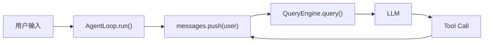
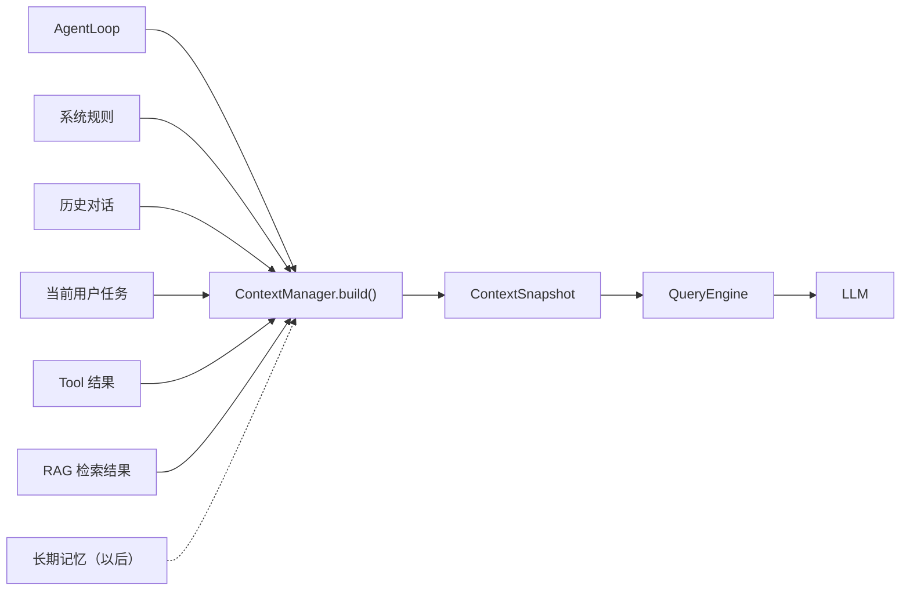
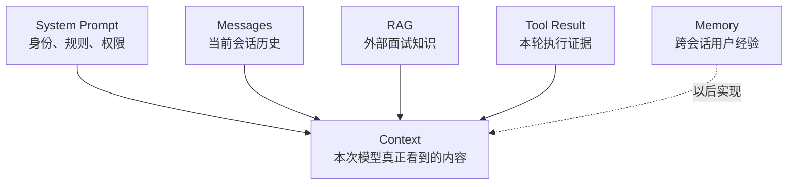
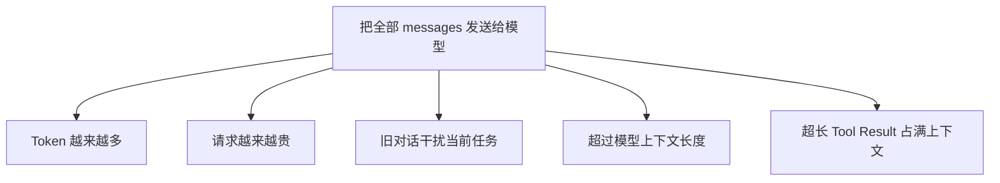
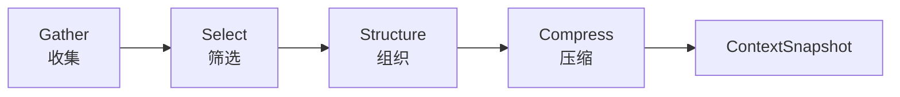
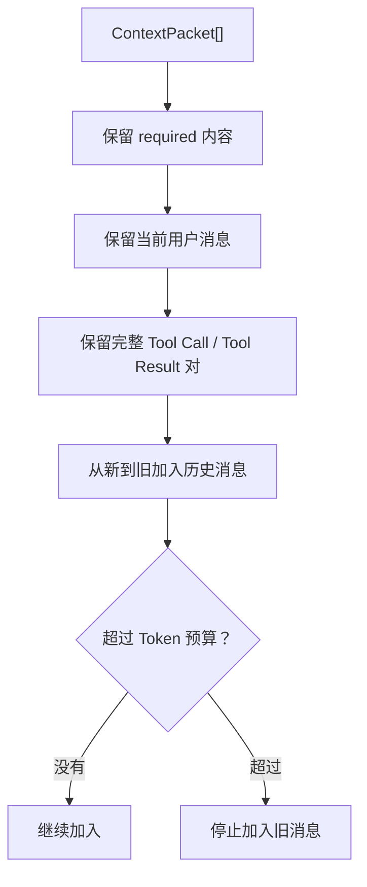
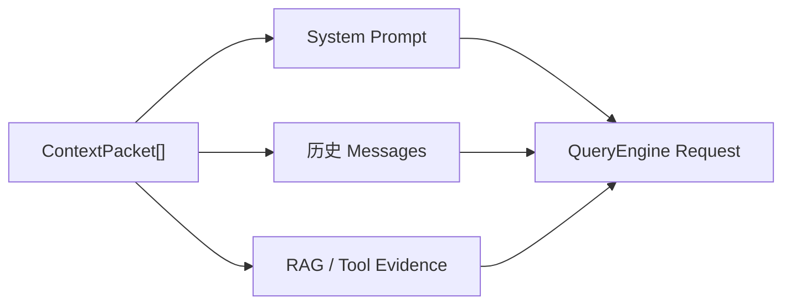
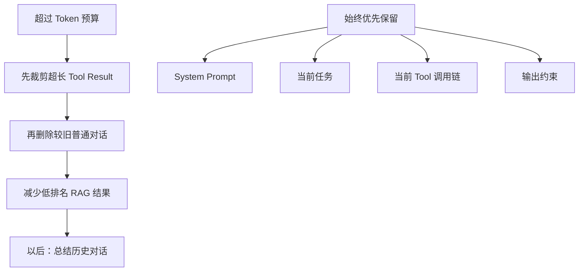
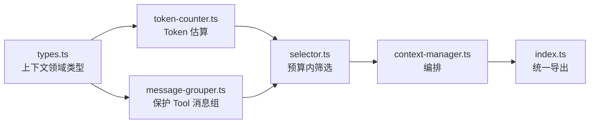
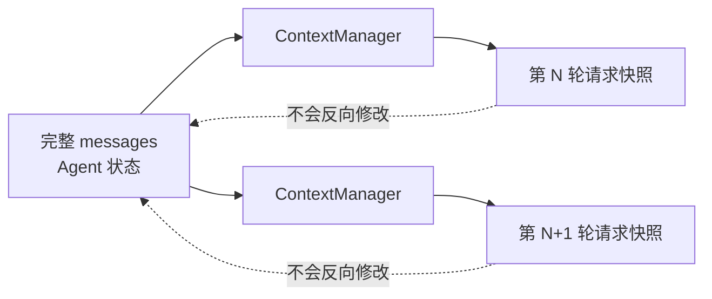

# 上下文工程 - GSSC

Gather：收集
Select：筛选
Structure：组织
Compress：压缩

## Gather

从哪里收集：
系统提示词、当前用户画像、长期记忆、工具列表、RAG外部知识

下一阶段进入“上下文工程”。先把核心概念定死：

> 上下文不是 `messages[]`。  
> 上下文是每次调用模型前，Harness 为模型组装出的完整输入快照。

## 一、它在 DKAgent 中的位置

当前调用链：



当前代码实际是：

```typescript
queryEngine.query({
    systemPrompt,
    messages: [...this.messages],
    tools,
});
```

也就是：

```text
模型上下文 = System Prompt + 全部历史消息 + Tool Schema
```

以后目标是：



换句话说，AgentLoop 不再自己随便把所有消息扔给模型，而是：

```typescript
const context = await contextManager.build({
    messages,
    systemPrompt,
    tools,
    currentInput,
});

await queryEngine.query(context);
```

---

## 二、Context、Messages、RAG、Memory 的区别



### Messages

```typescript
[
    { role: "user", content: "你好" },
    { role: "assistant", content: "你好，我是 DKAgent" },
];
```

它只是上下文的一个来源。

### RAG

```typescript
[
    {
        question: "闭包是什么？",
        expertAnswer: "闭包是函数与词法环境的组合。",
        sourceFile: "javascript/closure.md",
    },
];
```

它是外部知识，不应该永久塞进聊天历史。

### Memory

例如：

```text
用户是前端工程师
用户偏好简洁回答
用户最近在准备 Agent 面试
```

它通常跨会话保存。第一阶段暂时不做。

### Context

最终发给模型的请求：

```typescript
{
  systemPrompt: "你是 DKAgent……",

  messages: [
    // 筛选后的历史消息
    { role: "user", content: "帮我分析闭包回答" },

    // 本轮临时注入的 RAG 证据
    {
      role: "user",
      content: `
        以下是知识库证据：
        闭包是函数与词法环境的组合。
        来源：javascript/closure.md
      `,
    },
  ],

  tools: [...],
}
```

---

## 三、为什么当前 `messages[]` 不够

目前 AgentLoop 会不断追加消息：

```text
第 1 轮：2 条
第 10 轮：20 条
第 50 轮：100 条
```

最终会出现四个问题。



尤其是面试记录 Tool，结果可能非常长：

```typescript
{
  role: "tool",
  content: JSON.stringify(几万字面试记录),
}
```

如果一直保留，后面每轮都会重新发送这几万字。

所以需要一个独立模块决定：

```text
哪些必须保留？
哪些可以删？
哪些可以压缩？
哪些只在当前 Run 临时存在？
```

---

## 四、上下文工程的四个阶段：GSSC



## 1. Gather：从哪里收集

```typescript
const packets = [systemPromptPacket, currentUserPacket, ...historyPackets, ...toolResultPackets, ...ragPackets];
```

统一成一种中间类型：

```typescript
interface ContextPacket {
    id: string;

    // system、message、tool、rag
    kind: ContextKind;

    // 最终准备交给模型的内容
    content: string;

    // 越大越不能删除
    priority: number;

    // 估算占用多少 Token
    estimatedTokens: number;

    // 是否必须保留
    required: boolean;
}
```

---

## 2. Select：选择哪些内容

第一阶段不需要复杂算法，先用确定性规则。



伪代码：

```typescript
function selectPackets(packets: ContextPacket[], tokenBudget: number): ContextPacket[] {
    const selected = [];
    let usedTokens = 0;

    // System Prompt、当前用户任务一定保留
    for (const packet of packets.filter((item) => item.required)) {
        selected.push(packet);
        usedTokens += packet.estimatedTokens;
    }

    // 其他内容按优先级和时间选择
    const candidates = packets.filter((item) => !item.required).sort(comparePriorityAndRecency);

    for (const packet of candidates) {
        if (usedTokens + packet.estimatedTokens > tokenBudget) {
            continue;
        }

        selected.push(packet);
        usedTokens += packet.estimatedTokens;
    }

    return selected;
}
```

---

## 3. Structure：组织成模型输入

ContextManager 内部使用 `ContextPacket[]`，但 QueryEngine 仍然只认识：

```typescript
{
  systemPrompt,
  messages,
  tools,
}
```

因此需要转换：



伪代码：

```typescript
function structureContext(packets: ContextPacket[]): ContextSnapshot {
    return {
        systemPrompt: buildSystemPrompt(packets),

        messages: packets.filter(canConvertToMessage).map(convertToAgentMessage),

        estimatedTokens: sumTokens(packets),
    };
}
```

---

## 4. Compress：超出预算怎么办

压缩顺序必须明确。



第一阶段不要调用模型做摘要，因为那会引入：

- 额外模型调用
- 摘要失真
- 成本和失败重试
- 更复杂的状态管理

先做确定性压缩：

```typescript
function compressPackets(packets, budget) {
    return packets
        .map(truncateLongToolResults)
        .filter(removeOldLowPriorityMessages)
        .filter(removeLowRankedRagEvidence)
        .sliceUntilTokenBudget(budget);
}
```

---

## 五、DKAgent 第一阶段应该做到什么

不要一次做完整 GSSC 平台。第一阶段只实现：

```text
ContextManager
├── 收集 System Prompt
├── 收集 messages
├── 估算 Token
├── 保留当前消息
├── 保留完整 Tool Call / Tool Result
├── 从旧到新裁剪普通历史
└── 生成 ContextSnapshot
```

暂时不做：

```text
× 长期 Memory
× 模型摘要
× 向量化历史对话
× 多 Agent 上下文共享
× 复杂相关度打分
× 自动把 RAG 注入每一次对话
```

---

## 六、建议模块结构

```text
src/context/
├── types.ts
├── token-counter.ts
├── message-grouper.ts
├── selector.ts
├── context-manager.ts
└── index.ts
```



核心接口：

```typescript
interface ContextBuildInput {
    systemPrompt?: string;
    messages: readonly AgentMessage[];
    tools: readonly ToolSchema[];
    maxInputTokens: number;
    reservedOutputTokens: number;
}

interface ContextSnapshot {
    systemPrompt?: string;
    messages: AgentMessage[];
    tools: ToolSchema[];

    estimatedInputTokens: number;
    droppedMessageCount: number;
}

interface ContextManager {
    build(input: ContextBuildInput): Promise<ContextSnapshot>;
}
```

---

## 七、改造后的 AgentLoop

现在：

```typescript
const response = await queryEngine.query({
    model,
    messages: [...this.messages],
    tools,
    systemPrompt,
});
```

目标：

```typescript
const snapshot = await contextManager.build({
    systemPrompt,
    messages: this.messages,
    tools: toolRegistry.getSchemas(),

    // 模型最大上下文预算
    maxInputTokens: 16_000,

    // 给模型输出预留空间
    reservedOutputTokens: 2_000,
});

const response = await queryEngine.query({
    model,
    systemPrompt: snapshot.systemPrompt,
    messages: snapshot.messages,
    tools: snapshot.tools,
});
```

注意：

```text
AgentLoop.messages = 完整会话状态
ContextSnapshot.messages = 本次模型请求的裁剪快照
```

不能为了减少 Token，直接删除 `AgentLoop.messages`。



这就是上下文模块第一阶段最重要的边界。

# 问题

### 如何理解每轮计算前，都需要「模型最大TOKEN-本轮预留TOKEN」

假设：
模型最大TOKEN = 10_000;
本轮预留TOKEN = 2_000;
那么：
可用TOKEN = 10_000 - 2_000;

整体容量分配：

```text
模型最大上下文：10000 Token
├── 本次输入最多：8000 Token
│   ├── System Prompt
│   ├── 历史摘要
│   ├── 对话消息
│   └── Tool Schema
└── 本轮输出预留：2000 Token
```

### 为什么必须预留输出

假如不减：
输入已经占用 10000 Token
模型最大容量 10000 Token
模型就没有空间生成回答，可能出现：
1.上下文超限。
2.输出被严重截断。
3.Provider 直接拒绝请求。
4.Tool Call 参数生成到一半停止。

### 不同Token阈值之间的关系和结构

```text
主体结构：
maxContextTokens                         模型总容量，硬上限
│
├── reservedOutputTokens                 输出预留
│   └── 当前等于 maxOutputTokens
│
└── availableInputTokens                 输入硬上限
    │
    ├── triggerTokens                    80% 压缩触发线
    │   └── availableInputTokens × triggerRatio
    │
    └── targetTokens                     60% 压缩目标线
        └── availableInputTokens × targetRatio
            │
            ├── fixedTokens              System + Tool Schema
            ├── maxSummaryTokens         摘要最大预算
            └── rawMessageBudget         最近原始消息预算

旁路结构：
maxToolResultChars
└── Tool Result 进入摘要前的字符上限

Compressor maxTokens
└── 某段文本或某次摘要的局部 Token 上限

0.9
└── 文本截断算法内部的 10% 误差缓冲
```
