先记住一句话：

> 这套知识库分成两个阶段：离线把资料加工好，在线根据问题查资料。现在完成的是知识库底座，还没有接入 Agent Tool。

## 一、它在 DKAgent 顶层的位置

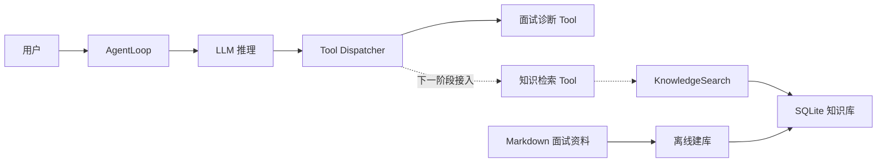

现在已经完成虚线下面的底层能力：

```text
Markdown → SQLite → FTS5 / Embedding / Hybrid Search
```

还没完成：

```text
Agent → query_knowledge_base Tool → KnowledgeSearch
```

因此目前它是一个可以独立使用的知识库模块，不会影响现有 AgentLoop。

---

## 二、知识库分成两条链路

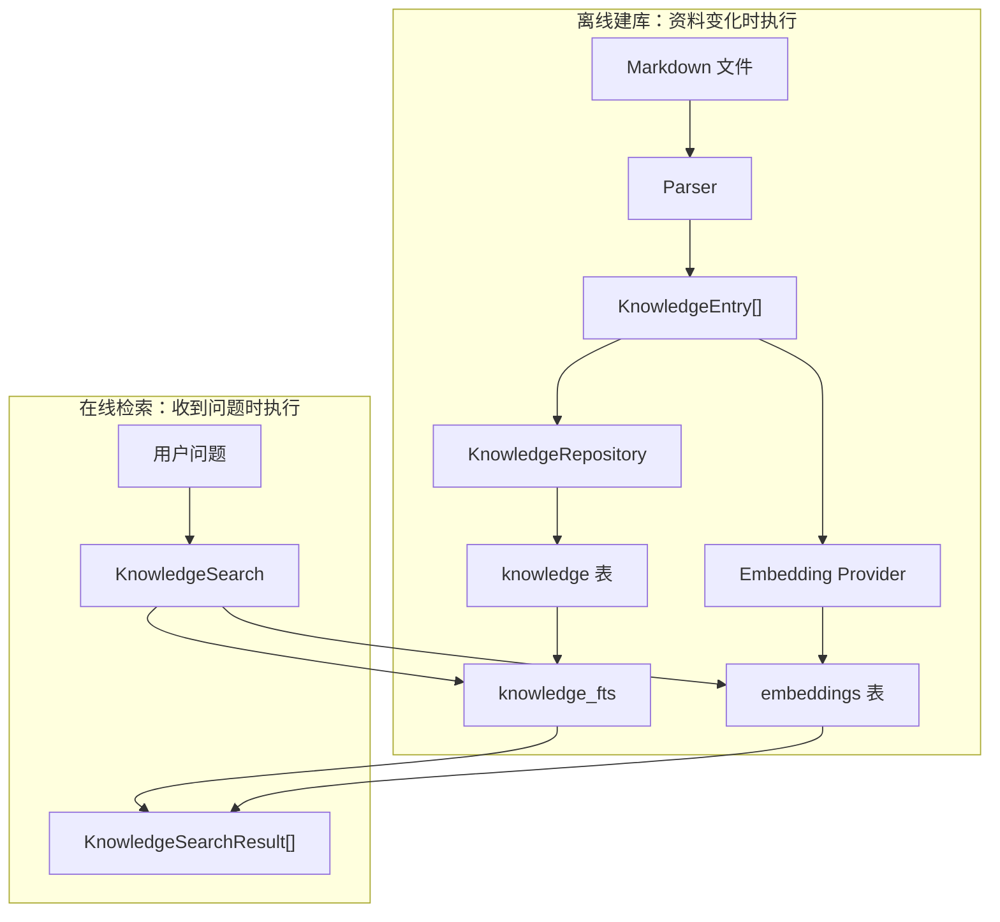

### 离线建库

把非结构化 Markdown 加工成适合检索的数据。

```text
输入：Markdown 文档
输出：SQLite 数据库
```

通常在以下情况执行：

- 第一次初始化知识库
- Markdown 内容发生变化
- 更换了 Embedding 模型

命令：

```bash
npm run kb:build
```

### 在线检索

用户提问时，不再扫描 Markdown，也不重新建库，而是直接查 SQLite。

```text
输入：用户问题
输出：最相关的 KnowledgeEntry[]
```

---

## 三、离线建库的完整调用链

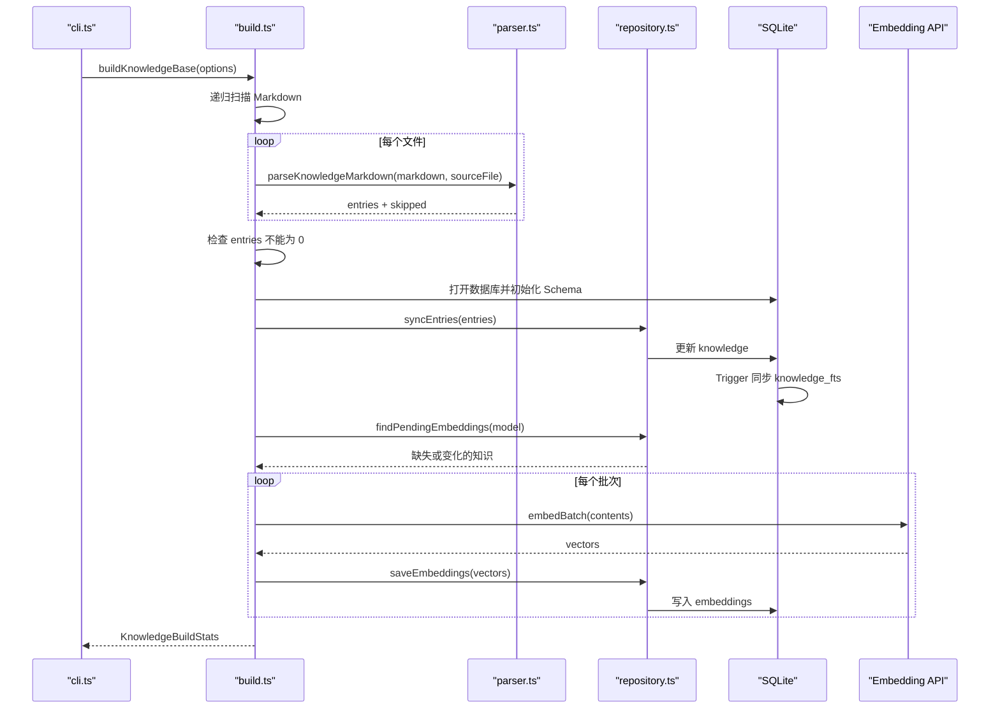

对应的顶层伪代码：

```typescript
async function buildKnowledgeBase(options) {
  // 1. 找到所有 Markdown 文件
  const files = await scanMarkdownFiles(options.sourceDir);

  // 2. 先完成全部解析
  const entries = [];
  const skipped = [];

  for (const file of files) {
    const markdown = await readFile(file);

    const result = parseKnowledgeMarkdown(
      markdown,
      getRelativePath(file),
    );

    entries.push(...result.entries);
    skipped.push(...result.skipped);
  }

  // 3. 防止空目录误删已有数据库
  if (entries.length === 0) {
    throw new Error("拒绝用空知识覆盖数据库");
  }

  // 4. 同步结构化知识和 FTS
  repository.syncEntries(entries);

  // 5. 找到真正需要生成向量的知识
  const pending = repository.findPendingEmbeddings(
    embeddingProvider.model,
  );

  // 6. 分批调用外部 API
  for (const batch of splitIntoBatches(pending)) {
    const vectors = await embeddingProvider.embedBatch(
      batch.map(item => item.content),
    );

    // 7. 每批生成成功后再写入数据库
    repository.saveEmbeddings(
      combine(batch, vectors),
    );
  }

  return buildStats();
}
```

关键设计：

> 先解析全部 Markdown，确认不是空结果，再操作数据库。

否则路径写错时，可能把原有知识库清空。

---

## 四、Parser 在做什么

一个 Markdown 问题块：

```markdown
## Q：闭包是什么？

**新手答**：函数里面的变量。

**高手答**：函数和它的词法环境的组合。

**差距在哪**：没有解释词法作用域。
```

被转换成：

```typescript
{
  id: "01-javascript/closure.md#q-1",
  dimension: "01-javascript",
  question: "闭包是什么？",
  noviceAnswer: "函数里面的变量。",
  expertAnswer: "函数和它的词法环境的组合。",
  gapAnalysis: "没有解释词法作用域。",
  sourceFile: "01-javascript/closure.md",

  // 专门给 FTS5 和 Embedding 使用
  content: `
    问题：闭包是什么？

    高手答：函数和它的词法环境的组合。

    差距分析：没有解释词法作用域。
  `
}
```

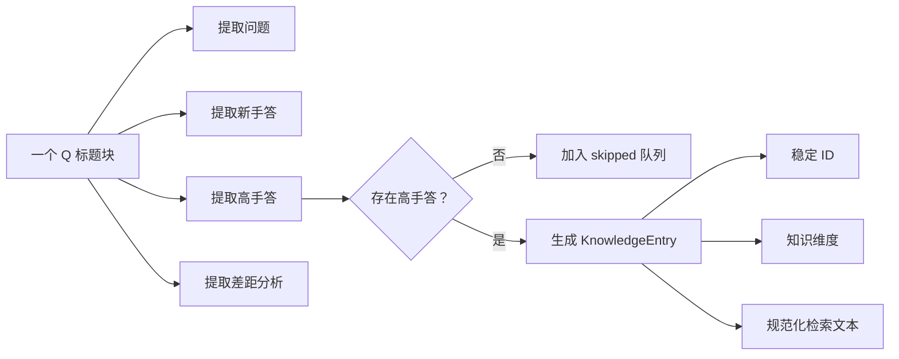

这里有三个重要字段：

### `id`

```typescript
id = `${sourceFile}#q-${blockIndex}`;
```

作用是让同一道题重复建库时仍然使用相同 ID。

### `dimension`

```typescript
dimension = sourceFile.split("/")[0];
```

例如：

```text
01-javascript/closure.md
```

得到：

```text
01-javascript
```

它相当于知识分类，未来可以只搜索 JavaScript、React 或工程化。

### `content`

Embedding 不直接处理整个对象，只接受字符串，所以需要把重要字段拼成一段规范文本。

没有放入 `noviceAnswer`，因为错误答案可能干扰检索。

---

## 五、数据库里为什么有三张表

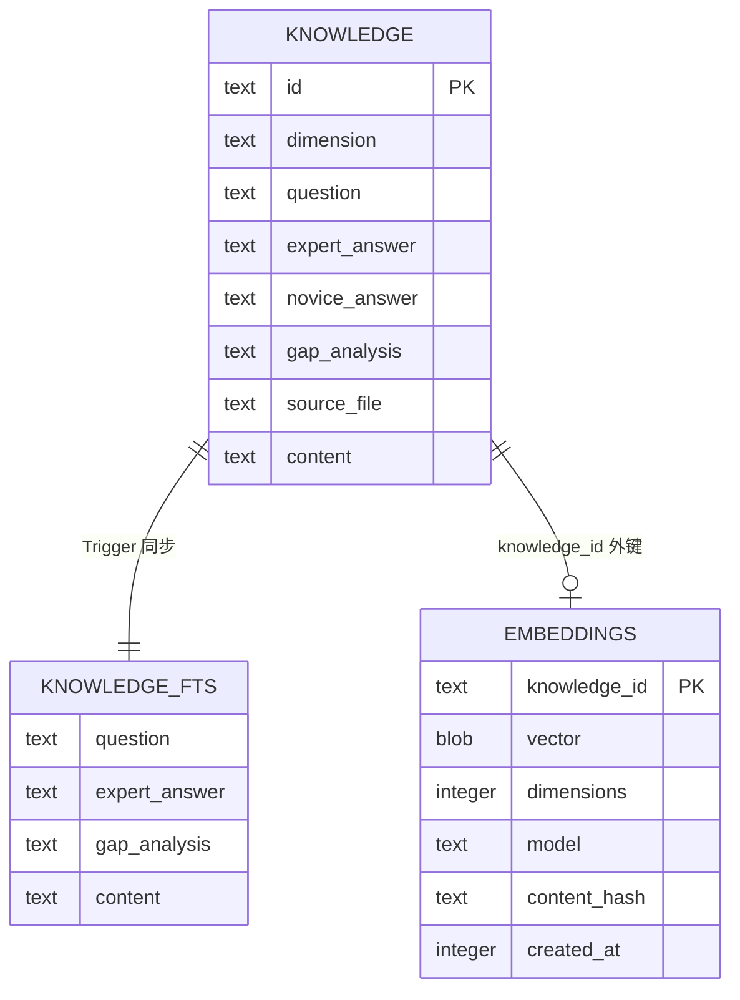

### `knowledge`

主数据表，保存完整的结构化问题。

它负责：

- 展示最终答案
- 保留来源
- 保存知识分类
- 作为其他索引的真实数据源

### `knowledge_fts`

FTS5 全文索引。

它不是另一份业务数据，而是 SQLite 为关键词搜索维护的索引。

```text
knowledge = 原始数据
knowledge_fts = 为搜索建立的倒排索引
```

`knowledge` 变化时，通过 Trigger 自动同步：

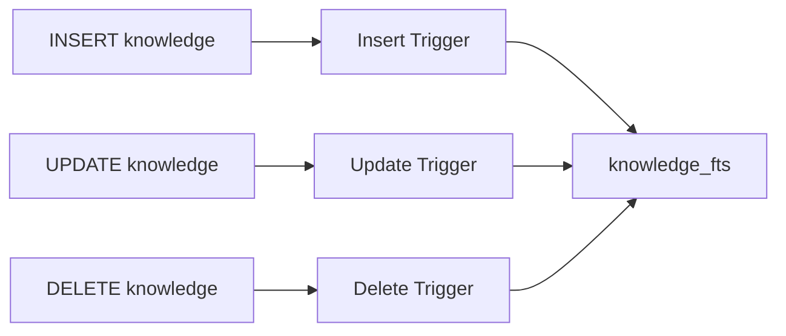

伪代码：

```sql
AFTER INSERT knowledge
  INSERT INTO knowledge_fts(...)

AFTER UPDATE knowledge
  DELETE old FTS record
  INSERT new FTS record

AFTER DELETE knowledge
  DELETE FTS record
```

### `embeddings`

保存每条知识的语义向量。

```typescript
{
  knowledgeId: "01-javascript/closure.md#q-1",
  vector: [0.12, -0.35, 0.87, ...],
  dimensions: 1024,
  model: "embedding-model-name",
  contentHash: "sha256..."
}
```

向量转换为 `Float32 BLOB` 后写入 SQLite：

```text
number[]
   ↓ Float32Array
二进制 Buffer
   ↓
SQLite BLOB
```

这样比把向量保存成 JSON 字符串更紧凑。

---

## 六、为什么需要 `contentHash`

如果每次执行建库，都重新调用 463 次 Embedding API：

- 浪费时间
- 浪费费用
- API 中途失败后难以恢复

所以每条知识会计算：

```typescript
contentHash = sha256(entry.content);
```

增量判断流程：

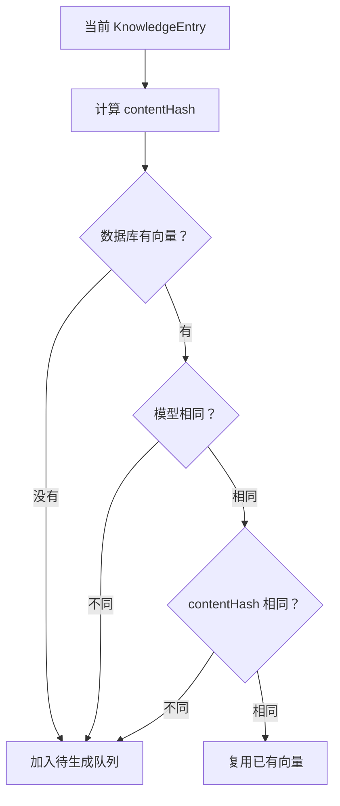

核心伪代码：

```typescript
function findPendingEmbeddings(model) {
  return knowledgeEntries.filter(entry => {
    const stored = embeddings.get(entry.id);
    const currentHash = sha256(entry.content);

    if (!stored) {
      return true;
    }

    if (stored.model !== model) {
      return true;
    }

    if (stored.contentHash !== currentHash) {
      return true;
    }

    return false;
  });
}
```

这就是“增量 Embedding”。

---

## 七、三种检索有什么区别

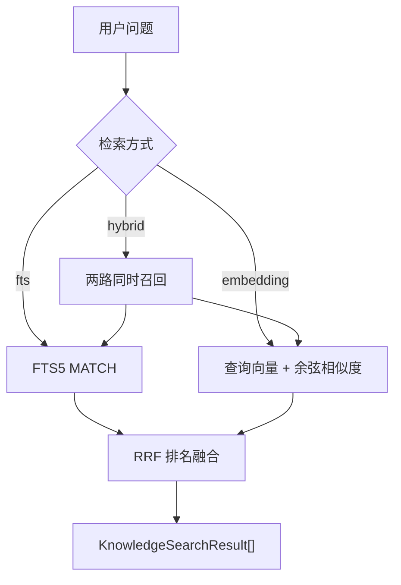

### FTS 检索

适合明确关键词：

```text
用户：什么是闭包？
知识：闭包是函数与词法环境的组合
```

伪代码：

```typescript
function searchFts(query) {
  return sqlite.query(`
    SELECT knowledge.*, bm25(knowledge_fts) AS rank
    FROM knowledge_fts
    JOIN knowledge
    WHERE knowledge_fts MATCH ?
    ORDER BY rank ASC
  `);
}
```

特点：

- 不调用外部 API
- 速度快
- 专有名词命中准确
- 依赖词面重合

### Embedding 检索

适合表达不同但语义相近：

```text
用户：函数为什么能记住外部变量？
知识：闭包是函数与词法环境的组合。
```

两个句子没有完全相同的关键词，但语义接近。

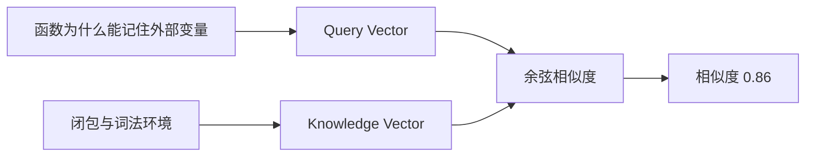

伪代码：

```typescript
async function searchEmbedding(query) {
  const queryVector = await provider.embedBatch([query]);
  const storedVectors = repository.listStoredVectors(provider.model);

  return storedVectors
    .map(item => ({
      entry: item.entry,
      similarity: cosineSimilarity(
        queryVector[0],
        item.vector,
      ),
    }))
    .sort((a, b) => b.similarity - a.similarity);
}
```

当前只有几百条数据，所以直接放在内存里计算余弦相似度。

达到几万、几十万条后，才需要 pgvector、Milvus、Qdrant 之类的向量索引。

### Hybrid 检索

同时使用 FTS 和 Embedding。

```text
FTS：擅长准确关键词
Embedding：擅长语义表达
Hybrid：综合两边结果
```

---

## 八、为什么不能直接把两个分数相加

FTS 使用 BM25：

```text
数值越小越相关
可能是 -3.2、-1.7
```

Embedding 使用余弦相似度：

```text
数值越大越相关
通常是 0～1
```

直接相加没有明确意义：

```typescript
// 错误思路
finalScore = bm25Score + cosineScore;
```

因此使用 RRF，只关心“各自在第几名”。

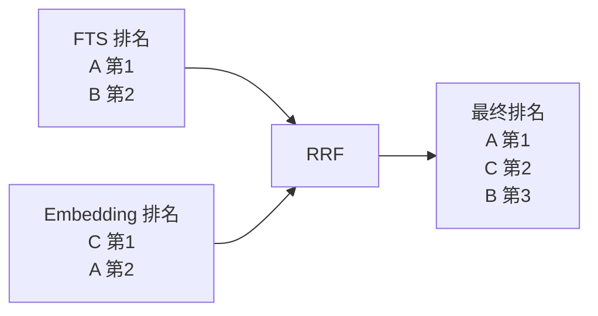

公式：

```text
RRF 分数 = 1 / (60 + rank)
```

伪代码：

```typescript
function hybridSearch(ftsResults, embeddingResults) {
  const resultMap = new Map();

  for (const [index, result] of ftsResults.entries()) {
    const rank = index + 1;

    resultMap[result.id].score +=
      1 / (60 + rank);
  }

  for (const [index, result] of embeddingResults.entries()) {
    const rank = index + 1;

    resultMap[result.id].score +=
      1 / (60 + rank);
  }

  return [...resultMap.values()]
    .sort((a, b) => b.score - a.score);
}
```

同一条知识如果两边都命中，会获得两次加分。

---

## 九、代码模块地图

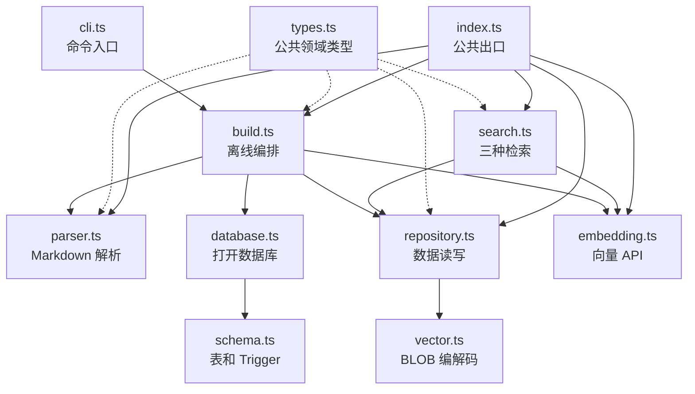

对应职责：

- [types.ts](/Users/xuxiaokang/apps/DKAgent/src/knowledge/types.ts)：领域类型
- [parser.ts](/Users/xuxiaokang/apps/DKAgent/src/knowledge/parser.ts)：Markdown 转对象
- [schema.ts](/Users/xuxiaokang/apps/DKAgent/src/knowledge/schema.ts)：SQLite 表、FTS、Trigger
- [database.ts](/Users/xuxiaokang/apps/DKAgent/src/knowledge/database.ts)：数据库连接
- [repository.ts](/Users/xuxiaokang/apps/DKAgent/src/knowledge/repository.ts)：数据库读写
- [embedding.ts](/Users/xuxiaokang/apps/DKAgent/src/knowledge/embedding.ts)：调用 Embedding API
- [vector.ts](/Users/xuxiaokang/apps/DKAgent/src/knowledge/vector.ts)：向量和 BLOB 转换
- [search.ts](/Users/xuxiaokang/apps/DKAgent/src/knowledge/search.ts)：FTS、Embedding、Hybrid
- [build.ts](/Users/xuxiaokang/apps/DKAgent/src/knowledge/build.ts)：离线建库编排
- [cli.ts](/Users/xuxiaokang/apps/DKAgent/src/knowledge/cli.ts)：`npm run kb:build`
- [index.ts](/Users/xuxiaokang/apps/DKAgent/src/knowledge/index.ts)：模块统一出口

最终可以把它理解成三层：

```text
编排层：build.ts / search.ts
   ↓
领域与能力层：parser.ts / embedding.ts / repository.ts
   ↓
基础设施层：database.ts / schema.ts / vector.ts
```

下一步最适合从 [build.ts](/Users/xuxiaokang/apps/DKAgent/src/knowledge/build.ts) 开始，顺着一次真实建库调用链逐行讲。