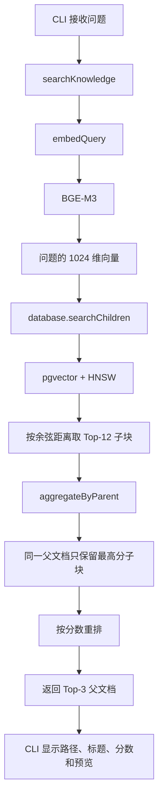
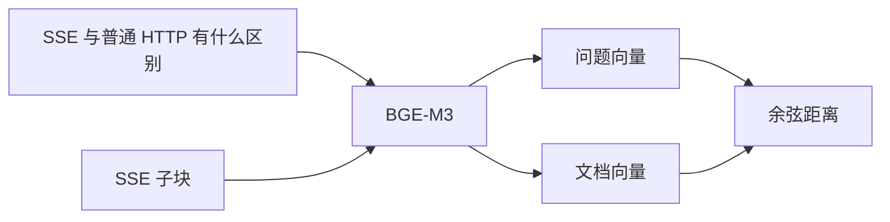

# 第三关：向量检索与父文档聚合

> 本关只学习“如何从 3335 个子块中找到最相关的 3 篇父文档”。  
> 不调用 DeepSeek，不生成答案，不调整 BM25、RRF、重排或查询重写。

核心代码：

- [`src/retrieval/search.ts`](src/retrieval/search.ts)
- [`src/storage/database.ts`](src/storage/database.ts)
- [`src/embedding/embedding.ts`](src/embedding/embedding.ts)

## 1. 学完后需要会什么

你应该能解释：

1. 为什么用户问题也必须调用同一个 Embedding 模型；
2. pgvector 如何通过余弦距离排列子块；
3. 为什么 `Top-3` 不是直接查询 3 个子块，而是先查至少 12 个；
4. 为什么同一父文档只保留最高分子块；
5. HNSW、余弦距离和父文档聚合分别处于哪一层；
6. 检索命中为什么不等于答案正确。

---

## 2. 完整检索流程

用户执行：

```bash
pnpm --filter @dkagent/rag-v2 run rag search "SSE 和普通 HTTP 有什么区别"
```

真实调用链：



一句话：

> 先把问题变成向量，在所有子块向量中寻找附近候选，再按父文档去重得到三个来源。

---

## 3. `search` 不会生成答案

当前 `search` 命令只做检索：

```text
输入问题
→ 返回相关文档和子块
```

它不会：

- 调用 DeepSeek；
- 综合多个来源；
- 判断引用是否支持结论；
- 生成自然语言答案；
- 自动拒答。

因此下面的输出：

```text
1. SSE.md#SSE 和普通 HTTP 的区别
   similarity=0.8149
```

只表示“这个子块与问题的向量比较接近”，不表示系统已经正确回答了问题。

---

## 4. 为什么查询也要生成 Embedding

摄入阶段已经把每个子块转换成：

```text
ChildChunk 文本 → BGE-M3 → 1024维文档向量
```

查询阶段必须使用同一个模型：

```text
用户问题 → BGE-M3 → 1024维问题向量
```

只有两边处在同一个语义空间，才能比较距离。



不能使用：

```text
BGE-M3 文档向量 + 另一个模型的问题向量
```

不同模型的维度和语义空间可能不同，即使维度碰巧相同，也不能直接比较。

当前调用：

```ts
const embedded = await input.embedding.embedQuery(input.query);
```

每执行一次真实搜索，都会产生一次查询 Embedding 调用。

---

## 5. `searchKnowledge()` 是检索总调度器

[`src/retrieval/search.ts`](src/retrieval/search.ts) 的主流程可以简化为：

```ts
async function searchKnowledge({ query, topK = 3 }) {
  const embedded = await embedQuery(query);

  const childHits = await searchChildren(
    embedded.embedding,
    Math.max(12, topK * 4),
  );

  return aggregateByParent(childHits, topK);
}
```

它负责三件事：

1. 把查询向量化；
2. 请求数据库召回更多子块候选；
3. 按父文档聚合成最终结果。

它不关心 SQL 细节，SQL 被封装在 `RagDatabase` 中。

---

## 6. pgvector 查询逐行解释

核心 SQL：

```sql
SELECT
  c.parent_id,
  c.source_path,
  d.title AS document_title,
  c.id AS chunk_id,
  c.heading_path,
  c.content,
  1 - (c.embedding <=> $1::vector) AS similarity,
  c.needs_vision
FROM rag_chunks c
JOIN rag_documents d
  ON d.id = c.parent_id
ORDER BY c.embedding <=> $1::vector
LIMIT $2;
```

### `FROM rag_chunks c`

检索对象是子块，不是整篇父文档。因为子块主题更集中，定位更精准。

### `JOIN rag_documents d`

```sql
d.id = c.parent_id
```

把子块与父文档连接，从而同时返回父文档标题。

### `$1::vector`

`$1` 是参数化 SQL 的第一个参数，即问题的 1024 维向量。

TypeScript 在传入前执行：

```ts
pgvector.toSql(vector)
```

把 `number[]` 转换成 pgvector 能识别的格式。

### `<=>`

`<=>` 是 pgvector 的余弦距离运算符：

```sql
c.embedding <=> query_vector
```

距离越小，方向越接近。

### `ORDER BY ... ASC`

SQL 默认升序，因此最小距离排在前面：

```text
距离 0.10
距离 0.18
距离 0.26
……
```

### `LIMIT $2`

只返回指定数量的候选子块，不把 3335 个子块全部交给 Node.js。

---

## 7. 余弦距离和相似度

余弦比较两个向量的方向，而不是文本长度。

直观示例：

```text
A = [1, 0]       向右
B = [0.9, 0.1]   大致向右
C = [0, 1]       向上
```

A 与 B 的方向更接近，所以语义相似度通常更高。

余弦相似度公式：

```text
cosineSimilarity(A, B)
= (A · B) / (|A| × |B|)
```

当前 SQL 使用余弦距离排序，再转换成相似度显示：

```text
similarity = 1 - cosineDistance
```

例如：

```text
cosineDistance = 0.1851
similarity     = 1 - 0.1851
               = 0.8149
```

理论上余弦相似度范围是 `-1～1`，不是严格的 `0～1`：

- 越接近 1：方向越相近；
- 接近 0：方向相关性弱；
- 越接近 -1：方向相反。

在实际文本 Embedding 中常看到正数，但不能把 `0.8` 当成跨模型通用的“80% 正确率”。

---

## 8. HNSW 在哪里发挥作用

数据库创建了：

```sql
CREATE INDEX rag_chunks_embedding_hnsw_idx
ON rag_chunks
USING hnsw (embedding vector_cosine_ops);
```

职责划分：

```text
余弦距离：定义“两个向量如何比较”
HNSW索引：帮助数据库快速找到可能接近的向量
LIMIT：控制最终返回多少个候选
```

HNSW 是近似最近邻索引。它通过图结构缩小搜索范围，不必逐个比较所有向量。


“近似”意味着它用少量召回损失换取查询速度。当前只有 3335 个子块，性能压力并不大；保留 HNSW 是为了使用真实生产形态的向量数据库。

---

## 9. 为什么 Top-3 要先召回至少 12 个子块

当前公式：

```ts
candidateLimit = Math.max(12, topK * 4);
```

例子：

| `topK` | 数据库候选子块数 |
|---:|---:|
| 1 | 12 |
| 3 | 12 |
| 5 | 20 |
| 10 | 40 |

原因是最终目标为 `Top-K 父文档`，数据库最先返回的是 `Top-N 子块`。

假设数据库只查 3 个子块：

```text
1. SSE.md / SSE是什么       0.92
2. SSE.md / SSE响应头       0.90
3. SSE.md / SSE数据格式     0.88
```

三个候选全部属于 `SSE.md`。父文档去重后只剩一个结果，无法得到 Top-3 父文档。

所以需要先扩大候选池：

```text
先取 12 个子块
→ 按父文档去重
→ 再取 3 篇父文档
```

`12` 和 `4倍` 是第一版经验值，不是理论最优值。后续应通过 20 题评估观察父文档去重后是否经常不足 3 篇，再决定是否调整。

---

## 10. 父文档聚合如何工作

核心函数：

```ts
aggregateByParent(hits, topK)
```

假设数据库返回：

| 顺序 | 父文档 | 子块 | 相似度 |
|---:|---|---|---:|
| 1 | A.md | A1 | 0.92 |
| 2 | A.md | A2 | 0.89 |
| 3 | B.md | B1 | 0.88 |
| 4 | C.md | C1 | 0.85 |
| 5 | B.md | B2 | 0.80 |
| 6 | D.md | D1 | 0.76 |

算法使用：

```ts
Map<parentId, bestHit>
```

处理后：

```text
A.md → 保留 A1 0.92
B.md → 保留 B1 0.88
C.md → 保留 C1 0.85
D.md → 保留 D1 0.76
```

再排序并取 Top-3：

```text
1. A.md / A1 / 0.92
2. B.md / B1 / 0.88
3. C.md / C1 / 0.85
```

### 为什么要按父文档去重

- 增加来源多样性；
- 避免 Top-3 被同一文件的相似子块占满；
- Recall@3 的正确文档口径本来就是父文档。

### 当前聚合的局限

- 每篇父文档只保留一个最高分子块；
- 同一文件中另一个同样重要的标题块会被丢弃；
- 一个问题需要同文件多个章节时，检索结果本身可能不完整。

生成阶段会根据最高分子块取父文档全文或相邻块补上下文，但这不能解决所有跨章节问题。

---

## 11. `SearchHit` 表示什么

最终每条结果包含：

```ts
interface SearchHit {
  parentId: string;
  sourcePath: string;
  documentTitle: string;
  chunkId: string;
  headingPath: string[];
  content: string;
  similarity: number;
  needsVision: boolean;
}
```

字段用途：

| 字段 | 用途 |
|---|---|
| `parentId` | 父文档聚合、找回完整父文档 |
| `sourcePath` | 展示来源和计算 Recall@3 |
| `chunkId` | 定位命中的具体子块 |
| `headingPath` | 显示命中章节、补充语义 |
| `content` | 预览证据内容 |
| `similarity` | 观察相对排序，不代表正确率 |
| `needsVision` | 提醒该证据可能依赖未解析图片 |

---

## 12. 用真实 SSE 搜索理解结果

之前运行：

```bash
pnpm --filter @dkagent/rag-v2 run rag search "SSE 和普通 HTTP 有什么区别"
```

Top-1：

```text
C-前端学习/node/SSE.md
# SSE 和普通 HTTP 的区别
similarity=0.8149
```

这说明：

- 查询 Embedding 成功；
- pgvector 能返回余弦距离较近的子块；
- 正确父文档进入 Top-1；
- 标题切块帮助定位到了对应章节。

但当时 Top-2、Top-3 主要是“SSE 与 WebSocket 的区别”。这暴露了 Dense 检索的一个真实问题：

```text
模型抓住了“SSE + 通信方式 + 区别”
但没有完全区分“普通 HTTP”和“WebSocket”
```

现在只记录问题，不立即增加 BM25、RRF 或重排。需要先放入 20 题评估，确认它是否是重复出现的真实失败。

---

## 13. 检索失败应该先归因

| 现象 | 可能原因 |
|---|---|
| 正确文件完全没进入候选 | 查询与文档术语差异、切块或 Embedding 问题 |
| 正确子块在 Top-12，但父文档不在 Top-3 | 聚合或排序问题 |
| Top-3 都是同类但不准确的文档 | Dense 语义过度泛化 |
| 命中正确文档但正文缺答案 | 答案跨块、跨文件或在图片中 |
| 相似度高但引用不支持答案 | 相似不等于证据充分 |
| 拒答问题也有较高分 | 知识库中存在语义相近但不支持回答的内容 |

后续优化顺序仍然是：

```text
先检查数据和切块
→ 再检查元数据
→ 再考虑 BM25 + Dense + RRF
→ 必要时查询重写
→ 最后才考虑重排模型
```

---

## 14. 三个最小实验

### 实验一：只验证父文档聚合

不调用模型和数据库：

```bash
cd /Users/xuxiaokang/apps/DKAgent
pnpm --filter @dkagent/rag-v2 exec tsx --test test/search-context.test.ts
```

重点观察测试：

```text
子块候选按父文档聚合，并保留每个父文档最高分块
```

测试数据中：

```text
a1=0.8、a2=0.9、b1=0.85、c1=0.7
```

当 `topK=2`，结果应该是：

```text
a2、b1
```

### 实验二：运行一次真实检索

```bash
pnpm --filter @dkagent/rag-v2 run rag search "SSE 和普通 HTTP 有什么区别"
```

手工检查：

- Top-1 是否仍是 `SSE.md`；
- 命中标题是否直接对应问题；
- 内容预览是否真正包含比较证据；
- Top-2、Top-3 是否只是语义相似而非直接回答。

这会调用一次查询 Embedding，但不会调用 DeepSeek。

### 实验三：改变 Top-K

```bash
pnpm --filter @dkagent/rag-v2 run rag search "SSE 和普通 HTTP 有什么区别" --top-k 5
```

预测：

```text
topK = 5
数据库候选数 = max(12, 5 × 4) = 20
最终最多返回 5 篇不同父文档
```

注意：两次命令会分别调用查询 Embedding。它们适合用于学习，不应无意义重复运行。

---

## 15. 当前调试能力的边界

CLI 目前只输出聚合后的最终 Top-K，没有显示数据库返回的原始 Top-12 子块。

因此如果出现聚合问题，目前无法直接从 CLI 判断：

```text
正确子块没有进入 Top-12
还是进入 Top-12 后被父文档聚合淘汰
```

这是后续评估出现真实失败时值得补充的诊断能力，但本关不提前增加功能。

---

## 16. 预测题

### 问题一

`topK=3` 时，为什么数据库不是只查询 3 个子块？

### 问题二

数据库返回：

```text
A/a1 0.91
A/a2 0.88
B/b1 0.86
C/c1 0.83
B/b2 0.80
D/d1 0.75
```

父文档聚合并取 Top-3 后，保留哪些子块？

### 问题三

某子块的余弦距离是 `0.24`，CLI 显示的相似度是多少？它是否代表答案有 76% 的概率正确？

### 问题四

HNSW 和余弦距离分别解决什么问题？

### 问题五

为什么 `search` 命中正确文件后，仍然不能宣称 RAG 已经回答正确？

---

## 17. 验收标准

- [ ] 能画出查询 Embedding 到 Top-3 的完整链路；
- [ ] 能解释问题向量与文档向量为什么必须来自同一模型；
- [ ] 能计算 `similarity = 1 - cosineDistance`；
- [ ] 能手工完成父文档聚合；
- [ ] 能区分 HNSW、余弦距离与父文档聚合的职责；
- [ ] 能解释相似度为什么不是正确率；
- [ ] 能指出当前 Dense 检索至少两个失败场景。

完成预测题和真实搜索检查后，第三关才验收通过。下一关进入 20 题 Recall@3 评估。
