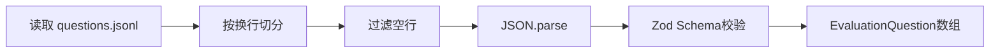
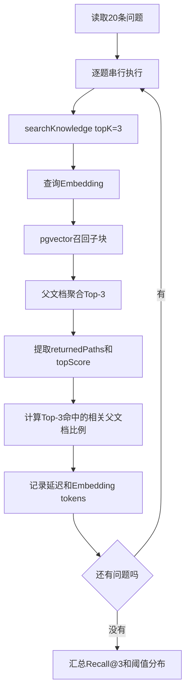

# 第四关：20题最小检索评估

> 本关目标：用20个真实问题判断检索是否把正确父文档放进前三。  
> 本关不调用 DeepSeek，不使用 RAGAS、Phoenix，不提前增加 BM25、RRF、重排或查询重写。

> 2026-09-02 实现更新：检索评估已支持 `--strategy dense|hybrid`，并增加显式 `baseline` 完整问答评估。下文“不增加 BM25、RRF”描述的是改造前基线阶段。

核心文件：

- [`eval/questions.jsonl`](eval/questions.jsonl)：20条人工评估数据；
- [`src/evaluation/evaluate.ts`](src/evaluation/evaluate.ts)：评估执行和统计；
- [`src/retrieval/search.ts`](src/retrieval/search.ts)：被评估的真实检索链路。

## 1. 为什么必须先评估

单次搜索成功只能证明一个问题能命中：

```text
“SSE 和普通 HTTP 有什么区别”
→ SSE.md 排名第一
```

它不能证明：

- 其他业务问题也能命中；
- SOP、代码、图片文档同样有效；
- 无答案问题能够拒答；
- 分块参数已经合理；
- 相似度阈值适合当前知识库。

最小评估的作用不是得到漂亮分数，而是建立一个可重复的失败清单：

```text
改动前运行20题
→ 修改切块或检索
→ 再运行同样20题
→ 判断真实问题是否改善
```

---

## 2. 当前20题的数据构成

当前 [`eval/questions.jsonl`](eval/questions.jsonl) 共有：

```text
18条可回答问题
2条应拒答问题
合计20条
```

可回答题覆盖：

- React、Zustand、SSE；
- GitHub Actions；
- Agent上下文、Session、QueryModel；
- RAG、MCP、评估、Zod。

拒答题是：

- 知识库中不存在的火星基地参数；
- 尚未发布产品的未来内部定价。

这是开发集，不是线上真实流量样本，也不是统计学上充分的质量证明。

---

## 3. 一条 JSONL 评估数据

JSONL 表示“每一行都是一个完整 JSON 对象”。下面是一条有效数据：

```json
{"query":"SSE适合哪些场景？","relevantSourcePaths":["C-前端学习/node/SSE.md"],"expectedFacts":["适合服务器向客户端单向推送"],"shouldRefuse":false}
```

字段说明：

| 字段 | 含义 | 谁使用 |
|---|---|---|
| `query` | 用户真实问题 | 检索链路 |
| `relevantSourcePaths` | 正确父文档路径 | 自动计算 Recall@3 |
| `expectedFacts` | 正确答案至少应包含的事实 | 当前只输出，暂不自动判分 |
| `shouldRefuse` | 是否期望系统拒答 | 阈值分布分析 |

拒答题示例：

```json
{"query":"火星基地氧气循环参数是多少？","relevantSourcePaths":[],"expectedFacts":[],"shouldRefuse":true}
```

拒答题没有正确文档，所以 `relevantSourcePaths` 应为空数组。

---

## 4. 数据加载与校验

`readEvaluationQuestions()` 先读取文件，再逐行解析：



Zod 检查：

```ts
// 中文注释：每条评估数据必须满足这些字段约束
const QuestionSchema = z.object({
  query: z.string().min(1),
  relevantSourcePaths: z.array(z.string()),
  expectedFacts: z.array(z.string()).default([]),
  shouldRefuse: z.boolean(),
});
```

如果第7行 JSON 格式错误或字段类型不对，程序会明确报告第7行无效，不会静默跳过。

---

## 5. 评估调用链



核心事实：

- 20题逐题串行执行；
- 每题调用一次查询 Embedding；
- 每题执行一次真实 pgvector 检索；
- 每题最终返回3篇父文档；
- 不调用 DeepSeek；
- 不生成答案。

---

## 6. Recall@3 如何计算

对一条可回答问题：

```text
Top-3命中的相关父文档数 / 标注的全部相关父文档数
→ 单题 Recall@3
```

代码逻辑可以简化为：

```ts
// 中文注释：计算Top-3命中了多少篇标注相关父文档
const matchedCount = relevantSourcePaths.filter((sourcePath) =>
  returnedPaths.includes(sourcePath),
).length;
const recallAt3 = matchedCount / relevantSourcePaths.length;
```

总指标：

```text
整体 Recall@3
= 所有可回答问题的单题 Recall@3 之和 / 可回答题总数
```

例如某题标注 A、E、F 三篇相关父文档，Top-3 返回 A、B、C：

```text
单题 Recall@3 = 1 / 3 = 33.3%
```

两条拒答题不进入 Recall@3 分母。

### 多个正确文档怎么算

“RAG基本流程”配置了两个可能的正确父文档：

```text
0.RAG介绍.md
RAG.md
```

只要其中任意一个进入 Top-3，该题就算召回成功。

当前指标衡量的是“是否找到至少一个正确父文档”，不衡量多个证据是否全部找齐。

---

## 7. 为什么口径是父文档

检索数据库首先召回子块，但评估配置的是：

```text
relevantSourcePaths
```

因此 Recall@3 的含义是：

> 正确 Markdown 文件是否进入最终3篇父文档。

它暂时不检查：

- 命中的具体标题是否正确；
- 命中子块是否包含答案；
- 相邻块是否足够；
- LLM引用是否真正支持结论。

所以父文档 Recall@3 通过，只是检索的第一层成功。

---

## 8. 拒答题在当前评估中做什么

对于 `shouldRefuse=true` 的问题，当前代码不计算 Recall：

```ts
// 中文注释：拒答题没有相关父文档，不进入 Recall@3 的分子或分母
const recallAt3 = question.shouldRefuse
  ? null
  : /* 计算命中的相关父文档比例 */;
```

这不代表系统真的拒答成功。

拒答题当前只用于收集 Top-1 相似度：

```text
问题虽然没有答案
→ Dense检索仍然会返回最相似的3篇文档
→ 记录其中最高分
```

第五关才会检查 `ask` 是否真正返回拒答文本。

---

## 9. 相似度阈值如何校准

当前评估分别收集：

```text
positiveScores：可回答题的Top-1分数
refusalScores：拒答题的Top-1分数
```

然后取：

```text
最低可回答题分数 = lowestPositive
最高拒答题分数   = highestRefusal
```

### 情况一：分布不重叠

```text
最低正例分数 0.72
最高拒答分数 0.60
```

可以取中点作为建议阈值：

```text
suggestedThreshold
= (0.72 + 0.60) / 2
= 0.66
```

含义：Top-1 低于0.66时，可以倾向拒答。

### 情况二：分布重叠

```text
最低正例分数 0.58
最高拒答分数 0.65
```

拒答题分数比部分可回答题还高，单一阈值无法同时区分它们：

```text
thresholdOverlap = true
suggestedThreshold = undefined
```

此时不能随便拍一个阈值，应检查检索证据是否真的支持答案。

### 当前阈值算法的局限

它使用每道题的 Top-1 分数，即使可回答题的 Top-1 是错误文档，也会进入 `positiveScores`。

因此 `suggestedThreshold` 只是开发提示，不是可靠分类器，也不能直接成为线上最终规则。

---

## 10. 延迟和调用成本

每道题记录：

```text
latencyMs：查询Embedding + 数据库检索 + 父文档聚合耗时
```

最终计算平均值：

```text
averageLatencyMs
= 所有问题延迟之和 / 问题数量
```

同时累计查询 Embedding 返回的 Token：

```text
embeddingTokens
= 20次查询Embedding的Token总数
```

本指标不包含：

- 摄入阶段的 Embedding 成本；
- DeepSeek输入输出 Token；
- 最终答案生成延迟。

这些要在第五关单独观察。

---

## 11. 当前程序自动评估什么

| 项目 | 当前是否自动评估 | 说明 |
|---|---|---|
| Recall@3 | 是 | 正确父文档是否进入前三 |
| 检索延迟 | 是 | 每题和平均耗时 |
| 查询Embedding Token | 是 | 模型返回用量时累计 |
| Top-1分数分布 | 是 | 用于辅助校准阈值 |
| 引用是否支持答案 | 否 | 本关没有生成答案 |
| 回答是否完整 | 否 | 需要人工检查最终答案 |
| 不知道时是否真的拒答 | 否 | 当前只分析拒答题分数 |
| LLM调用成本 | 否 | 第五关才调用DeepSeek |
| `expectedFacts`覆盖率 | 否 | 当前只写入报告，不自动判分 |

这是本关最重要的边界：

> `evaluate` 是检索评估，不是完整 RAG 回答评估。

---

## 12. 当前20题还缺什么

事实：当前20条数据的 `expectedFacts` 全部是空数组。

这不影响 Recall@3，但无法用于人工检查答案完整性。

进入第五关前，应为可回答题补充1～3条最关键事实。例如 SSE：

```json
{"query":"SSE适合哪些场景，它和普通HTTP有什么区别？","relevantSourcePaths":["C-前端学习/node/SSE.md"],"expectedFacts":["SSE适合服务器单向推送","SSE保持HTTP响应连接并持续写入数据","普通HTTP通常一次返回后结束连接"],"shouldRefuse":false}
```

不要复制整段标准答案。`expectedFacts` 应该是用于检查完整性的最小事实清单。

---

## 13. 如何准备一条可靠评估题

### 可回答题

必须人工确认：

1. 知识库中确实存在答案；
2. `relevantSourcePaths` 路径完全正确；
3. 文档正文确实支持问题；
4. 问题使用真实用户表达，不只是照抄标题；
5. `expectedFacts` 只写文档中存在的事实。

### 拒答题

必须确认：

1. 当前扫描范围内没有答案；
2. 不是“答案很难找”，而是真的没有证据；
3. 问题仍可能与知识库主题相近，用于测试语义误召回；
4. `relevantSourcePaths` 和 `expectedFacts` 都为空。

---

## 14. 运行评估

先进入 DKAgent 根目录，再运行真实评估：

```bash
# 中文注释：进入 DKAgent 仓库根目录
cd /Users/xuxiaokang/apps/DKAgent

# 中文注释：执行20题真实检索评估，会调用20次查询Embedding，不调用DeepSeek
pnpm --filter @dkagent/rag-v2 run rag evaluate
```

运行前检查：

- PostgreSQL容器正在运行；
- 根目录 `.env` 已配置 `SILICONFLOW_API_KEY`；
- `DATABASE_URL` 指向当前 `rag-v2` 数据库；
- 20条 `relevantSourcePaths` 已人工核对。

---

## 15. 如何阅读报告

报告摘要示意：

```json
{
  "total": 20,
  "answerable": 18,
  "recallAt3": 0.8333,
  "averageLatencyMs": 260,
  "embeddingTokens": 240,
  "suggestedThreshold": 0.66,
  "thresholdOverlap": false,
  "cases": []
}
```

以上只是字段示例，不是当前项目的实际评估结果。

阅读顺序：

1. 先看 `recallAt3`，确认检索基线；
2. 再找单题 `recallAt3 < 1` 的具体问题；
3. 核对 `returnedPaths`，判断错误类型；
4. 查看 `topScore`，不要只看分数下结论；
5. 查看 `thresholdOverlap`，判断单阈值是否可用；
6. 最后记录延迟和 Token，避免为了小幅提升造成明显成本增加。

---

## 16. 每个失败只归一个首要原因

| 首要原因 | 判断方式 | 当前优先动作 |
|---|---|---|
| 数据缺失 | 正确文档本身没有答案 | 补数据，不调检索 |
| 标注错误 | `relevantSourcePaths` 写错 | 修评估数据 |
| 分块问题 | 答案跨块或块语义混杂 | 调整切块 |
| 标题/元数据不足 | 业务术语不在检索文本中 | 补标题或元数据 |
| Dense过度泛化 | 返回语义相似但关键术语不同 | 后续考虑BM25混合检索 |
| 父文档聚合 | 正确子块进入候选但聚合后丢失 | 增加候选诊断再调整 |
| 图片依赖 | 答案主要存在截图 | 标记视觉缺口，不伪装成功 |

不要看到一个失败就同时修改切块、Embedding模型、Top-K和Prompt。否则无法知道哪项改动真正有效。

---

## 17. 本关完成标准

本关跳过预测题，只做应用验收：

- [ ] 人工核对20条问题及正确父文档；
- [ ] 确认18条可回答、2条应拒答；
- [ ] 运行一次 `evaluate`；
- [ ] 记录 Recall@3、平均延迟和Embedding Token；
- [ ] 列出所有单题 `recallAt3 < 1` 的问题；
- [ ] 为每个失败标记一个首要原因；
- [ ] 不根据20题结果宣称线上有效率；
- [ ] 不在分析失败前直接增加复杂检索技术。

完成后进入第五关：证据上下文、DeepSeek回答、引用检查与拒答。
