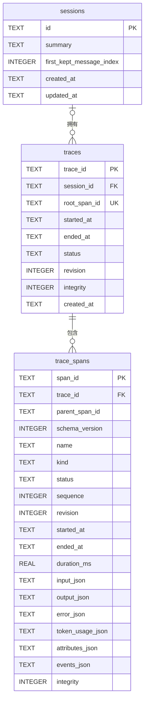

# DKAgent Trace V2 MVP 数据库 ER 设计

## 1. 结论

Trace V2 与 Session 共用 `.dkagent/sessions.db`，采用规范化三表关系：

`sessions 1 ── N traces 1 ── N trace_spans`

- `sessions` 是已有 Session 主表。
- `traces` 表示一次用户输入触发的完整 Agent Turn。
- `trace_spans` 表示 Turn 内的 Agent、Context、Model、Tool、Memory、Artifact 执行节点。
- `session_id` 只保存在 `traces`，`trace_spans` 通过 `trace_id` 获得 Session 归属，避免重复事实不一致。
- 本设计不展开 `session_messages`，它仍由 Session 模块独立管理，不属于 Trace 数据结构。

## 2. ER 图



## 3. 表职责与字段

### 3.1 `sessions`：Session 根实体

该表已经存在，Trace 只引用它，不复制 Session 消息或 Context 正文。

| 字段 | 类型 | 约束 | 意义 |
| --- | --- | --- | --- |
| `id` | TEXT | PK | Session 唯一标识 |
| `summary` | TEXT | NOT NULL | 当前 Context 摘要 |
| `first_kept_message_index` | INTEGER | NOT NULL | Context 压缩边界 |
| `created_at` | TEXT | NOT NULL | Session 创建时间 |
| `updated_at` | TEXT | NOT NULL | Session 最近更新时间 |

### 3.2 `traces`：一次 Agent Turn

一条 Trace 对应一次用户输入。该表保存 recent 查询所需的摘要状态，不复制完整 Span 内容。

| 字段 | 类型 | 约束 | 意义 |
| --- | --- | --- | --- |
| `trace_id` | TEXT | PK | Trace 唯一标识 |
| `session_id` | TEXT | FK → `sessions.id`，ON DELETE CASCADE | Trace 所属 Session；无 Session 的独立 Trace 可为 NULL |
| `root_span_id` | TEXT | NOT NULL、UNIQUE | 唯一根 `agent.turn` Span |
| `started_at` | TEXT | NOT NULL | 根 Span 开始时间，ISO 8601 |
| `ended_at` | TEXT | NULL | 根 Span 结束时间；运行中为 NULL |
| `status` | TEXT | NOT NULL | `running`、`ok` 或 `error` |
| `revision` | INTEGER | NOT NULL | 根 Span 当前 revision |
| `integrity` | INTEGER | NOT NULL | 整条 Trace 是否完整，SQLite 中使用 0/1 |
| `created_at` | TEXT | NOT NULL | 首次持久化时间 |

### 3.3 `trace_spans`：Typed Span 快照

每个 Span 只保留最高 revision 的 canonical 快照。`parent_span_id` 不设置自外键：Sink 写入失败时仍允许保存可诊断数据，Reader 通过完整性检查报告缺父节点。

| 字段 | 类型 | 约束 | 意义 |
| --- | --- | --- | --- |
| `span_id` | TEXT | PK | Span 唯一标识 |
| `trace_id` | TEXT | NOT NULL，FK → `traces.trace_id`，ON DELETE CASCADE | 所属 Trace |
| `parent_span_id` | TEXT | NULL | 父 Span；根节点为 NULL |
| `schema_version` | INTEGER | NOT NULL | MVP 固定为 2 |
| `name` | TEXT | NOT NULL | 有限枚举的 Typed Span 名称 |
| `kind` | TEXT | NOT NULL | `AGENT/STEP/CONTEXT/LLM/TOOL/MEMORY/ARTIFACT` |
| `status` | TEXT | NOT NULL | `running`、`ok` 或 `error` |
| `sequence` | INTEGER | NOT NULL | Trace 内创建顺序 |
| `revision` | INTEGER | NOT NULL | 同一 Span 的快照版本 |
| `started_at` | TEXT | NOT NULL | 开始时间 |
| `ended_at` | TEXT | NULL | 结束时间；运行中为 NULL |
| `duration_ms` | REAL | NULL | 执行耗时，保留小数毫秒 |
| `input_json` | TEXT | NOT NULL | Typed Span 输入 JSON |
| `output_json` | TEXT | NOT NULL | Typed Span 输出 JSON；无输出保存 `null` |
| `error_json` | TEXT | NULL | 安全错误名称和代码，不保存 Provider 原始 message |
| `token_usage_json` | TEXT | NULL | 仅 `model.generate` 保存 Provider Token |
| `attributes_json` | TEXT | NOT NULL | 小型扩展属性 JSON |
| `events_json` | TEXT | NOT NULL | Span 内事件 JSON |
| `integrity` | INTEGER | NOT NULL | Span 是否通过完整性检查，SQLite 中使用 0/1 |

联合约束：`UNIQUE(trace_id, sequence)`，保证同一 Trace 内 Span 顺序唯一。

## 4. 外键与删除链路

```text
DELETE sessions(id)
  └─ CASCADE DELETE traces(session_id)
       └─ CASCADE DELETE trace_spans(trace_id)
```

Session 删除后，其消息由 Session 模块处理，其 Trace 和 Span 由数据库外键自动删除。应用层不编写第二套 Trace 清理循环。

数据库连接必须执行：

```sql
PRAGMA foreign_keys = ON;
PRAGMA journal_mode = WAL;
```

## 5. Revision Upsert 规则

写入以 `span_id` 为冲突键，在单个 SQLite 事务中完成：

1. 未知 `schema_version/name/kind` 不进入写侧。
2. 新 Span 创建新行；`agent.turn` 同时创建对应 `traces` 行。
3. 只有 `incoming.revision > stored.revision` 才允许更新。
4. `trace_id/parent_span_id/name/kind/sequence` 属于身份字段，创建后不得改变。
5. terminal Span 不得被后到的 `running` 快照覆盖。
6. 先提交 SQLite，再通知订阅者，避免 Web 收到尚未落库的数据。
7. Sink、序列化或订阅者失败不得改变 Agent 的业务返回值和原始异常。

## 6. 索引

MVP 只增加三类真实查询需要的索引：

```sql
CREATE INDEX idx_traces_session_started
    ON traces(session_id, started_at DESC);

CREATE INDEX idx_trace_spans_trace_sequence
    ON trace_spans(trace_id, sequence);

CREATE INDEX idx_trace_spans_parent
    ON trace_spans(parent_span_id);
```

- `recent`：按 Session/时间查询最近 Trace。
- `show <traceId>`：按 sequence 还原完整 Span 链。
- 父节点索引：辅助树结构和缺父诊断。

## 7. 读取链路

### 最近 Trace

```text
sessions.id → traces.session_id → TraceSummary
```

只读取根状态、开始/结束时间、耗时、Span 数和完整性，不读取大型模型输入输出。

### Trace 详情

```text
traces.trace_id → trace_spans.trace_id
  → ORDER BY sequence
  → TraceDocument
```

`TraceDocument` 检查：唯一根、缺失父节点、running Span、`trace.output_missing`、`trace.serialization_error`。未知 schema 明确返回“不支持”，不猜测或静默转换。

## 8. MVP 边界

- 不保存成本、采样、评测、OTel 或第三方导出字段。
- 不建立 V1 `trace_events` 表，也不迁移不存在的 V1 持久化数据。
- 不在 `trace_spans` 冗余 `session_id`。
- 不为 JSON 内容建立索引。
- 不实现保留期、归档或后台清理任务。
