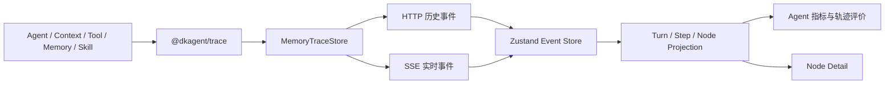
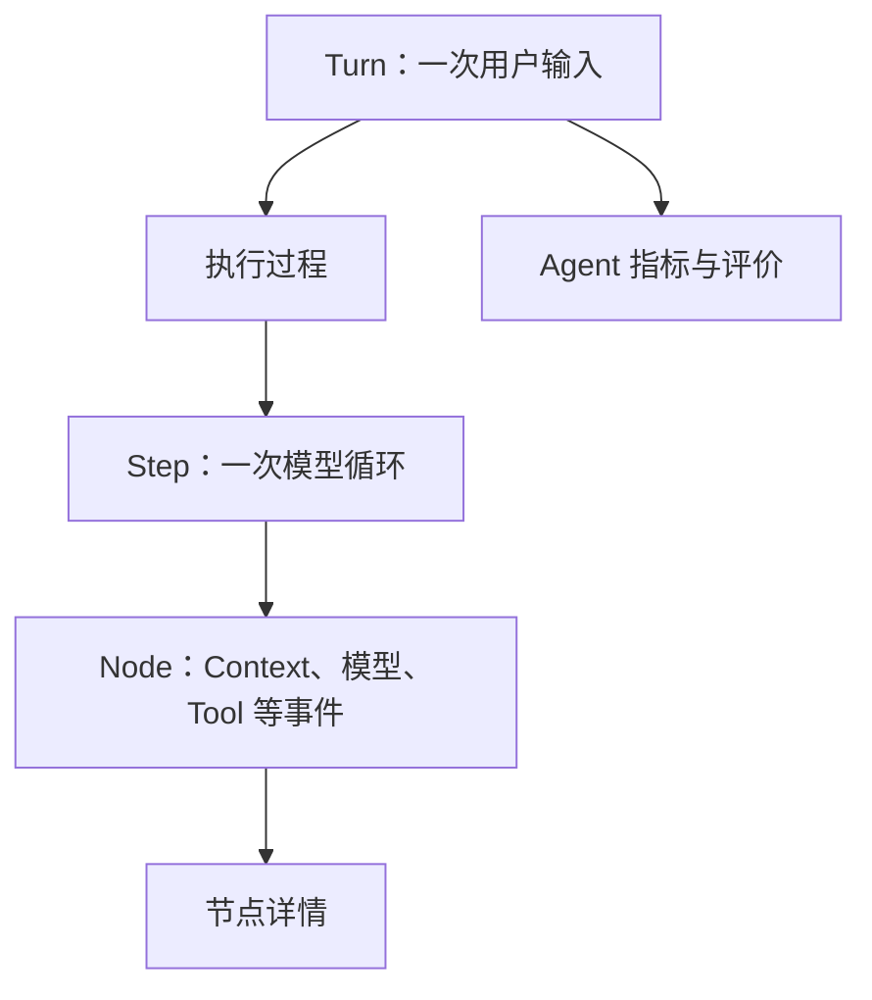

# Web Tap

## 背景

Web Tap 是 DKAgent 的本地学习与调试界面，用于观察一次用户输入触发的 AgentLoop。它帮助开发者理解 Context 构建、模型调用、Tool 调用、Memory 生命周期、Skill 阶段和上下文压缩过程，不参与 Agent 决策。

## 当前能力

- 按 Turn、Step、Node 展示 AgentLoop。
- 通过 HTTP 加载已有内存 Trace，通过 SSE 接收实时事件。
- 展示模型请求响应、Tool 调用结果和 Context 压缩前后内容。
- 展示 Memory 召回、提取、写入以及 Skill 阶段和它们的内部模型调用。
- 展示当前 Turn 的 Agent 运行指标和确定性轨迹评价。
- 对常用节点和字段做中文显示，同时保留原始 JSON。

## 启动

```bash
npm run observe
```

开发前端界面：

```bash
npm run dev
```

## 架构



页面数据关系：



页面在桌面端同时展示执行过程和可折叠 Agent 指标栏；紧凑视口默认折叠指标栏，移动端通过抽屉查看 Turn 和 Agent 指标。切换 Node 不会改变 Turn 级指标。

## 模块职责

### Agent

- 执行 AgentLoop。
- 在关键流程调用 Trace API。
- 不知道 Web Tap 的组件、指标和评价规则。

### Trace

- 记录结构化事实、父子关系、时间、顺序和耗时。
- 在 Store 边界进行脱敏。
- 观测失败不能改变 Agent 的执行结果。

### Web Tap

- 读取 Trace 并投影成页面数据。
- 对技术事件和常用字段做中文显示。
- 从 Trace 计算运行指标和确定性规则结果。
- 未适配事件降级展示原始 JSON。

### Memory 与 Skill

- Skill Trace 保留完整阶段内容，便于定位面试分析等内部流程。
- Memory Trace 只展示 Agent 侧生成的安全摘要，不包含召回原文或待写入内容。

## 指标与评价边界

Web Tap 区分：

- 可观测事实：耗时、Step、Token、Tool 调用和压缩次数。
- 规则判断：调用链是否完整、Tool 是否明确失败、压缩后 Token 是否下降。
- 待评测：幻觉、压缩语义保真度和最终答案质量。

没有外部证据时，Web Tap 不会把“未发现错误”显示成“答案正确”。

## 开发规则

1. Agent 执行需要的字段定义在 Agent；只为观测服务的字段和计算定义在 Trace 或 Web Tap。
2. Trace 技术字段使用英文，中文只存在于 Web Tap 展示层。
3. 新事件必须保留原始 JSON，并为未知事件提供降级显示。
4. 进入 Store 时当前仅按字段名脱敏 API Key、Authorization、Header/Headers 和 env/environment。Prompt、用户输入和模型内容会为本地调试保留，并可通过 HTTP/SSE 展示；使用者不应输入敏感信息。
5. Web Tap 不能反向修改 Agent 状态或改变 Agent 结果。
6. 优先扩展纯投影函数，再增加 React 展示；组件不直接解释原始 Trace。
7. 页面继续使用 React、Zustand、Ant Design 和 CSS Flex，不为简单指标增加图表依赖。

## 当前非目标

- Session 列表与持久化。
- 数据库、分页和全文搜索。
- LLM-as-a-Judge、人工标注和综合评分。
- 实验对比、趋势监控和告警。
- OpenTelemetry 导出和跨进程追踪。

## 扩展方向

未来在真实需求出现后，可增加 Session 列表、时间瀑布图、Trace 对比、人工评价和独立 Evaluator。扩展仍应通过 Trace 或评价接口接入，不能把 Tap 展示字段放回 Agent 业务对象。
