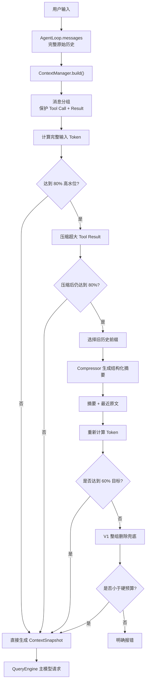
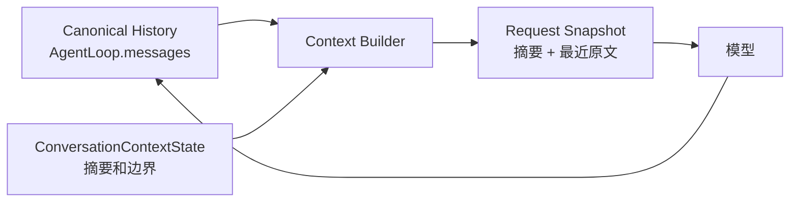

> Context 压缩不是“把字符串变短”，而是在 Token 有限时，尽量保留 Agent 继续完成任务所需的信息。

DKAgent 的完整历史永远保存在 `AgentLoop.messages`。压缩只改变“本轮发送给模型的快照”。

## 一、顶层数据流





为什么是“80% 触发、60% 目标”：

- 80%：提前处理，不等模型直接报上下文溢出。
- 60%：压缩后留出空间，避免下一轮马上再次压缩。
- 中间 20%：相当于防抖区间。

```
0%                60%              80%             100%
|------------------|----------------|----------------|
        安全区           缓冲区          必须处理
```

## 二、需要保护的三份数据

````

````

### 1. Canonical History

完整历史：

```
this.messages = [
  user1,
  assistant1,
  user2,
  assistantToolCall,
  toolResult,
  assistant2,
];
```

不因为压缩而修改。

### 2. Compression State

当前进程中的压缩状态：

```
const contextState = {
  summary: "此前对话的结构化摘要",
  firstKeptMessageIndex: 4,
  tokensBefore: 7200,
  compactionCount: 1,
};
```

含义：

```
messages[0...3]  → 已进入 summary
messages[4...末尾] → 继续保留原文
```

### 3. Request Snapshot

本轮真正发给模型：

```
固定 System Prompt
+ 历史摘要
+ messages[4...末尾]
+ Tool Schema
```

摘要不会写回 `this.messages`，只进入本次请求。

---

## 三、四种压缩策略

### 策略一：普通文本截断

```
function truncate(
  text: string,
  maxTokens: number,
): string {
  if (estimateTokens(text) <= maxTokens) {
    return text;
  }

  const ratio =
    maxTokens / estimateTokens(text);

  const maxChars =
    Math.floor(text.length * ratio * 0.9);

  return (
    text.slice(0, maxChars) +
    "\n\n[... 已截断]"
  );
}
```

它解决的是：

- Tool 返回大段日志。
- Tool 返回网页正文。
- 单段文本异常大。
- 需要快速、确定性地降低 Token。

为什么有效：

- Token 数与字符数大致正相关。
- 不调用模型，速度快、成本低。
- 使用 90% 是因为 Token 估算存在误差。

缺点：

- 后半部分信息全部丢失。
- 重要结论可能恰好在结尾。
- 不理解语义。

衡量方式：

```
截断前 Token
截断后 Token
是否满足 maxTokens
截断字符数量
```

不做会怎样：

> 一个超大的 Tool Result 就可能占满整个上下文，其他历史全部被挤掉。

因此它只适合 Tool Result、日志等内容，不应该随便截断用户问题。

---

### 策略二：JSON 结构压缩

例如 Tool 返回：

```
{
  "questions": [
    {
      "question": "请介绍事件循环",
      "expertAnswer": "很长的高手回答……",
      "beginnerAnswer": "很长的新手回答……"
    }
  ],
  "metadata": {
    "source": "interview.md",
    "duration": 7200
  }
}
```

压缩后：

```
{
  "questions": [
    {
      "question": "请介绍事件循环",
      "expertAnswer": "很长的高手回答...",
      "beginnerAnswer": "很长的新手回答..."
    }
  ],
  "metadata": {
    "source": "interview.md",
    "duration": 7200
  }
}
```

基本规则：

```
function compressObject(value: unknown): unknown {
  if (typeof value === "string") {
    return value.length > 100
      ? `${value.slice(0, 100)}...`
      : value;
  }

  if (Array.isArray(value)) {
    return value
      .slice(0, 3)
      .map(compressObject);
  }

  if (isObject(value)) {
    return Object.fromEntries(
      Object.entries(value).map(
        ([key, child]) => [
          key,
          compressObject(child),
        ],
      ),
    );
  }

  return value;
}
```

它解决的是：

- Tool Result 是大型 JSON。
- 数组项目大量重复。
- 需要保留字段结构，帮助模型理解返回值含义。

为什么优于直接截断：

```
直接截断：可能得到半个 JSON，后面字段完全消失
结构压缩：保留 key，只缩短数组和 value
```

衡量方式：

- 压缩前后 Token。
- JSON 是否仍可解析。
- 关键字段是否存在。
- 数组原数量和保留数量。
- 是否最终满足预算。

不做会怎样：

> 模型可能看到大量重复数据，却看不到后面的回答和当前问题。

需要注意：你之前的示例存在一个问题：

```
compressObject(obj, maxTokens)
```

虽然传入了 `maxTokens`，但递归过程中并没有真正使用它控制全局预算。

如果 JSON 有一万个不同的 key，即使每个 value 只保留 100 字符，结果仍然可能很大。因此必须：

```
let compressed = compressObject(parsed);

if (estimateTokens(JSON.stringify(compressed)) > maxTokens) {
  compressed = truncate(
    JSON.stringify(compressed),
    maxTokens,
  );
}
```

也就是：结构压缩之后必须重新计数。

---

### 策略三：历史摘要

原始历史：

```
用户：我要实现普通聊天和诊断 Tool
助手：建议由模型根据 Tool Schema 选择
用户：同意
助手：实现了 AgentLoop
用户：下一步实现 RAG
助手：实现了离线知识库
用户：下一步实现 Context
助手：实现了 Token 预算和消息分组
```

摘要后：

```
## Goal
- 构建用于面试诊断的 DKAgent。

## Progress
### Done
- 已完成基础 AgentLoop。
- 已完成 Tool Registry 和 Dispatcher。
- 已完成离线知识库。
- 已完成 Context V1 Token 预算与 Tool 消息分组。

### In Progress
- 实现历史摘要与 Tool Result 压缩。

## Key Decisions
- 普通语言由模型决定是否调用 Tool。
- AgentLoop.messages 保存完整历史。
- 摘要只在当前进程、当前会话中保存。

## Next Steps
1. 实现 Compressor。
2. 将摘要状态接入 AgentLoop。
```

它解决的是：

- 多轮对话越来越长。
- 旧历史不能全部删除。
- 目标、约束、已完成工作和关键决定需要长期保留。

为什么有效：

```
旧历史 5000 tokens
↓
结构化摘要 500 tokens
```

模型不再看到完整过程，但仍能知道：

- 用户要做什么。
- 已经做了什么。
- 做过哪些决定。
- 不能违反哪些约束。
- 接下来要继续什么。

衡量方式不能只看 Token：

|指标|含义|
|---|---|
|压缩率|`摘要 Token / 原历史 Token`|
|关键事实保留率|文件名、数据、约束、结论是否还在|
|连续工作成功率|下一轮模型能否继续正确执行|
|摘要延迟|摘要模型请求耗时|
|摘要成本|摘要额外消耗的输入、输出 Token|
|摘要漂移率|多次摘要后事实是否改变或丢失|

不做会怎样：

- 只能不断删除最旧消息。
- Agent 会忘记用户最初目标。
- 会重复已经完成的工作。
- 可能推翻之前确认的设计。
- 长对话最终无法继续。

摘要的主要风险是“语义漂移”：

```
原文：用户暂时不做跨进程持久化
第一次摘要：暂不持久化
第二次摘要：不需要持久化
第三次摘要：禁止持久化
```

原意逐渐改变。

因此结构化摘要要尽量保留明确措辞，并使用“已有摘要 + 新增历史”增量更新。

---

### 策略四：整组删除兜底

这是 Context V1 已有的能力：

```
while (tokens > availableTokens) {
  const oldestRemovableGroup =
    findOldestRemovableGroup();

  removeWholeGroup(oldestRemovableGroup);

  tokens = recount();
}
```

删除单位不是单条消息，而是消息组：

```
普通 User/Assistant 消息 → 单独一组

Assistant Tool Call
+ Tool Result
→ 一个不可拆分组
```

它解决的是：

- 摘要模型调用失败。
- 摘要后仍然超过预算。
- 当前 Run 或单个 Tool Result 太大。
- 粗略 Token 估算出现误差。

为什么必须保留：

> 摘要属于有失败概率的模型能力；整组删除属于确定性的安全兜底。

衡量方式：

- `droppedMessageCount`
- 删除的消息组数量。
- 摘要失败后的 fallback 次数。
- Tool Call/Result 完整性错误必须为 0。
- 最终是否满足硬预算。

不做会怎样：

> 一旦摘要失败，整个 Agent Run 就只能报错，普通聊天也无法继续。

它不应该是首选，因为会直接丢失语义。

---

## 四、完整压缩伪代码

```js
async function buildContext(
  input: ContextBuildInput,
  state: ConversationContextState,
): Promise<{
  snapshot: ContextSnapshot;
  nextState: ConversationContextState;
}> {
  const availableTokens =
    input.maxContextTokens -
    input.reservedOutputTokens;

  const triggerTokens =
    availableTokens * 0.8;

  const targetTokens =
    availableTokens * 0.6;

  // 1. Tool Call 与 Result 必须一起处理。
  const groups =
    groupContextMessages(input.messages);

  // 2. 先构建完整请求并计数。
  let request = createRequest({
    systemPrompt: input.systemPrompt,
    summary: state.summary,
    messages: input.messages.slice(
      state.firstKeptMessageIndex,
    ),
    tools: input.tools,
  });

  let tokens = await countTokens(request);

  if (tokens <= triggerTokens) {
    return {
      snapshot: createSnapshot(request),
      nextState: state,
    };
  }

  // 3. 先压缩超大的 Tool Result。
  request = compressOversizedToolResults(
    request,
  );

  tokens = await countTokens(request);

  if (tokens <= triggerTokens) {
    return {
      snapshot: createSnapshot(request),
      nextState: state,
    };
  }

  // 4. 从后向前保留最近消息，找到摘要切点。
  const cutPoint = findCutPoint({
    groups,
    targetTokens,
    summaryTokenReserve:
      input.compaction.maxSummaryTokens,
  });

  const messagesToSummarize =
    input.messages.slice(
      state.firstKeptMessageIndex,
      cutPoint,
    );

  // 5. 摘要 Tool Result 在进入摘要模型前也要截断。
  const serializedHistory =
    serializeForSummary(
      messagesToSummarize,
      input.compaction.maxToolResultChars,
    );

  // 6. 使用旧摘要和新增历史生成新摘要。
  let nextSummary: string;

  try {
    nextSummary =
      await compressor.summarizeHistory({
        previousSummary: state.summary,
        history: serializedHistory,
        maxTokens:
          input.compaction.maxSummaryTokens,
      });
  } catch {
    // 摘要失败时保留旧摘要，后面使用 V1 删除兜底。
    nextSummary = state.summary;
  }

  const nextState = {
    summary: nextSummary,
    firstKeptMessageIndex: cutPoint,
    tokensBefore: tokens,
    compactionCount:
      state.compactionCount + 1,
  };

  // 7. 重新组装本轮请求。
  request = createRequest({
    systemPrompt: input.systemPrompt,
    summary: nextSummary,
    messages:
      input.messages.slice(cutPoint),
    tools: input.tools,
  });

  tokens = await countTokens(request);

  // 8. 摘要后仍超出硬预算，整组删除兜底。
  while (tokens > availableTokens) {
    request = dropOldestRemovableGroup(
      request,
    );

    tokens = await countTokens(request);
  }

  return {
    snapshot: createSnapshot(request),
    nextState,
  };
}
```

## 五、一组真实数字模拟

假设模型配置：

```
最大上下文：10000 tokens
预留输出：2000 tokens
可用输入：8000 tokens

80% 触发线：6400
60% 目标线：4800
```

压缩前：

|内容|Token|
|---|---|
|System Prompt|500|
|Tool Schema|500|
|旧历史|3500|
|最近历史|1500|
|大型 Tool Result|1200|
|当前问题|300|
|合计|7500|

已经超过 6400，开始压缩。

第一步，压缩 Tool Result：

```
1200 → 400
总计：7500 → 6700
```

仍然超过 6400。

第二步，摘要旧历史：

```
旧历史：3500
摘要：600
```

结果：

```
500 + 500 + 600 + 1500 + 400 + 300
= 3800 tokens
```

最终占用：

```
3800 / 8000 = 47.5%
```

低于 60% 目标，压缩成功。

保存状态：

```
{
  summary: "结构化历史摘要",
  firstKeptMessageIndex: 12,
  tokensBefore: 7500,
  compactionCount: 1,
}
```

## 六、我们最终要观察什么

第一版至少记录这些字段：

```
interface ContextSnapshot {
  estimatedInputTokens: number;
  availableInputTokens: number;
  droppedMessageCount: number;

  /** 是否执行了历史摘要 */
  compacted: boolean;

  /** 压缩前输入 Token */
  tokensBeforeCompaction?: number;

  /** 压缩后输入 Token */
  tokensAfterCompaction?: number;

  /** 是否使用了删除兜底 */
  compressionFallbackUsed: boolean;
}
```

核心目标：

|目标|第一版标准|
|---|---|
|不发生上下文溢出|最终 Token 不超过硬预算|
|不频繁压缩|压缩后尽量降到 60%|
|Tool 结构完整|Tool Call/Result 拆散次数为 0|
|摘要可继续工作|保留目标、约束、进度、决定、关键数据|
|摘要失败可恢复|自动退回 V1 整组删除|
|不污染完整历史|`AgentLoop.messages` 不被压缩修改|

最重要的判断不是“压缩了多少”，而是：

> 压缩后，Agent 是否还能准确知道现在要做什么、已经做过什么、哪些决定不能丢。

下一步再进入 `Compressor` 的接口设计和具体代码。