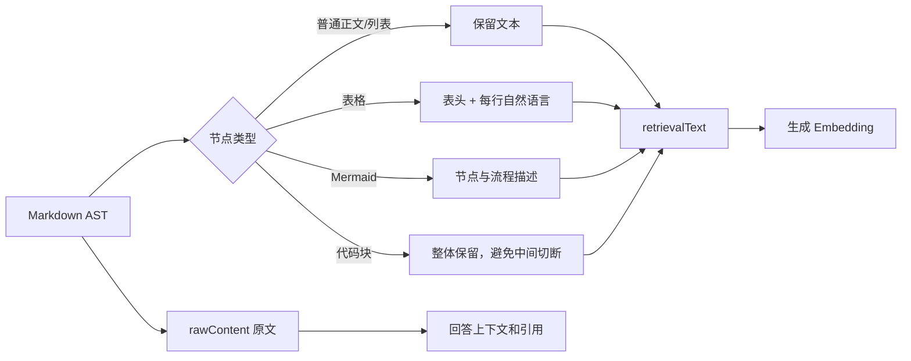
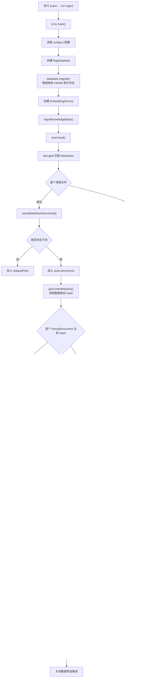
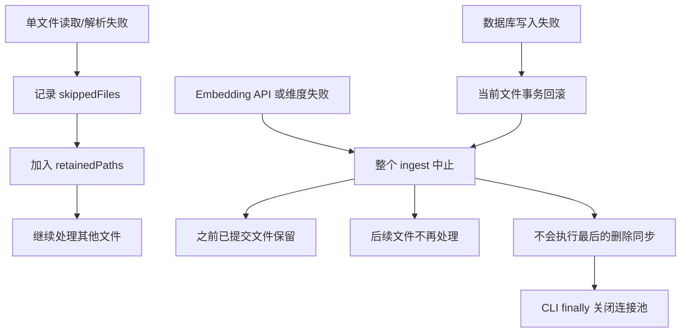

# 自测题

### 预测文档切块

不要运行搜索。先手工预测下面这段 Markdown：

````md
---
tags: [rag]
---

# 素材管理

这是一段总览。

## 素材为空

先检查素材组是否生效。

```ts
# 这里不是标题
const status = 'empty'
```

### 排查步骤

第一步检查配置，第二步检查数据。

## 素材为空

这是另一种异常。

![[素材配置.png|配置截图]]
````

请回答：

1. 会生成几个子块？每个 `headingPath` 是什么？

	子块数量：共 4 个
```
["素材管理"]
["素材管理", "素材为空"]
["素材管理", "素材为空", "排查步骤"]
["素材管理", "素材为空"]
```

2. 两个“素材为空”的 `headingOrdinal` 分别是什么？
	0 1

3. 哪个块可能是 `needsVision=true`？为什么？
	第二个“素材为空”块有图片，去掉标题、图片语法和空白后，正文“这是另一种异常”不足 120 字符，因此为 `true`

4. 只把“另一种异常”改成“缓存异常”后，哪些 ID/Hash 会变化？
	`parentId`不变
	父文档 `contentHash`变化
	所有 `chunkId`不变
	第二个“素材为空”的 `contentHash`变化
	其他子块 `contentHash`不变


### 父文档和子块各自解决什么问题

系统先按照 Markdown 的 H1/H2/H3 结构生成语义子块，超过 1600 字符再进行带 160 字符重叠的二次拆分。子块用于提高向量检索的定位精度；命中后，再通过父文档或相邻子块补充上下文，避免模型只看到孤立片段。短父文档可以使用全文，长父文档通常只补命中块及相邻块，并非总是把全文交给模型。

### AST 为什么不会误判代码里的 `#`
AST 根据 Markdown 语法识别节点类型，而不是只看一行是否以 `#` 开头。

```
root
├─ heading(depth=2, text="真正标题")
└─ code(value="# 这里只是代码")

node.type === "heading" && node.depth <= 3

```


### 长块重叠的作用与局限

作用：如果关键答案刚好落在第 1600 字附近，两个子块都保留部分上下文，不容易被硬切断。
局限：
- 重叠会产生重复内容，可能让两个近似子块同时进入 Top-K。
- 只是字符重叠，不能保证语义完整。
- 仍可能切开代码块、表格或连续排查步骤。

### `needsVision` 的作用与局限
系统会标记它可能依赖图片。

但这只是风险标签，当前系统：

- 知道有一张图片；
- 知道图片文件名和说明；
- 不知道截图里有什么按钮、箭头或配置值

### 举出两个可能检索失败的例子

- 答案被切散  
    一个完整排查流程分布在多个标题或多个长块中，只召回其中一个，回答不完整。
- 图片承载核心信息  
    正文只写“按照下图配置”，真正步骤在截图里，纯文字检索即使命中文档也无法回答。


### 针对Markdown的特殊格式如何处理




# 离线建库文档

结论：`ingest.ts` 是“离线建索引”的总调度器。它不负责具体解析、向量计算或 SQL，而是把这三层串起来：

```
扫描并解析全部 Markdown
→ 根据父文档 Hash 判断是否变化
→ 只对变化文档生成 Embedding
→ 单文件事务替换父文档和子块
→ 删除源目录中已经消失的旧文档
→ 输出统计报告
```

## 一、完整调用流程图



## 二、入口：CLI 如何进入 ingest

入口在 [cli.ts (line 64)](/Users/xuxiaokang/apps/DKAgent/packages/rag-v2/src/cli.ts:64)。

执行：

```
pnpm --filter @dkagent/rag-v2 run ingest
```

实际启动：

```
tsx src/cli.ts ingest
```

CLI 做四件事：

```
const database = new RagDatabase(config.databaseUrl);

await database.migrate();

const report = await ingestKnowledgeBase({
  database,
  embedding: createEmbedding(),
  vaultPath: config.vaultPath,
  sourceGlobs: config.sourceGlobs,
});
```

配置来自 DKAgent 根目录 `.env`，扫描范围固定为：

```
C-前端学习/**/*.md
CICD/**/*.md
个人Agent项目/**/*.md
学习笔记/**/*.md
```

CLI 最终通过 `finally` 关闭 PostgreSQL 连接池。

## 三、第一阶段：扫描并解析全部文档

入口是 [ingest.ts (line 20)](/Users/xuxiaokang/apps/DKAgent/packages/rag-v2/src/ingest.ts:20)：

```
const scan = await scanVault(
  input.vaultPath,
  input.sourceGlobs,
);
```

### 1. fast-glob 查找文件

[scanner.ts (line 21)](/Users/xuxiaokang/apps/DKAgent/packages/rag-v2/src/scanner.ts:21) 使用 `fast-glob`：

```
const matches = await fg(sourceGlobs, {
  cwd: vaultRoot,
  onlyFiles: true,
  unique: true,
  dot: false,
  followSymbolicLinks: false,
});
```

结果是相对于大康 Note 根目录的路径，例如：

```
C-前端学习/node/SSE.md
```

之后统一路径分隔符并排序，保证 macOS、Linux、Windows 下得到一致路径。

### 2. 逐个读取文件

```
const [content, stat] = await Promise.all([
  fs.readFile(absolutePath, "utf8"),
  fs.stat(absolutePath),
]);
```

这里的并行只发生在“同一文件的读取和 stat”之间。

不同文件仍然是：

```
文件1读取完成 → 文件2读取 → 文件3读取
```

并没有并发扫描 390 个文件。

### 3. 解析 Markdown

读取成功后调用：

```
parseMarkdownDocument(
  absolutePath,
  vaultRoot,
  content,
  stat.mtime,
);
```

解析器位于 [parser.ts (line 150)](/Users/xuxiaokang/apps/DKAgent/packages/rag-v2/src/parser.ts:150)。

内部流程：


1 gray-matter是分离md开头的元数据，但不一定有

2 remark-parse 是 将md转化成Markdown AST语法树：

```json
# 标题一
一段正文，包含 **加粗** 和 [链接](https://x.com)。

## 标题二
- 列表项一
- 列表项二
  
{
    "type": "root",
    "children": [
        {
            "type": "heading",
            "depth": 1,
            "children": [{ "type": "text", "value": "标题一" }],
            "position": { "start": { "offset": 0 }, "end": { "offset": 6 } }
        },
        {
            "type": "paragraph",
            "children": [
                { "type": "text", "value": "一段正文，包含 " },
                {
                    "type": "strong",
                    "children": [{ "type": "text", "value": "加粗" }]
                },
                { "type": "text", "value": " 和 " },
                {
                    "type": "link",
                    "url": "https://x.com",
                    "children": [{ "type": "text", "value": "链接" }]
                },
                { "type": "text", "value": "。" }
            ]
        },
        {
            "type": "heading",
            "depth": 2,
            "children": [{ "type": "text", "value": "标题二" }]
        },
		//...
    ]
}
  
```

3 如果正文超过1600，就会裁切：
**先按"段落 > 换行"找断点，但只有落在本块后半段的断点才被采纳，否则硬切到 1600**——目的是"尽量在语义完整处断开，又不让块过短"。

4 判断是否依赖图片：
把图片和标题都删掉，看文字是否大于120个，如果不大于，说明依赖图片


5 **尽量让"内容更新"不触发大规模重建，只有结构/身份变化才重建**：
父文档 ID：

```
parentId = sha256(relativePath);
```

父文档变化判断：

```
contentHash = sha256(rawContent);
```

子块 ID：

```
chunkId = sha256(
  parentId +
  headingPath +
  headingOrdinal +
  splitIndex
);
```

因此：

- 改正文：父文档 ID 通常不变，`contentHash` 变化。
- 改标题：受影响子块 ID 变化。
- 移动或改名：父文档和所有子块 ID 都变化。

### 4. 文件读取失败

如果 iCloud 文件暂时不可读：

```
retainedPaths.push(sourcePath);
```

它不会进入本次重新索引，但后面删除旧数据时会被视为仍然存在。

这是为了避免一次临时读取失败把数据库旧索引删掉。

### 5. 空文档

如果解析后：

```
parsed.chunks.length === 0
```

则加入：

```
skippedFiles
```

它不会进入 `documents`。


## 四、第二阶段：增量变化判断

扫描结束后调用：

```
const existingHashes =
  await database.getContentHashes();
```

对应 SQL：

```
SELECT source_path, content_hash
FROM rag_documents;
```

得到：

```
Map<sourcePath, contentHash>
```

随后逐篇比较：

```
if (
  existingHashes.get(document.parent.sourcePath)
  === document.parent.contentHash
) {
  unchangedDocuments += 1;
  continue;
}
```

### 增量更新到底节省了什么

Hash 相同的文档不会：

- 调用 BGE-M3；
- 重建向量；
- 删除并插入子块；
- 消耗 Embedding Token。

但仍然会：

- glob 扫描；
- 读取 Markdown；
- 解析 AST；
- 执行切块；
- 计算 Hash。

所以当前是“Embedding 与数据库写入增量”，不是“文件读取增量”。

## 五、第三阶段：构造 Embedding 文本

变化文档会执行：

```ts
const texts = document.chunks.map((chunk) =>
  buildEmbeddingText(
    chunk.headingPath,
    chunk.content,
  ),
);
```

例如原子块：

```
headingPath = [
  "SSE",
  "SSE 和普通 HTTP 的区别",
];

content = `
## SSE 和普通 HTTP 的区别
普通 HTTP 一次返回……
`;
```

实际送给 BGE-M3 的内容是：

```
SSE > SSE 和普通 HTTP 的区别
## SSE 和普通 HTTP 的区别
普通 HTTP 一次返回……
```

标题路径前缀的价值是：即使子块正文较短，也能保留所在主题。

当前实现会出现一次标题语义重复：

```
标题路径前缀
+
content 中原始 Markdown 标题
```

这是当前代码事实，不一定是错误，需要通过 Recall@3 判断是否需要调整。


## 六、第四阶段：批量生成向量

[embedding.ts (line 45)](/Users/xuxiaokang/apps/DKAgent/packages/rag-v2/src/embedding.ts:45) 每次最多处理 32 个子块：

```ts
for (let index = 0; index < values.length; index += 32) {
  const batch = values.slice(index, index + 32);

  const result = await embedMany({
    model: this.model,
    values: batch,
    maxParallelCalls: 2,
  });
}
```

例如一个文件有 70 个子块：

```
第1批：0～31
第2批：32～63
第3批：64～69
```

三批之间串行执行。

每批返回：

```
number[][]
```

即：

```
子块1 → 1024维向量
子块2 → 1024维向量
子块3 → 1024维向量
```

代码会校验每条向量必须是 1024 维；维度错误会立即抛异常，不允许写入数据库。

## 七、第五阶段：单文件事务入库

入口在 [database.ts (line 96)](/Users/xuxiaokang/apps/DKAgent/packages/rag-v2/src/database.ts:96)。

首先检查：

```
chunks.length === embeddings.length
```

避免子块与向量错位。

之后开启事务：

```
BEGIN;
```

### 1. UPSERT 父文档

```
INSERT INTO rag_documents (...)
VALUES (...)
ON CONFLICT (id)
DO UPDATE SET ...;
```

新文件执行插入，已有文件更新正文、Hash、frontmatter 和索引时间。

### 2. 删除该文件的旧子块

```
DELETE FROM rag_chunks
WHERE parent_id = $1;
```

当前没有逐子块差异更新，而是：

```
父文档发生变化
→ 删除它的全部旧子块
→ 插入全部新子块
```

实现简单，也能避免残留已经不存在的标题块。

### 3. 逐个插入子块和向量

```
INSERT INTO rag_chunks (
  id,
  parent_id,
  sequence,
  heading_path,
  content,
  image_refs,
  needs_vision,
  embedding
)
VALUES (...);
```

`sequence` 表示子块在父文档中的顺序，后续生成上下文时可以找到命中块的相邻块。

### 4. 提交或回滚

成功：

```
COMMIT;
```

任何一个子块插入失败：

```
ROLLBACK;
```

因此不会出现“父文档更新成功，但只写入一半子块”的状态。

不过整个 ingest 不是一个大事务。前面已经成功提交的文件不会因为后面某个文件失败而回滚。

## 八、第六阶段：删除已经消失的文档

全部变化文档处理后，计算：

```
activePaths = [
  ...scan.documents 的路径,
  ...scan.retainedPaths,
];
```

注意 `retainedPaths` 必须加入，因为这些文件只是临时读取失败，不是真的被删除。

然后执行：

```
DELETE FROM rag_documents
WHERE NOT (
  source_path = ANY(activePaths)
);
```

父表外键设置了：

```
ON DELETE CASCADE
```

所以删除父文档时，其全部子块和向量自动删除。

安全保护：

```
if (seenPaths.length === 0) {
  throw new Error("扫描结果为空，拒绝删除既有索引");
}
```

防止 Vault 路径配错时清空数据库。

## 九、报告字段如何对应你上次的结果

你上次得到：

```
{
  "scannedFiles": 390,
  "indexedDocuments": 383,
  "unchangedDocuments": 0,
  "deletedDocuments": 0,
  "chunksEmbedded": 3335,
  "embeddingTokens": 813294,
  "durationMs": 72835
}
```

含义：

| 字段                       | 实际含义                               |
| ------------------------ | ---------------------------------- |
| `scannedFiles=390`       | glob 找到 390 个 Markdown             |
| `indexedDocuments=383`   | 383 个非空文档需要重新索引                    |
| `unchangedDocuments=0`   | 第一次运行，没有旧 Hash 可复用                 |
| `skippedFiles=7`         | 7 个文件没有可索引文本                       |
| `chunksEmbedded=3335`    | 383 个文件共生成 3335 个子块向量              |
| `embeddingTokens=813294` | SiliconFlow 返回的 Embedding Token 总量 |
| `deletedDocuments=0`     | 没有需要清理的旧父文档                        |
| `durationMs=72835`       | 扫描、解析、Embedding、写库和清理总耗时           |

第二次不修改任何文件时，理想结果应接近：

```
scannedFiles = 390
indexedDocuments = 0
unchangedDocuments = 383
chunksEmbedded = 0
embeddingTokens = undefined
```


## 十、错误边界





这是一个重要区别：

- 文件读取失败：局部容错，继续运行。
- Embedding 或数据库失败：整体停止。
- 数据库失败：当前文件回滚，但已完成文件不回滚。

