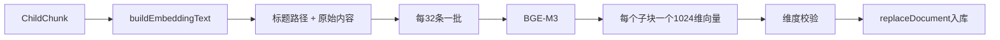
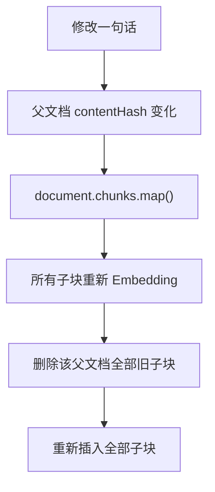

你最终需要解释：

```
ChildChunk
→ retrievalText
→ BGE-M3
→ 1024维向量
→ PostgreSQL事务写入
```

以及第二次 `ingest` 为什么不重复调用 Embedding。

## 2.1 先学习 Embedding

核心流程：





例如：

```
headingPath = ["Node", "SSE", "响应头"];
content = "Content-Type 必须是 text/event-stream";
```

送给 Embedding 模型的是：

```
Node > SSE > 响应头
Content-Type 必须是 text/event-stream
```

返回的不是关键词或答案，而是：

```
[
  0.012,
  -0.034,
  // 共1024个浮点数
]
```

它表示文本在语义空间中的位置。意思相近的文本，向量方向通常更接近。

### 为什么标题路径也要参与 Embedding

正文可能只有：

```
需要重新发布后才能生效。
```

单独看不知道什么需要发布。加入标题路径：

```
素材管理 > 素材为空 > 排查步骤
需要重新发布后才能生效。
```

语义会更完整。

### 为什么每批32条

这是请求批次大小，不是切块大小：

```
3335个子块
→ 大约105个批次
→ 每批最多32条
```

目的是减少网络请求次数，同时避免单次请求过大。

### 为什么必须检查1024维

数据库字段固定为：

```
embedding vector(1024)
```

如果模型返回其他维度，继续写入会失败，或者导致查询向量与文档向量无法比较，所以在入库前立即报错。

## 预测题

暂时不要运行命令，先回答：

1. 一个父文档有 70 个子块，需要分成几个 Embedding 批次？每批多少条？

```
第1批：32
第2批：32
第3批：6
```

2. 文档有 10 个子块，Embedding API 只返回 9 个向量，当前系统会在哪里阻止入库？
	数据库执行更新操作前，被拦截

3. 为什么不能只把 `chunk.content` 发送给 Embedding？
	Embedding 才知道“重新发布”解决的是什么问题，尤其能补充 H1/H2 上级语义。
	eg：
	素材管理 > 素材为空 > 排查步骤
	\#\#\# 排查步骤
	重新发布。

4. Embedding 返回的 1024 个数字是不是答案？它们用于做什么？
	模型生成的文本语义坐标，用于计算问题与子块的余弦相似度。

#### 修改子块内容，还会重新向量化么？


