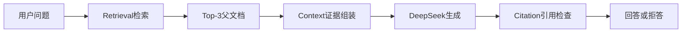
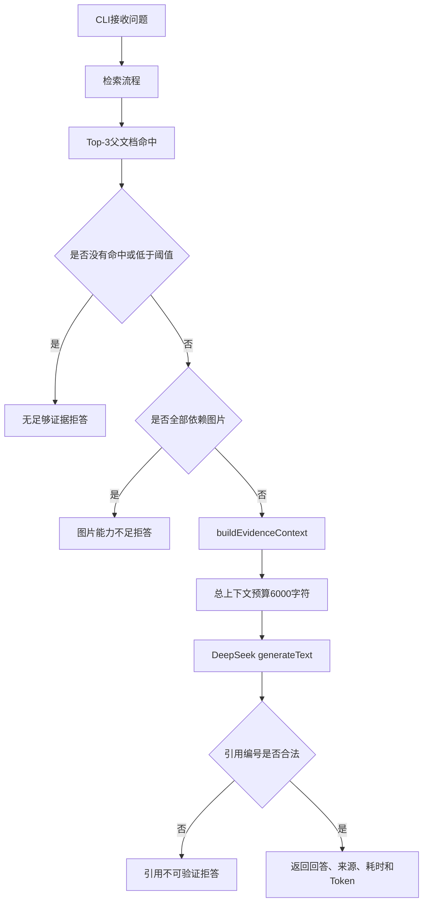
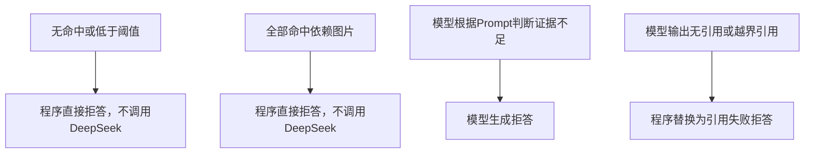

> 本关目标：把检索到的 3 篇父文档组织成受控证据，让 DeepSeek 只依据证据回答，并对低相关、图片依赖和无有效引用的结果进行降级。  
> 本关不实现 LangGraph、重排模型、自动幻觉评分或多模态图片理解。

核心文件：

- [`src/generation/ask.ts`](src/generation/ask.ts)：问答总流程；
- [`src/generation/context.ts`](src/generation/context.ts)：父文档上下文选择；
- [`src/retrieval/search.ts`](src/retrieval/search.ts)：Top-3 证据检索；
- [`src/config.ts`](src/config.ts)：DeepSeek 和拒答阈值配置。

## 1. 第五关在完整 RAG 中的位置



前四关解决：

```text
能否找到证据
```

第五关解决：

```text
如何把证据交给模型
→ 如何限制模型只能根据证据回答
→ 如何让回答带可追溯引用
→ 什么时候应该拒答
```

---

## 2. 完整调用链

用户执行问答命令后，真实链路如下：



一句话：

> 先检索并执行生成前拒答，再组装有限证据让模型回答，最后检查引用编号，不合格就降级拒答。

## 3. CLI 如何进入问答流程

CLI 读取问题后调用：

```ts
// 中文注释：把数据库、Embedding、问题和DeepSeek配置注入问答流程
const result = await askKnowledgeBase({
  database,
  embedding,
  query,
  generation: {
    apiKey: requireSecret(config.generation.apiKey, "DEEPSEEK_API_KEY"),
    baseUrl: config.generation.baseUrl,
    model: config.generation.model,
  },
  minSimilarity: config.minSimilarity,
});
```

配置来自 DKAgent 根目录 `.env`：

```dotenv
# 中文注释：DeepSeek密钥，仅用于最终答案生成
DEEPSEEK_API_KEY=你的密钥

# 中文注释：DeepSeek的OpenAI兼容接口地址
DEEPSEEK_BASE_URL=https://api.deepseek.com/v1

# 中文注释：当前生成模型
DEEPSEEK_MODEL=deepseek-chat

# 中文注释：可选的Top-1最低相似度，需要通过评估集校准
RAG_MIN_SIMILARITY=0.66
```

`RAG_MIN_SIMILARITY` 是可选项。没有配置时，当前代码不会通过固定分数提前拒答。

## 4. 第一步仍然是检索

问答不是直接把用户问题交给 DeepSeek，而是先执行：

```ts
// 中文注释：固定检索3篇不同的父文档作为候选证据
const search = await searchKnowledge({
  database: input.database,
  embedding: input.embedding,
  query: input.query,
  topK: 3,
});
```

结果包含：

```text
Top-3父文档
每篇父文档的最高分子块
相似度
标题路径
needsVision
```

这一步会调用 BGE-M3，不调用 DeepSeek。

## 5. 生成前的第一层拒答：证据不足

当前代码先获取 Top-1 分数：

```ts
// 中文注释：最高相似度用于判断是否存在足够相关的候选证据
const topScore = search.hits[0]?.similarity;
```

满足任一条件就直接拒答：

```text
没有任何检索结果
或者
配置了minSimilarity，并且Top-1分数低于阈值
```

返回：

```text
知识库中没有足够证据回答这个问题。
```

此时：

- 已调用查询 Embedding；
- 未调用 DeepSeek；
- 不产生生成模型 Token；
- 仍返回检索命中和耗时，便于诊断。

### 阈值不能拍脑袋

`0.66` 只能是示例，不能直接照抄。正确方式是使用第四关的分数分布：

```text
最低可回答题Top-1分数
与
最高拒答题Top-1分数
```

如果两类分数重叠，就不能依赖单一阈值。

## 6. 生成前的第二层拒答：全部依赖图片

当前判断：

```ts
// 中文注释：三个命中都依赖图片时，文字知识库无法可靠回答
if (search.hits.every((hit) => hit.needsVision)) {
  return {
    answer: "相关说明主要依赖图片，当前文字版知识库无法可靠回答。",
  };
}
```

这里使用 `every`：

```text
3个命中全部needsVision=true → 拒答
只要有1个命中needsVision=false → 继续生成
```

局限：有一个文字块不依赖图片，不代表它一定足够回答。最终仍需要人工检查证据完整性。

`needsVision=true` 只是风险标记，系统没有读取截图内容。

## 7. 为什么不能直接把 Top-3 子块交给模型

命中子块负责精确定位，但可能只有局部信息。例如：

```text
命中块：检查素材组是否生效
前一块：问题现象与触发条件
后一块：重新发布与验证步骤
```

只传命中块，模型可能知道“检查什么”，却不知道完整排查路径。

当前策略是：

```text
短父文档 → 返回完整原文
长父文档 → 返回命中块 + 前一个块 + 后一个块
```

这就是“小块检索，大块补上下文”的生成阶段实现。

## 8. `selectParentContext()` 如何选择内容

函数输入：

```ts
// 中文注释：完整父文档、命中子块ID、该来源可使用的字符预算
selectParentContext(document, chunkId, maxChars);
```

### 情况一：父文档足够短

```ts
// 中文注释：全文没有超过当前来源预算时，直接返回完整Markdown
if (document.parent.content.length <= maxChars) {
  return document.parent.content;
}
```

优点：上下文完整。  
代价：可能包含与问题无关的章节。

### 情况二：父文档较长

先找到命中子块的位置：

```ts
// 中文注释：根据chunkId定位命中块在父文档子块数组中的顺序
const hitIndex = document.chunks.findIndex(
  (chunk) => chunk.id === chunkId,
);
```

再选择相邻范围：

```text
hitIndex - 1：前一个子块
hitIndex：命中子块
hitIndex + 1：后一个子块
```

最后拼接并裁剪：

```ts
// 中文注释：拼接相邻三个子块，并限制在当前来源的字符预算内
return selected
  .map((chunk) => chunk.content)
  .join("\n\n")
  .slice(0, maxChars);
```

### 当前裁剪策略的局限

裁剪从拼接内容开头开始。如果前一个子块很长，可能出现：

```text
前一个子块占满预算
→ 命中子块反而被截断
```

这是需要真实评估驱动的上下文问题。更稳妥的后续方案是优先保证命中块完整，再把剩余预算分给前后块；当前尚未实现。

---

## 9. 6000 字符预算如何分配

调用入口固定总预算：

```ts
// 中文注释：三个来源合计最多使用约6000个JavaScript字符
const context = await buildEvidenceContext(
  input.database,
  search.hits,
  6000,
);
```

平均分配：

```text
perSourceBudget = floor(6000 / 命中来源数)
```

当命中 3 篇父文档时：

```text
每篇约2000字符
```

每个来源还需要先放置引用头：

```text
[1] C-前端学习/node/SSE.md#SSE和普通HTTP的区别
```

正文预算是：

```text
每篇总预算 - 引用头长度
```

最后得到类似：

```text
[1] 路径A#标题A
证据正文A

[2] 路径B#标题B
证据正文B

[3] 路径C#标题C
证据正文C
```

### 为什么限制上下文

- 控制 DeepSeek 输入 Token 和费用；
- 降低无关内容干扰；
- 减少模型在长上下文中遗漏关键证据；
- 保持延迟可控。

6000 是字符预算，不是严格 Token 预算，也没有经过当前 20 题校准。

---

## 10. DeepSeek 如何接入

项目通过 OpenAI 兼容接口创建 Provider：

```ts
// 中文注释：创建DeepSeek的OpenAI兼容Provider
const provider = createOpenAICompatible({
  name: "deepseek",
  apiKey: input.generation.apiKey,
  baseURL: input.generation.baseUrl,
});
```

生成调用：

```ts
// 中文注释：把系统约束、用户问题和证据上下文交给生成模型
const result = await generateText({
  model: provider(input.generation.model),
  temperature: 0.1,
  system: systemPrompt,
  prompt: `问题：${input.query}\n\n资料：\n${context}`,
});
```

`temperature=0.1` 的意图是减少随机发挥，让基于证据的回答更稳定；它不能保证完全没有幻觉。

---

## 11. System Prompt 约束了什么

当前系统提示词包含四条规则：

```text
1. 只能依据给定知识库证据
2. 不得补充资料外事实
3. 每个关键结论必须使用[n]引用
4. 资料不足、冲突或依赖图片时明确拒答
```

它处理的是模型行为约束，但 Prompt 不是强制安全边界：

- 模型仍可能误解证据；
- 模型可能引用了相关文档，但文档并不支持具体结论；
- 模型可能遗漏部分问题；
- 模型可能把常识补充进答案。

因此还需要程序校验和人工评估。

---

## 12. 当前引用校验到底检查什么

函数：

```ts
// 中文注释：提取答案中所有形如[n]的数字引用
const references = [
  ...answer.matchAll(/\[(\d+)\]/g),
].map((match) => Number(match[1]));
```

通过条件：

```text
答案至少存在一个引用
并且
所有引用编号都在1～sourceCount范围内
```

例如有 3 个来源：

| 回答                   | 当前校验结果 |
| ---------------------- | ------------ |
| `SSE基于HTTP长连接[1]` | 通过         |
| `SSE基于HTTP长连接`    | 拒绝         |
| `SSE基于HTTP长连接[4]` | 拒绝         |
| `错误结论[1]`          | 仍可能通过   |

最后一行说明：当前校验只验证引用格式和编号范围，不验证引用是否真正支持结论。

因此项目目前没有实现自动“证据支持检查”或真正的“幻觉自检”。引用支持度仍然需要人工核对。

---

## 13. 四层拒答与降级



四层职责：

| 层级         | 解决的问题               | 当前局限                    |
| ------------ | ------------------------ | --------------------------- |
| 相似度拒答   | 候选证据过于不相关       | 阈值可能与正例重叠          |
| 图片拒答     | 文字系统无法读取关键截图 | `needsVision`只是启发式规则 |
| Prompt 拒答  | 证据不足或冲突           | 依赖模型遵守指令            |
| 引用格式拒答 | 没有引用或引用编号越界   | 不检查语义支持关系          |

---

## 14. 回答结果与调用量

`askKnowledgeBase()` 返回：

```ts
// 中文注释：最终问答结果同时保留答案、检索来源、耗时和模型用量
{
  answer,
  hits,
  durationMs,
  usage: {
    embeddingTokens,
    inputTokens,
    outputTokens,
    totalTokens,
  },
}
```

字段含义：

| 字段              | 含义                                |
| ----------------- | ----------------------------------- |
| `answer`          | 最终回答或降级拒答文本              |
| `hits`            | 检索到的 Top-3 来源                 |
| `durationMs`      | 从检索开始到生成结束的总耗时        |
| `embeddingTokens` | 问题向量化成本                      |
| `inputTokens`     | DeepSeek 读取 Prompt 和证据的 Token |
| `outputTokens`    | DeepSeek 生成回答的 Token           |
| `totalTokens`     | DeepSeek 输入与输出总量             |

生成前直接拒答时，没有 DeepSeek 用量，只有查询 Embedding 用量。

---

## 15. 一条可回答问题如何流转

问题：

```text
SSE和普通HTTP有什么区别？
```

链路：

```text
1. BGE-M3生成问题向量
2. pgvector命中SSE.md对应标题块
3. Top-1分数通过阈值检查
4. 命中结果不是全部needsVision
5. 读取SSE.md父文档和相邻块
6. 组装带[1][2][3]编号的证据
7. DeepSeek基于证据回答
8. 检查答案是否有合法引用编号
9. CLI打印回答、耗时、Token和来源
```

最终仍需人工确认：

- 是否明确说明连接是否立即结束；
- 是否解释持续 `res.write()`；
- 每个引用是否真的支持前面的结论；
- 是否混入 WebSocket 等无关比较。

---

## 16. 一条拒答问题如何流转

问题：

```text
2035年苹果尚未发布产品的内部定价是多少？
```

可能出现两种路径：

### 路径一：分数低于已校准阈值

```text
检索完成
→ Top-1低于阈值
→ 程序直接拒答
→ 不调用DeepSeek
```

### 路径二：没有可靠单一阈值

```text
检索仍返回语义相近文档
→ 组装证据
→ Prompt要求模型判断资料不足
→ 模型应明确拒答
```

第二条路径依赖模型判断，稳定性弱于程序化拒答，因此必须进入真实评估。

---

## 17. 当前实现的主要局限

1. 引用校验只检查编号，不检查证据是否支持结论；
2. 没有第二次 LLM 调用进行幻觉自检；
3. 6000 字符按来源平均分配，没有按相关性动态分配；
4. 长文档裁剪可能先保留前一个块，截断真正命中块；
5. 同一父文档只从最高分块向相邻位置扩展；
6. `needsVision` 只在三个命中全部为 `true` 时直接拒答；
7. 未配置阈值时，无关问题仍可能进入 DeepSeek；
8. 原始 Markdown 中的复杂表格、Mermaid 和图片没有转换成更适合模型的结构化证据；
9. 当前没有 LangGraph 工作流、重试节点或自动降级编排。

这些是事实边界，简历和面试中不能描述成已经实现的能力。

---

## 18. 最小实验

### 实验一：运行不调用模型的单元测试

```bash
# 中文注释：进入DKAgent仓库根目录
cd /Users/xuxiaokang/apps/DKAgent

# 中文注释：验证上下文选择和引用编号规则，不调用Embedding或DeepSeek
pnpm --filter @dkagent/rag-v2 exec tsx --test test/ask-cli.test.ts test/search-context.test.ts
```

需要看到：

```text
引用必须存在且落在实际来源编号内
短父文档返回全文，长父文档仅返回命中块及相邻块
```

### 实验二：运行一条可回答问题

```bash
# 中文注释：执行完整RAG问答，会调用一次查询Embedding和一次DeepSeek
pnpm --filter @dkagent/rag-v2 run rag ask "SSE和普通HTTP有什么区别？"
```

人工检查：

- 是否直接回答问题；
- 是否包含 `[1]` 等引用；
- 引用路径和标题是否可追溯；
- 引用正文是否真的支持结论；
- 回答是否覆盖关键事实；
- 是否显示 Embedding 和 DeepSeek 用量。

### 实验三：运行一条应拒答问题

```bash
# 中文注释：测试无证据问题是否拒答，是否调用DeepSeek取决于阈值和检索分数
pnpm --filter @dkagent/rag-v2 run rag ask "2035年苹果尚未发布产品的内部定价是多少？"
```

合格结果应该明确说明知识库没有足够证据，不能编造价格。

---

## 19. 最小人工评估表

第五关不引入评估平台。对 20 题记录：

| 字段     | 判断方式                    |
| -------- | --------------------------- |
| Recall@3 | 正确父文档是否进入前三      |
| 引用支持 | 每个 `[n]` 是否支持紧邻结论 |
| 回答完整 | 是否覆盖 `expectedFacts`    |
| 正确拒答 | 无证据题是否明确拒绝编造    |
| 延迟     | `durationMs`                |
| 成本     | Embedding 和 DeepSeek Token |
| 图片缺口 | 是否因截图信息无法回答      |

当前 `expectedFacts` 全部为空。正式检查回答完整性前，需要为 18 条可回答题分别补充 1 ～ 3 个最小事实。

---

## 20. 标准面试回答

> 我的生成层不是直接把 Top-K 子块交给模型，而是先执行证据门控。系统先完成 Top-3 父文档检索；如果没有命中、Top-1 低于评估集校准的阈值，或者命中全部依赖未解析图片，就直接拒答，避免无效调用生成模型。
>
> 对可回答问题，我采用小块检索、大块补上下文。短父文档使用全文；长父文档围绕最高分命中块选择前后相邻块。三个来源共享约 6000 字符预算，并使用 `[n] 路径#标题` 组织成可追溯证据。
>
> 生成模型通过 OpenAI 兼容接口调用 DeepSeek，温度设为 0.1。System Prompt 要求模型只能使用给定证据、关键结论必须引用来源，证据不足或冲突时明确拒答。
>
> 生成后程序检查答案至少包含一个合法引用，且编号不能超过实际来源数量。需要强调的是，当前引用检查只验证格式和编号，不能证明引用在语义上支持结论，所以我还会用 20 条真实问题人工检查引用支持、回答完整性、拒答正确性、延迟和 Token 成本。它目前不应被描述为已经实现完整幻觉自检。

---

## 21. 第五关完成标准

本关不要求预测题，以真实结果验收：

- [ ] 完成上下文与引用单元测试；
- [ ] 可回答问题能够生成带来源编号的答案；
- [ ] 每个关键引用能定位到真实文件和标题；
- [ ] 人工确认引用内容确实支持结论；
- [ ] 应拒答问题不编造知识库外事实；
- [ ] 能查看 Embedding 和 DeepSeek 调用量及总耗时；
- [ ] 能明确说明当前没有自动语义级引用校验；
- [ ] 图片相关失败明确标记，不能宣称已经实现多模态。

完成后，五个基础教学关卡结束。下一阶段只根据 20 题真实失败进行优化。
