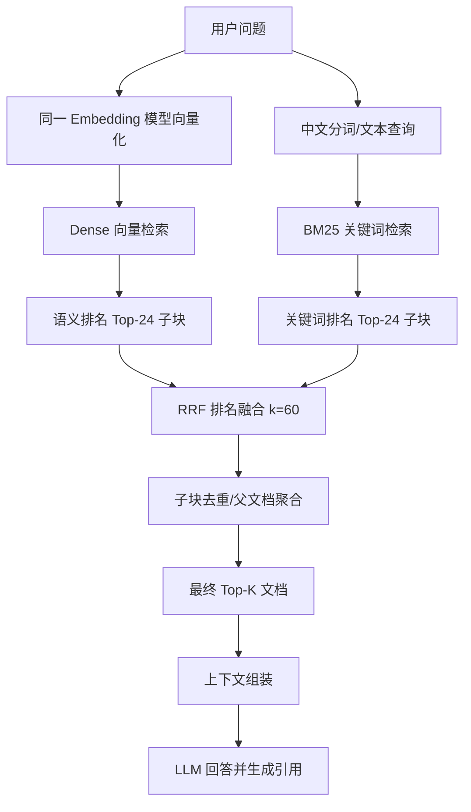

`Dense Top-24 + BM25 Top-24 + RRF(k=60)` 是一种混合检索策略：

- Dense 负责“语义相近”
- BM25 负责“关键词精确命中”
- RRF 负责合并两份排名
- 最终得到兼顾语义与关键词的候选结果

````

````

## 1. Dense Top-24

Dense 指向量语义检索。

用户问题和知识库子块都通过同一个 Embedding 模型变成向量，然后比较余弦距离：

```
similarity = 1 - cosineDistance
```

例如：

```
问题：素材为空导致掉楼怎么办？
```

即使文档写的是：

```
楼层未展示时，先检查素材组是否生效
```

两者没有完全相同的关键词，Dense 仍可能判断语义接近。

`Top-24` 表示先取相似度最高的 24 个子块，不是最终给用户返回24条。

优点：

- 能处理同义词、口语和不同表达
- 用户不必准确记住文档术语
- 适合自然语言业务问题

缺点：

- 对错误码、配置项、专有名词的精确匹配可能较弱
- 语义相似不代表答案真的相关
- Embedding 模型可能把“看起来像”的内容排得过高

解决的问题：关键词不同，但含义相同。

## 2. BM25 Top-24

BM25 是关键词检索算法，可以理解为更合理的全文搜索。

它主要考虑三个因素：

```
BM25 分数 ≈ 关键词稀有程度
          × 关键词在文档中的出现强度
          × 文档长度修正

BM25 = Σ（稀有度 IDF × 词频饱和 × 长度惩罚），核心是"给稀有词高权重 + 词频增益递减 + 惩罚长文档"，这让它天生擅长关键词精确命中
```

### 关键词稀有程度

“素材组”出现得越少，它越有区分度；“什么”“如何”等常见词权重低。

### 词频饱和

关键词出现两次通常比出现一次更相关，但出现100次不会简单地获得100倍分数。

### 文档长度修正

避免超长文档因为包含的词更多而天然占优势。

例如用户搜索：

```
TraceId 9527 素材组为空
```

BM25 对 `TraceId`、`9527`、`素材组` 这类精确文本非常敏感。

`Top-24` 表示取 BM25 排名前24的子块。

优点：

- 精确命中错误码、接口名、配置项和业务术语
- 不调用 Embedding API
- 结果比较容易解释

缺点：

- 不理解真正的语义
- 同义词但用词不同，可能完全召回不到
- 中文分词质量会直接影响结果
- 用户描述与文档措辞差异大时表现较差

解决的问题：向量检索对精确关键词不够敏感。

## 3. RRF(k=60)

RRF 全称是 Reciprocal Rank Fusion，即“倒数排名融合”。

它不直接比较 Dense 相似度和 BM25 分数，因为二者的分数不在同一个尺度：

```
Dense：0.81、0.76、0.72
BM25：12.4、8.7、5.1
```

RRF 只使用每个子块在两份结果中的排名：

```
RRF(chunk) = Σ 1 / (k + rank)
```

当前 `k=60`，排名从1开始。

假设子块 A：

```
Dense 排名：2
BM25 排名：5
```

那么：

```
A 的 RRF 分数
= 1 / (60 + 2) + 1 / (60 + 5)
= 1 / 62 + 1 / 65
≈ 0.03151
```

子块 B 只在 Dense 中排名第一：

```
B 的 RRF 分数
= 1 / (60 + 1)
≈ 0.01639
```

因此 A 会排在 B 前面。因为 A 同时得到了语义检索和关键词检索的支持。

### `k=60` 有什么作用

`k` 是排名平滑参数，不是取60条结果：

- `k` 越小：前几名优势越明显
- `k` 越大：相邻排名差距越平缓
- `60` 是常见默认值，但不是理论最优值，需要通过评估集验证

优点：

- 不需要归一化两种完全不同的分数
- 实现简单、稳定
- 同时被两路检索命中的结果会自然获得提升
- 单路检索漏掉时，另一路还能补充

缺点：

- 丢弃了原始分数差距
- 排名第一“遥遥领先”和“勉强第一”在 RRF 中没有区别
- `Top-24`、`k=60` 都是需要评估调优的参数
- 两路都召回了错误结果时，RRF 不能判断内容正确性

解决的问题：如何稳定地合并两种不可直接比较的检索分数。


### 进阶检索优化

>愿意多花计算，换取检索质量

#### Step-back 检索 - 检索前

**场景：**
正确文件完全没进候选       
	→ 可能是查询表达问题 
	→ Step-back（改写/抽象查询）

```text
# Step-back（两次检索拼上下文）

原理：对用户原始问题生成一个更抽象的"退一步"问题，两路检索后合并上下文，让 LLM 同时拥有具体细节与背景知识。

用户问题 ─────────────────────► 具体检索结果 (concrete_ctx)
	│                             │
	│ LLM 生成抽象问题              │ merge()
    ▼                             │
抽象问题 ─────────────────────► 背景检索结果 (background_ctx)
								  │
								  ▼
							final_prompt → LLM
```

#### Rerank 重排序 - 检索后

多调一个 Cross-Encoder 精排

**场景：**
正确子块进了候选但排不到前面 
	→ 可能是排序问题     
	→ Reranking（精排）

**什么时候用rerank**
Rerank（重排）是融合后排序仍不准时才需要加

**Bi-Encoder（双编码器 / 双塔）**

使用两个独立的编码器分别将 query 和 document 编码为稠密向量，再通过相似度函数（余弦相似度或点积）计算相关度。

 **Cross-Encoder（交叉编码器）**
 
将 query 与 document 拼接为单个输入序列 `[CLS] query [SEP] doc [SEP]`，通过一个 Transformer 编码器，取 `[CLS]` 位置的隐状态接分类头，输出相关度分数。

```text
原理：
Bi-Encoder 为速度对 query-doc 独立编码，交互信息不足；
Cross-Encoder 把 query 与 doc 拼在一起打分，精度更高但慢，
故放在 Top-K 之后做小范围重排。

┌─────────────────────────────────────────────┐
│ Bi-Encoder                                  │
│ encode(query) ──► q_vec                     │ 快，可 ANN
│ encode(doc)   ──► d_vec                     │ 精度低于 CE
│ score = q_vec · d_vec                       │ 
└─────────────────────────────────────────────┘
┌─────────────────────────────────────────────┐
│ Cross-Encoder                               │
│ encode([query, doc]) ──► score              │ 精度高
│ query 与 doc 深度交互(Self-Attention）        │ 慢，小批量
└─────────────────────────────────────────────┘

流程：
Query ──► Bi-Encoder 向量检索 ──► Top-K 候选
  │
Cross-Encoder 重排序
  │
Top-N 结果（N < K）
```

